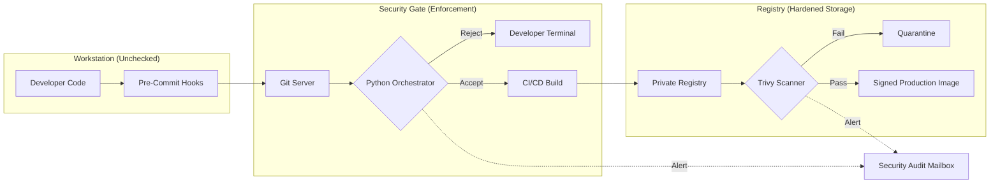
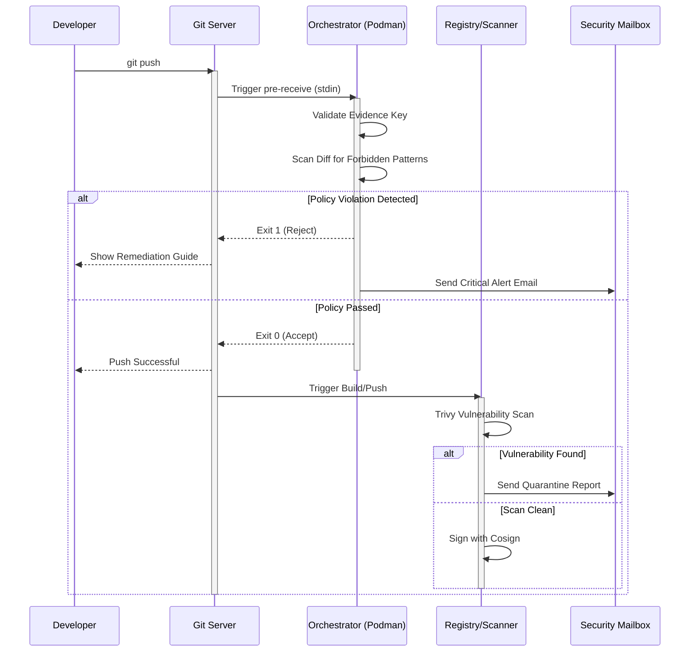

# Solution Architecture Document (SAD): Modular Security Gatekeeper

**Project:** Modular Git Policy Enforcer & Registry Scanner  
**Status:** FINAL / PRODUCTION  
**Compliance Baseline:** NIST SP 800-53, DISA STIG, FIPS 140-3  

---

## 1. System Overview
The **Security Gatekeeper** is a distributed security infrastructure designed to enforce compliance across the Software Development Life Cycle (SDLC). It prevents "Security Drift" by ensuring no code or artifact reaches production without passing a centralized, containerized policy check.

---

## 2. High-Level Component Topology
The system is divided into three functional zones: **Local (Client)**, **Logic (Server)**, and **Artifact (Registry)**.

## 3. Data Flow: Push-to-Deploy SequenceThis sequence illustrates the transaction lifecycle from a developer's git push command to a signed production artifact.

Code snippet

### 4. Component Details

### 4.1 Git Policy Enforcer (Orchestrator)
- Runtime: Rootless Podman container.
- Input: Receives old_rev, new_rev, and ref_name via stdin from the Git pre-receive hook.
- Logic:
	-- Verifies [COMPLIANCE-SCAN-PASSED] signature in commit messages.
	-- Executes regex-based pattern matching on git show outputs.
	
- Hardening: Read-only filesystem, dropped capabilities, and no-new-privileges flag.

### 4.2 Registry Scanner (Trivy Integration)Trigger: Post-push webhook from the internal Container Registry.
--	Evaluation Logic:
 - **Pass:** CVSS < 7.0 OR No Vendor Fix available.Fail: CVSS ≥ 7.0 AND Vendor Fix available.
 - **Result:** Clean images are signed via Cosign; failing images are restricted to a quarantine namespace.

### 4.3 Notification Manager (SMTP)Encryption: STARTTLS (NIST SC-8).
- Redaction: Alerts contain file paths and rule IDs but **never** the actual secret or code snippet to prevent secondary leakage in audit mailboxes.

## 5. Compliance Mapping

ComponentSecurity ControlSourcePodman RuntimeLeast Privilege / Container IsolationCIS Level 2Evidence KeyNon-Repudiation of Local ChecksNIST SI-7STARTTLSCryptographic Protection (Transit)FIPS 140-3JSON LoggingContent-Based Audit TrailsNIST AU-12END OF ARCHITECTURE DOCUMENT

**End of Document**