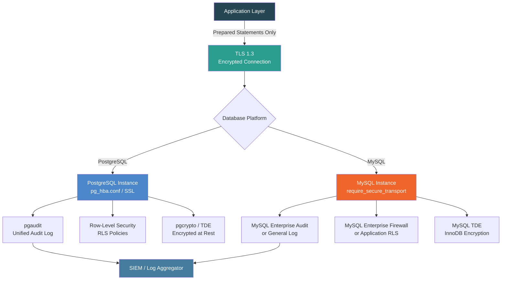
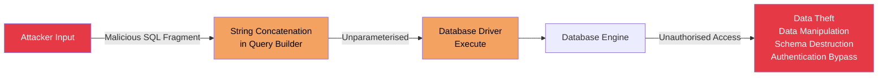
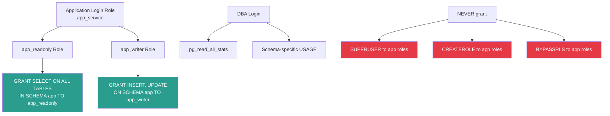

# ANSI SQL Security Best Practices Guide
## PostgreSQL and MySQL

**Document Reference:** SBP-ANSI-SQL-SEC-001  
**Version:** 1.0.0  
**Classification:** OFFICIAL – SENSITIVE  
**Date:** 2026-03-23  
**Author:** SecureByPolicy Standards Authority  
**Review Cycle:** Annual (or upon major standard revision)  
**Related Documents:** SBP-TSQL-SEC-001 (T-SQL), SBP-PLSQL-SEC-001 (PL/SQL)

---

## Standards Cross-Reference

| Standard | Version | Reference Date |
|---|---|---|
| NIST Cybersecurity Framework | CSF 2.0 | February 26, 2024 |
| NIST SP 800-53 | Rev. 5 (updated Aug 2025) | August 2025 |
| OWASP Top 10 | 2025 (confirmed Jan 2026) | January 2026 |
| DISA STIG Crunchy Data PostgreSQL 16 | V1R1 | June 25, 2024 |
| DISA STIG Crunchy Data PostgreSQL | V3R1 | July 24, 2024 |
| DISA STIG Oracle MySQL 8.0 | V2R2 | November 2025 |
| CIS PostgreSQL Benchmark | Level 2 (current) | Current |
| CIS MySQL Enterprise Edition 8.0 | Level 2 (current) | Current |
| CIS Oracle Database 23ai Benchmark | v1.1.0 | September 2025 |
| FIPS 140-3 | Current | Supersedes FIPS 140-2 |

> **Sources:**  
> - NIST CSF 2.0: https://www.nist.gov/cyberframework  
> - NIST SP 800-53 Rev. 5: https://csrc.nist.gov/publications/detail/sp/800-53/rev-5/final  
> - OWASP Top 10:2025: https://owasp.org/Top10/2025/  
> - PostgreSQL 16 STIG: https://www.crunchydata.com/news/crunchy-data-postgres-16-security-technical-implementation-guide-released-by-disa  
> - PostgreSQL STIG V3R1: https://ncp.nist.gov/checklist/981  
> - PostgreSQL 16 STIG NCP: https://ncp.nist.gov/checklist/1246  
> - MySQL 8.0 STIG: https://ncp.nist.gov/checklist/990  
> - MySQL STIG V2R2: https://forum.bigfix.com/t/bigfix-compliance-new-disa-stig-checklist-for-oracle-mysql-enterprise-edition-8-0-on-linux-published-2025-11-25/53265  
> - DISA STIG downloads: https://public.cyber.mil/stigs/  
> - CIS Benchmarks: https://www.cisecurity.org/cis-benchmarks  
> - FIPS 140-3: https://csrc.nist.gov/publications/detail/fips/140/3/final

> **Important Notes on STIG Coverage:**  
> - The PostgreSQL STIG applies to open source PostgreSQL; compliance requires the `pgaudit` extension.  
> - The MySQL STIG applies to MySQL **Enterprise Edition** 8.0. MySQL Community Edition has reduced features; where noted, Community equivalents or MariaDB audit plugin alternatives are referenced.  
> - No dedicated DISA STIG exists for MySQL Community Edition or MariaDB standalone; the Database SRG (V3R1) provides generic controls applicable to both.

---

## Table of Contents

1. [Document Purpose and Scope](#1-document-purpose-and-scope)
2. [Compliance Framework Summary](#2-compliance-framework-summary)
3. [SQL Injection Prevention](#3-sql-injection-prevention)
4. [Authentication and Authorisation](#4-authentication-and-authorisation)
5. [Least Privilege and Role-Based Access Control](#5-least-privilege-and-role-based-access-control)
6. [Functions, Procedures, and Defensive Coding](#6-functions-procedures-and-defensive-coding)
7. [Data Encryption and Cryptographic Standards](#7-data-encryption-and-cryptographic-standards)
8. [Auditing and Logging](#8-auditing-and-logging)
9. [Error Handling and Information Disclosure](#9-error-handling-and-information-disclosure)
10. [Dynamic SQL Controls](#10-dynamic-sql-controls)
11. [Schema and Object Security](#11-schema-and-object-security)
12. [Extensions, Plugins, and External Access](#12-extensions-plugins-and-external-access)
13. [Sensitive Data Handling](#13-sensitive-data-handling)
14. [Database Configuration Hardening](#14-database-configuration-hardening)
15. [Compliance Checklist](#15-compliance-checklist)
16. [Appendix A: CWE Reference Table](#appendix-a-cwe-reference-table)
17. [Appendix B: DISA STIG Control Mapping](#appendix-b-disa-stig-control-mapping)
18. [Appendix C: Platform Feature Comparison](#appendix-c-platform-feature-comparison)
19. [Document Control](#document-control)

---

## 1. Document Purpose and Scope

### 1.1 Purpose

This guide establishes mandatory SQL security practices for development teams building or maintaining database-tier logic using **PostgreSQL** and **MySQL**. It covers ANSI SQL patterns applicable across both platforms, with explicit per-platform notes where behaviour, syntax, or tooling differs significantly.

Both PostgreSQL and MySQL are widely deployed in government, defence, and enterprise environments as open source alternatives to proprietary database platforms. Their shared ANSI SQL foundation means most injection, privilege, and cryptographic risks are identical — but their security feature sets, privilege models, and audit mechanisms differ materially.

### 1.2 Scope

This document applies to:

- All SQL code: queries, views, functions, stored procedures, and triggers
- PostgreSQL versions: 13, 14, 15, 16 (STIG-covered), and 17
- MySQL versions: 8.0, 8.4 (LTS), and 9.x
- MariaDB 10.x (where Community MySQL guidance is referenced)
- Deployment environments: on-premises, containerised (including OpenShift/Kubernetes), air-gapped, and government classified networks

### 1.3 Document Audience

| Audience | Usage |
|---|---|
| SQL Developers | Primary reference for secure query and procedure authoring |
| Database Administrators | Configuration hardening and audit |
| Security Engineers | Compliance assessment and gap analysis |
| DevOps / Platform Engineers | Container and configuration security |
| Compliance Officers | Audit evidence and traceability |

### 1.4 Security Architecture Overview



---

## 2. Compliance Framework Summary

### 2.1 NIST CSF 2.0 Functions Addressed

| CSF 2.0 Function | PostgreSQL Controls | MySQL Controls |
|---|---|---|
| **GV (Govern)** | Role-based security policy; pg_hba.conf policy | Plugin and privilege governance |
| **ID (Identify)** | information_schema; pg_catalog inventory | information_schema; SHOW VARIABLES |
| **PR (Protect)** | GRANT/REVOKE; RLS; TDE; prepared statements | GRANT/REVOKE; TDE; prepared statements |
| **DE (Detect)** | pgaudit; pg_stat_activity; DDL triggers | MySQL Enterprise Audit; general_log |
| **RS (Respond)** | WAL-based PITR; transaction rollback | Binary log; transaction rollback |
| **RC (Recover)** | pg_dump encrypted backups; PITR | mysqldump; binary log replay |

### 2.2 OWASP Top 10:2025 Mapping

| OWASP 2025 | PostgreSQL / MySQL Relevance | Primary Controls |
|---|---|---|
| A01 – Broken Access Control | Schema-level and row-level access | GRANT/REVOKE; RLS (PG); application-enforced (MySQL) |
| A02 – Security Misconfiguration | Default accounts, open listen addresses | pg_hba.conf; bind-address; skip-name-resolve |
| A03 – Software Supply Chain Failures | Untrusted extensions/plugins | Trusted extension model (PG 13+); plugin allowlisting |
| A04 – Cryptographic Failures | Weak hashing, no TDE | pgcrypto SHA-256; MySQL AES_ENCRYPT; TDE |
| A05 – Injection | SQL injection via string concatenation | Prepared statements; parameterised queries |
| A06 – Insecure Design | Over-privileged roles; PUBLIC grants | Least privilege; schema isolation |
| A07 – Authentication Failures | Default passwords; weak auth methods | scram-sha-256 (PG); caching_sha2_password (MySQL) |
| A08 – Data Integrity Failures | Unverified functions/plugins | Code review gates; signed plugins |
| A09 – Security Logging Failures | Missing audit trail | pgaudit; MySQL Enterprise Audit; general_log |
| A10 – Mishandling of Exceptional Conditions | Unhandled exceptions leaking state | Structured error handling; generic client messages |

### 2.3 DISA STIG Key Controls

#### PostgreSQL (Crunchy Data PostgreSQL 16 STIG V1R1 / V3R1)

| STIG Rule | Severity | Requirement | Section |
|---|---|---|---|
| V-233522 | High | PostgreSQL must use SCRAM-SHA-256 for authentication | §4 |
| V-233544 | High | Log connections must be enabled | §8 |
| V-233545 | High | Log disconnections must be enabled | §8 |
| V-233548 | High | pgaudit must be installed and configured | §8 |
| V-233556 | High | SSL/TLS must be enabled | §7, §14 |
| V-233573 | High | PostgreSQL must produce audit records for schema changes | §8 |
| V-233580 | Medium | PostgreSQL must enforce discretionary access control | §5 |
| V-233590 | Medium | Extensions must be approved before installation | §12 |
| V-233612 | High | Only approved authentication methods in pg_hba.conf | §4 |

#### MySQL (DISA Oracle MySQL 8.0 STIG V2R2, November 2025)

| STIG Rule | Severity | Requirement | Section |
|---|---|---|---|
| SV-235096 | High | MySQL must use approved authentication plugins | §4 |
| SV-235098 | High | Audit logging must be enabled | §8 |
| SV-235100 | High | Data at rest must be encrypted (TDE) | §7 |
| SV-235102 | Medium | Privileges must follow least privilege | §5 |
| SV-235105 | High | TLS must be enforced for all connections | §7, §14 |
| SV-235110 | Medium | Default accounts must be removed or locked | §4 |
| SV-235115 | High | SQL injection mitigations must be in place | §3 |

### 2.4 FIPS 140-3 in PostgreSQL and MySQL

| Requirement | PostgreSQL | MySQL |
|---|---|---|
| Approved hash (passwords) | SCRAM-SHA-256 (built-in) | caching_sha2_password |
| Data encryption at rest | pgcrypto (AES-256) + OS-level TDE | InnoDB TDE (AES-256) |
| Transport encryption | TLS 1.3 (OpenSSL FIPS build) | TLS 1.3 (require_secure_transport=ON) |
| FIPS mode activation | OpenSSL FIPS module on host OS | MySQL compiled with FIPS-enabled OpenSSL |
| Prohibited | MD5 auth (md5 in pg_hba.conf) | mysql_native_password (SHA-1 based) |

---

## 3. SQL Injection Prevention

SQL injection is the most directly exploitable vulnerability in both PostgreSQL and MySQL. It is classified under **OWASP A05:2025**, **CWE-89**, and is a High severity finding under both PostgreSQL and MySQL DISA STIGs.

### 3.1 Threat Model



### 3.2 Parameterised Queries — Mandatory (Both Platforms)

Parameterised (prepared) statements are the **primary and mandatory** defence. Values are never interpreted as SQL regardless of their content.

#### PostgreSQL — Parameterised Queries

```sql
-- ============================================================
-- PROHIBITED: String concatenation (DO NOT USE)
-- CWE-89 | OWASP A05:2025 | PostgreSQL STIG V-233515
-- ============================================================

-- BAD: Vulnerable to SQL injection
-- query = "SELECT * FROM users WHERE username = '" + username + "'"

-- ============================================================
-- REQUIRED: Parameterised query via application layer
-- psycopg2 (Python), node-postgres, JDBC — all use $N placeholders
-- ============================================================

-- PostgreSQL parameterised query pattern ($1, $2, ... placeholders)
-- In application code (Python/psycopg2 example):
--   cursor.execute(
--       "SELECT user_id, username, email FROM app.users WHERE username = %s AND is_active = TRUE",
--       (username_input,)   -- Tuple: value is bound, never interpreted as SQL
--   )

-- ============================================================
-- REQUIRED: PREPARE / EXECUTE for ad-hoc SQL in psql sessions
-- ============================================================

-- Server-side prepared statement
PREPARE get_user_by_id (INTEGER) AS
    SELECT
        u.user_id,
        u.username,
        u.email,
        u.created_at
    FROM app.users AS u
    WHERE u.user_id   = $1
      AND u.is_active = TRUE;

-- Execute with a bound value (no injection possible)
EXECUTE get_user_by_id(42);

-- Deallocate when done
DEALLOCATE get_user_by_id;
```

#### MySQL — Parameterised Queries

```sql
-- ============================================================
-- REQUIRED: MySQL Prepared Statements
-- CWE-89 | OWASP A05:2025 | MySQL STIG SV-235115
-- ============================================================

-- Server-side prepared statement (MySQL syntax uses ? placeholders)
PREPARE get_order_stmt FROM
    'SELECT order_id, order_date, total_amount, order_status
     FROM app.orders
     WHERE order_id    = ?
       AND is_deleted  = 0';

-- Bind and execute (value is never parsed as SQL)
SET @order_id = 42;
EXECUTE get_order_stmt USING @order_id;

DEALLOCATE PREPARE get_order_stmt;

-- ============================================================
-- In application code (Python/mysql-connector-python example):
--   cursor.execute(
--       "SELECT order_id, total_amount FROM orders WHERE order_id = %s AND is_deleted = 0",
--       (order_id_input,)
--   )
-- Java JDBC equivalent:
--   PreparedStatement ps = conn.prepareStatement(
--       "SELECT order_id, total_amount FROM orders WHERE order_id = ? AND is_deleted = 0");
--   ps.setInt(1, orderIdInput);
-- ============================================================
```

### 3.3 Stored Procedures as Injection Boundaries

Stored procedures with typed parameters prevent injection when they avoid internal dynamic SQL construction.

#### PostgreSQL — Secure Function Pattern

```sql
-- ============================================================
-- Secure PostgreSQL function (SQL-injection safe)
-- NIST SI-10 | OWASP A05:2025
-- ============================================================

CREATE OR REPLACE FUNCTION app.get_orders_by_customer(
    p_customer_id  INTEGER,
    p_status       VARCHAR(20) DEFAULT 'PENDING'
)
RETURNS TABLE (
    order_id       INTEGER,
    order_date     TIMESTAMPTZ,
    total_amount   NUMERIC(10,2),
    order_status   VARCHAR(20)
)
LANGUAGE sql
STABLE          -- Marks function as non-modifying (query planner hint)
SECURITY DEFINER  -- Runs as function owner (see §5 for privilege notes)
SET search_path = app, pg_catalog  -- Lock search_path to prevent hijacking
AS $$
    SELECT
        o.order_id,
        o.order_date,
        o.total_amount,
        o.order_status
    FROM app.orders AS o
    WHERE o.customer_id  = p_customer_id   -- typed parameter: no injection
      AND o.order_status = p_status         -- typed parameter: no injection
      AND o.is_deleted   = FALSE
    ORDER BY o.order_date DESC;
$$;

-- Revoke PUBLIC execute, grant to specific role only
REVOKE EXECUTE ON FUNCTION app.get_orders_by_customer(INTEGER, VARCHAR) FROM PUBLIC;
GRANT  EXECUTE ON FUNCTION app.get_orders_by_customer(INTEGER, VARCHAR) TO app_readonly;
```

#### MySQL — Secure Stored Procedure Pattern

```sql
-- ============================================================
-- Secure MySQL stored procedure
-- NIST SI-10 | OWASP A05:2025 | MySQL STIG SV-235115
-- ============================================================

DELIMITER $$

CREATE PROCEDURE app.usp_get_orders_by_customer(
    IN  p_customer_id  INT,
    IN  p_status       VARCHAR(20)
)
SQL SECURITY DEFINER   -- Runs as procedure owner (document justification)
COMMENT 'Retrieve orders for a customer by status'
BEGIN
    -- Input validation: reject invalid customer ID
    IF p_customer_id IS NULL OR p_customer_id <= 0 THEN
        SIGNAL SQLSTATE '45000'
            SET MESSAGE_TEXT = 'Invalid customer identifier.';
    END IF;

    -- Validate status against whitelist
    IF p_status NOT IN ('PENDING', 'PROCESSING', 'COMPLETE', 'CANCELLED') THEN
        SIGNAL SQLSTATE '45000'
            SET MESSAGE_TEXT = 'Invalid order status value.';
    END IF;

    -- Static parameterised query: no concatenation, no injection possible
    SELECT
        o.order_id,
        o.order_date,
        o.total_amount,
        o.order_status
    FROM app.orders AS o
    WHERE o.customer_id  = p_customer_id
      AND o.order_status = p_status
      AND o.is_deleted   = 0
    ORDER BY o.order_date DESC;

END$$

DELIMITER ;

-- Grant execute to application role only
GRANT EXECUTE ON PROCEDURE app.usp_get_orders_by_customer TO 'app_readonly'@'%';
```

### 3.4 Input Validation Patterns

```sql
-- ============================================================
-- PostgreSQL: Input validation function
-- NIST SI-10 | OWASP A05:2025
-- ============================================================

CREATE OR REPLACE FUNCTION app.validate_positive_integer(
    p_value  INTEGER,
    p_name   TEXT DEFAULT 'parameter'
)
RETURNS INTEGER
LANGUAGE plpgsql
IMMUTABLE STRICT
SET search_path = pg_catalog
AS $$
BEGIN
    IF p_value IS NULL OR p_value <= 0 THEN
        RAISE EXCEPTION 'Invalid %: must be a positive integer.', p_name
            USING ERRCODE = 'invalid_parameter_value';
    END IF;
    RETURN p_value;
END;
$$;

-- Usage within procedures:
-- PERFORM app.validate_positive_integer(p_order_id, 'order_id');

-- ============================================================
-- PostgreSQL: Whitelist validation for string values
-- Prevents injection when values are later used in dynamic SQL
-- ============================================================

CREATE OR REPLACE FUNCTION app.validate_in_list(
    p_value    TEXT,
    p_allowed  TEXT[],
    p_name     TEXT DEFAULT 'parameter'
)
RETURNS TEXT
LANGUAGE plpgsql
IMMUTABLE STRICT
SET search_path = pg_catalog
AS $$
BEGIN
    IF NOT (UPPER(p_value) = ANY(p_allowed)) THEN
        RAISE EXCEPTION '% contains an invalid value.', p_name
            USING ERRCODE = 'invalid_parameter_value';
    END IF;
    RETURN p_value;
END;
$$;
```

---

## 4. Authentication and Authorisation

### 4.1 PostgreSQL Authentication Configuration

**DISA STIG V-233522, V-233612 | CIS PostgreSQL Level 2 | NIST IA-5**

PostgreSQL authentication is controlled via `pg_hba.conf`. The STIG mandates SCRAM-SHA-256; MD5 is explicitly prohibited as it uses a broken hash (CWE-327, FIPS 140-3 non-compliant).

```
# ============================================================
# pg_hba.conf — Secure configuration
# DISA PostgreSQL STIG V-233522, V-233612
# NIST IA-2, IA-5 | CIS PostgreSQL Level 2
# ============================================================

# TYPE  DATABASE        USER            ADDRESS             METHOD

# Local connections: use peer (OS user matching) for trusted admin accounts
local   all             postgres                            peer

# Application connections: SCRAM-SHA-256 mandatory
# NEVER use: md5, trust, password (cleartext)
host    app_db          app_user        10.0.0.0/24         scram-sha-256
host    app_db          app_readonly    10.0.0.0/24         scram-sha-256

# Replication connections: certificate-based authentication
hostssl replication     replicator      10.0.1.0/24         cert

# Reject all other connections by default (deny-by-default posture)
host    all             all             0.0.0.0/0           reject
host    all             all             ::/0                reject
```

```sql
-- ============================================================
-- Verify no MD5 password hashes remain (FIPS 140-3 non-compliant)
-- DISA V-233522 | FIPS 140-3 | CWE-327
-- ============================================================

SELECT
    usename         AS username,
    passwd          AS password_hash,
    CASE
        WHEN passwd LIKE 'md5%' THEN 'NON-COMPLIANT: MD5 hash — upgrade to scram-sha-256'
        WHEN passwd LIKE 'SCRAM-SHA-256%' THEN 'COMPLIANT'
        WHEN passwd IS NULL THEN 'REVIEW: No password set'
        ELSE 'REVIEW: Unknown hash format'
    END AS compliance_status
FROM pg_shadow
ORDER BY usename;
-- Any MD5 rows: ALTER USER username PASSWORD 'new_password'; with pg_hba.conf set to scram-sha-256
```

### 4.2 MySQL Authentication Configuration

**MySQL STIG SV-235096 | CIS MySQL Level 2 | NIST IA-5**

MySQL 8.0 uses `caching_sha2_password` as the default (SHA-256 based, FIPS-compatible). The legacy `mysql_native_password` plugin uses SHA-1 and is prohibited under FIPS 140-3.

```sql
-- ============================================================
-- Verify authentication plugin compliance
-- DISA MySQL STIG SV-235096 | FIPS 140-3 | CWE-327
-- ============================================================

SELECT
    user,
    host,
    plugin,
    CASE plugin
        WHEN 'caching_sha2_password' THEN 'COMPLIANT'
        WHEN 'mysql_native_password'  THEN 'NON-COMPLIANT: SHA-1 based — migrate immediately'
        WHEN 'auth_socket'            THEN 'COMPLIANT (OS auth)'
        WHEN 'mysql_no_login'         THEN 'COMPLIANT (no login account)'
        ELSE 'REVIEW: Unknown plugin'
    END AS compliance_status
FROM mysql.user
WHERE account_locked = 'N'   -- Only check active accounts
ORDER BY user, host;

-- Migrate a user from mysql_native_password to caching_sha2_password:
-- ALTER USER 'app_user'@'%' IDENTIFIED WITH caching_sha2_password BY 'new_secure_password';

-- Set system-level default to prevent any future mysql_native_password creation:
-- SET PERSIST default_authentication_plugin = 'caching_sha2_password';
-- (MySQL 8.4+: mysql_native_password is disabled by default)
```

### 4.3 Password Policy — PostgreSQL

```sql
-- ============================================================
-- PostgreSQL password complexity via passwordcheck extension
-- NIST IA-5 | CIS PostgreSQL Level 2
-- ============================================================

-- Enable in postgresql.conf:
-- shared_preload_libraries = 'passwordcheck'

-- Verify the extension is loaded
SELECT name, setting FROM pg_settings WHERE name = 'shared_preload_libraries';

-- Set password expiry policy (PostgreSQL uses VALID UNTIL)
CREATE ROLE app_service_account
    WITH LOGIN
         PASSWORD 'ChangeThisInVault_2026!'
         VALID UNTIL '2026-12-31'       -- Enforce rotation
         CONNECTION LIMIT 10;           -- Limit concurrent connections

-- Review users with no password expiry
SELECT
    usename,
    valuntil,
    CASE
        WHEN valuntil IS NULL THEN 'NON-COMPLIANT: No expiry set'
        WHEN valuntil < NOW() THEN 'REVIEW: Password has expired'
        ELSE 'COMPLIANT: ' || valuntil::TEXT
    END AS expiry_status
FROM pg_user
WHERE usename NOT IN ('postgres', 'replicator')  -- Exclude managed system accounts
ORDER BY usename;
```

### 4.4 Password Policy — MySQL

```sql
-- ============================================================
-- MySQL password validation and expiry
-- MySQL STIG SV-235096 | NIST IA-5 | CIS MySQL Level 2
-- ============================================================

-- Enable and configure the validate_password component (MySQL 8.0+)
-- In my.cnf or SET PERSIST:
-- validate_password.policy = STRONG
-- validate_password.length = 15
-- validate_password.mixed_case_count = 1
-- validate_password.number_count = 1
-- validate_password.special_char_count = 1

-- Verify validate_password is active
SELECT PLUGIN_NAME, PLUGIN_STATUS
FROM information_schema.PLUGINS
WHERE PLUGIN_NAME = 'validate_password';

-- Set global password expiry policy
SET PERSIST default_password_lifetime = 90;  -- Expire after 90 days

-- Create a compliant user account
CREATE USER 'app_service'@'10.0.0.%'
    IDENTIFIED WITH caching_sha2_password BY 'Str0ng!Pass2026#'
    PASSWORD EXPIRE INTERVAL 90 DAY
    FAILED_LOGIN_ATTEMPTS 5             -- Lock after 5 failures
    PASSWORD_LOCK_TIME 1;               -- Lock for 1 day

-- Audit users with non-expiring passwords
SELECT
    user,
    host,
    password_expired,
    password_lifetime,
    password_last_changed,
    account_locked
FROM mysql.user
WHERE password_lifetime = 0           -- Explicitly set to never expire
   OR password_lifetime IS NULL       -- Inheriting global (check global policy)
ORDER BY user;
```

### 4.5 Default Account Audit

```sql
-- ============================================================
-- PostgreSQL: Identify superuser accounts and assess necessity
-- CIS PostgreSQL Level 2 | NIST AC-6
-- ============================================================

SELECT
    usename         AS username,
    usesuper        AS is_superuser,
    usecreatedb     AS can_create_db,
    usecreaterole   AS can_create_role,
    usebypassrls    AS bypasses_rls,
    CASE
        WHEN usesuper = TRUE AND usename != 'postgres'
            THEN 'NON-COMPLIANT: Unnecessary superuser — review and remove'
        WHEN usebypassrls = TRUE
            THEN 'REVIEW: Bypasses Row-Level Security'
        ELSE 'COMPLIANT'
    END AS compliance_note
FROM pg_user
ORDER BY usesuper DESC, usename;

-- ============================================================
-- MySQL: Audit accounts with excessive global privileges
-- CIS MySQL Level 2 | NIST AC-6
-- ============================================================

SELECT
    user,
    host,
    Super_priv,
    Grant_priv,
    Shutdown_priv,
    File_priv,
    CASE
        WHEN Super_priv  = 'Y' THEN 'NON-COMPLIANT: SUPER privilege — review'
        WHEN Grant_priv  = 'Y' THEN 'REVIEW: Can grant privileges to others'
        WHEN File_priv   = 'Y' THEN 'REVIEW: FILE privilege — can read/write files'
        ELSE 'COMPLIANT'
    END AS compliance_note
FROM mysql.user
WHERE user NOT IN ('mysql.sys', 'mysql.session', 'mysql.infoschema')
ORDER BY Super_priv DESC, user;
```

---

## 5. Least Privilege and Role-Based Access Control

### 5.1 PostgreSQL Role Separation



```sql
-- ============================================================
-- PostgreSQL: Schema-based role separation
-- NIST AC-3, AC-6 | OWASP A01:2025 | CIS PostgreSQL Level 2
-- ============================================================

-- Create functional schemas
CREATE SCHEMA app;        -- Application data
CREATE SCHEMA ref;        -- Reference / lookup data
CREATE SCHEMA audit_log;  -- Audit records (restricted write)

-- Create application roles (not login roles — separation of concerns)
CREATE ROLE app_readonly;
CREATE ROLE app_writer;
CREATE ROLE app_audit_reader;

-- Create login roles that are members of functional roles
CREATE ROLE app_service LOGIN
    PASSWORD 'ChangeThisInVault!'
    CONNECTION LIMIT 20
    VALID UNTIL '2026-12-31';

-- Revoke PUBLIC access from schemas
REVOKE ALL ON SCHEMA app  FROM PUBLIC;
REVOKE ALL ON SCHEMA ref  FROM PUBLIC;
REVOKE ALL ON SCHEMA audit_log FROM PUBLIC;

-- Grant schema usage (required to access objects within)
GRANT USAGE ON SCHEMA app TO app_readonly, app_writer;
GRANT USAGE ON SCHEMA ref TO app_readonly, app_writer;
GRANT USAGE ON SCHEMA audit_log TO app_audit_reader;

-- Table-level permissions
GRANT SELECT ON ALL TABLES IN SCHEMA app TO app_readonly;
GRANT SELECT ON ALL TABLES IN SCHEMA ref TO app_readonly, app_writer;
GRANT INSERT, UPDATE ON ALL TABLES IN SCHEMA app TO app_writer;
-- Note: DELETE must be explicitly justified and granted individually

-- Ensure future tables inherit the same permissions
ALTER DEFAULT PRIVILEGES IN SCHEMA app
    GRANT SELECT ON TABLES TO app_readonly;
ALTER DEFAULT PRIVILEGES IN SCHEMA app
    GRANT INSERT, UPDATE ON TABLES TO app_writer;

-- Assign login role to functional role
GRANT app_readonly TO app_service;

-- Audit PUBLIC schema privileges (PostgreSQL grants PUBLIC USAGE on public schema by default)
REVOKE ALL ON SCHEMA public FROM PUBLIC;  -- Remove default public schema access
```

### 5.2 PostgreSQL Row-Level Security (RLS)

```sql
-- ============================================================
-- Row-Level Security — multi-tenant or classified data isolation
-- NIST AC-3(3) | OWASP A01:2025 | CIS PostgreSQL Level 2
-- ============================================================

-- Enable RLS on the table
ALTER TABLE app.orders ENABLE ROW LEVEL SECURITY;
ALTER TABLE app.orders FORCE ROW LEVEL SECURITY;  -- Applies to table owner too

-- Create policy: users see only their tenant's data
CREATE POLICY orders_tenant_isolation
    ON app.orders
    AS RESTRICTIVE                    -- Additive restriction (not permissive)
    FOR ALL
    TO app_readonly, app_writer
    USING (
        tenant_id = current_setting('app.tenant_id')::INTEGER
    )
    WITH CHECK (
        tenant_id = current_setting('app.tenant_id')::INTEGER
    );

-- Superuser/admin bypass policy
CREATE POLICY orders_admin_full_access
    ON app.orders
    AS PERMISSIVE
    FOR ALL
    TO app_admin_role
    USING (TRUE);

-- Application sets tenant context at session start:
-- SET LOCAL app.tenant_id = '42';

-- Verify RLS is active
SELECT
    schemaname,
    tablename,
    rowsecurity,
    CASE rowsecurity
        WHEN TRUE THEN 'COMPLIANT: RLS enabled'
        ELSE 'NON-COMPLIANT: RLS not enabled'
    END AS rls_status
FROM pg_tables
WHERE schemaname = 'app'
ORDER BY tablename;
```

### 5.3 MySQL Privilege Management

```sql
-- ============================================================
-- MySQL: Granular privilege management
-- NIST AC-3, AC-6 | CIS MySQL Level 2
-- ============================================================

-- Create application roles (MySQL 8.0+ supports roles)
CREATE ROLE 'app_readonly', 'app_writer', 'app_admin';

-- Grant minimum necessary privileges to roles
GRANT SELECT ON app.*           TO 'app_readonly';
GRANT SELECT ON ref.*           TO 'app_readonly';
GRANT SELECT, INSERT, UPDATE
      ON app.*                  TO 'app_writer';

-- Create service account and assign role (not direct privileges)
CREATE USER 'app_service'@'10.0.0.%'
    IDENTIFIED WITH caching_sha2_password BY 'Vault_Managed_Password!'
    PASSWORD EXPIRE INTERVAL 90 DAY;

GRANT 'app_readonly' TO 'app_service'@'10.0.0.%';

-- Activate role at login (MySQL does not auto-activate assigned roles)
SET DEFAULT ROLE 'app_readonly' TO 'app_service'@'10.0.0.%';

-- Audit: find users with direct table privileges (prefer role-based)
SELECT
    grantee,
    table_schema,
    table_name,
    GROUP_CONCAT(privilege_type ORDER BY privilege_type) AS privileges
FROM information_schema.TABLE_PRIVILEGES
WHERE table_schema NOT IN ('mysql', 'information_schema', 'performance_schema', 'sys')
  AND grantee NOT LIKE '\'app_readonly\'@%'
  AND grantee NOT LIKE '\'app_writer\'@%'
ORDER BY grantee, table_schema, table_name;
-- Review all rows: direct user privileges should be minimal

-- Audit: GRANT OPTION holders
SELECT user, host FROM mysql.user WHERE Grant_priv = 'Y';
-- Only DBA accounts should have GRANT OPTION
```

---

## 6. Functions, Procedures, and Defensive Coding

### 6.1 PostgreSQL SECURITY DEFINER Caution

In PostgreSQL, `SECURITY DEFINER` is analogous to Oracle's `AUTHID DEFINER` — the function runs with the **owner's** privileges, not the caller's. This can silently escalate privileges if the owner is a superuser or has broader access than the caller.

```sql
-- ============================================================
-- SECURITY DEFINER: use with explicit care and search_path lock
-- NIST AC-3 | OWASP A06:2025 | CIS PostgreSQL Level 2
-- ============================================================

-- RISKY: SECURITY DEFINER without search_path lock
-- An attacker can create a malicious function in the search path
-- that gets called by this function (search path hijacking)
CREATE OR REPLACE FUNCTION risky.get_data()
RETURNS TABLE (id INT, data TEXT)
LANGUAGE sql
SECURITY DEFINER
-- MISSING: SET search_path = ... (VULNERABLE)
AS $$ SELECT id, data FROM app.sensitive_table; $$;

-- SAFE: SECURITY DEFINER with locked search_path
CREATE OR REPLACE FUNCTION app.get_user_data(p_user_id INTEGER)
RETURNS TABLE (user_id INT, username TEXT, email TEXT)
LANGUAGE sql
STABLE
SECURITY DEFINER
SET search_path = app, pg_catalog  -- REQUIRED: prevents hijacking
AS $$
    SELECT
        u.user_id,
        u.username,
        u.email
    FROM app.users AS u
    WHERE u.user_id   = p_user_id
      AND u.is_active = TRUE;
$$;

-- Prefer SECURITY INVOKER (caller's privileges) where possible
CREATE OR REPLACE FUNCTION app.calculate_order_total(p_order_id INTEGER)
RETURNS NUMERIC(10,2)
LANGUAGE sql
STABLE
-- SECURITY INVOKER is the default — caller must have SELECT on app.order_items
SET search_path = app, pg_catalog
AS $$
    SELECT COALESCE(SUM(oi.quantity * oi.unit_price), 0.00)
    FROM app.order_items AS oi
    WHERE oi.order_id = p_order_id;
$$;

-- Audit all SECURITY DEFINER functions
SELECT
    n.nspname       AS schema_name,
    p.proname       AS function_name,
    p.prosecdef     AS security_definer,
    p.proconfig     AS config_settings,   -- Should include search_path
    r.rolname       AS owner
FROM pg_proc AS p
JOIN pg_namespace AS n ON p.pronamespace = n.oid
JOIN pg_roles     AS r ON p.proowner     = r.oid
WHERE p.prosecdef = TRUE
  AND n.nspname NOT IN ('pg_catalog', 'information_schema')
  AND (p.proconfig IS NULL
       OR NOT (p.proconfig::TEXT LIKE '%search_path%'))
ORDER BY n.nspname, p.proname;
-- Any rows = SECURITY DEFINER function without search_path lock — remediate
```

### 6.2 PostgreSQL Secure PL/pgSQL Procedure Template

```sql
-- ============================================================
-- Secure PL/pgSQL Procedure Template
-- NIST SI-10, AC-3 | CIS PostgreSQL Level 2
-- ============================================================

CREATE OR REPLACE PROCEDURE app.usp_create_order(
    IN  p_customer_id  INTEGER,
    IN  p_amount       NUMERIC(10,2),
    OUT p_order_id     INTEGER
)
LANGUAGE plpgsql
SECURITY DEFINER
SET search_path = app, pg_catalog
AS $$
BEGIN
    -- --------------------------------------------------------
    -- SECTION 1: Input Validation
    -- --------------------------------------------------------
    IF p_customer_id IS NULL OR p_customer_id <= 0 THEN
        RAISE EXCEPTION 'Invalid customer identifier.'
            USING ERRCODE = 'invalid_parameter_value';
    END IF;

    IF p_amount IS NULL OR p_amount <= 0 OR p_amount > 999999.99 THEN
        RAISE EXCEPTION 'Order amount is outside acceptable range.'
            USING ERRCODE = 'invalid_parameter_value';
    END IF;

    -- --------------------------------------------------------
    -- SECTION 2: Business Logic
    -- --------------------------------------------------------
    INSERT INTO app.orders (customer_id, total_amount, order_status, created_at)
    VALUES (p_customer_id, p_amount, 'PENDING', CURRENT_TIMESTAMP)
    RETURNING order_id INTO p_order_id;

    -- --------------------------------------------------------
    -- SECTION 3: Audit (in same transaction — committed with business data)
    -- --------------------------------------------------------
    INSERT INTO audit_log.application_events
        (event_time, session_user, action, entity, detail)
    VALUES
        (CURRENT_TIMESTAMP, SESSION_USER, 'CREATE_ORDER', 'orders',
         'order_id=' || p_order_id);

EXCEPTION
    WHEN OTHERS THEN
        -- Log internally with details — never expose to caller
        INSERT INTO audit_log.error_log
            (error_time, error_code, error_message, session_user, detail)
        VALUES
            (CURRENT_TIMESTAMP, SQLSTATE, SQLERRM, SESSION_USER,
             'customer_id=' || COALESCE(p_customer_id::TEXT, 'NULL'));

        -- Return generic message (SQLERRM never propagated)
        RAISE EXCEPTION 'Order creation failed. Contact your administrator.'
            USING ERRCODE = 'internal_error';
END;
$$;
```

### 6.3 MySQL Secure Stored Procedure Template

```sql
-- ============================================================
-- Secure MySQL Stored Procedure Template
-- NIST SI-10, AC-3 | CIS MySQL Level 2
-- ============================================================

DELIMITER $$

CREATE PROCEDURE app.usp_create_order(
    IN  p_customer_id  INT,
    IN  p_amount       DECIMAL(10,2),
    OUT p_order_id     INT,
    OUT p_error_msg    VARCHAR(500)
)
SQL SECURITY DEFINER
COMMENT 'Creates a new order; returns order_id on success'
BEGIN
    DECLARE v_err_code INT DEFAULT 0;
    DECLARE v_err_msg  VARCHAR(500) DEFAULT '';
    DECLARE EXIT HANDLER FOR SQLEXCEPTION
    BEGIN
        GET DIAGNOSTICS CONDITION 1
            v_err_code = MYSQL_ERRNO,
            v_err_msg  = MESSAGE_TEXT;

        -- Internal audit log
        INSERT IGNORE INTO audit_log.error_log
            (error_time, error_code, error_message, db_user, detail)
        VALUES
            (NOW(6), v_err_code, v_err_msg, CURRENT_USER(),
             CONCAT('customer_id=', IFNULL(p_customer_id, 'NULL')));

        -- Generic message to caller (never expose internal error)
        SET p_order_id  = NULL;
        SET p_error_msg = 'Order creation failed. Contact your administrator.';
        ROLLBACK;
    END;

    -- --------------------------------------------------------
    -- SECTION 1: Input Validation
    -- --------------------------------------------------------
    IF p_customer_id IS NULL OR p_customer_id <= 0 THEN
        SIGNAL SQLSTATE '45001'
            SET MESSAGE_TEXT = 'Invalid customer identifier.';
    END IF;

    IF p_amount IS NULL OR p_amount <= 0 OR p_amount > 999999.99 THEN
        SIGNAL SQLSTATE '45002'
            SET MESSAGE_TEXT = 'Order amount is outside acceptable range.';
    END IF;

    -- --------------------------------------------------------
    -- SECTION 2: Business Logic
    -- --------------------------------------------------------
    START TRANSACTION;

    INSERT INTO app.orders (customer_id, total_amount, order_status, created_at)
    VALUES (p_customer_id, p_amount, 'PENDING', NOW(6));

    SET p_order_id  = LAST_INSERT_ID();
    SET p_error_msg = NULL;

    -- Audit within the same transaction
    INSERT INTO audit_log.application_events
        (event_time, db_user, action, entity, detail)
    VALUES
        (NOW(6), CURRENT_USER(), 'CREATE_ORDER', 'orders',
         CONCAT('order_id=', p_order_id));

    COMMIT;

END$$

DELIMITER ;
```

---

## 7. Data Encryption and Cryptographic Standards

### 7.1 Transport Encryption — PostgreSQL

**DISA STIG V-233556 | NIST SC-8 | FIPS 140-3**

```
# postgresql.conf — TLS configuration
ssl = on
ssl_cert_file = 'server.crt'
ssl_key_file  = 'server.key'
ssl_ca_file   = 'ca.crt'

# Restrict to TLS 1.2 minimum; TLS 1.3 preferred
ssl_min_protocol_version = 'TLSv1.2'

# FIPS 140-3 approved cipher suites only
ssl_ciphers = 'TLS_AES_256_GCM_SHA384:TLS_CHACHA20_POLY1305_SHA256:ECDHE-ECDSA-AES256-GCM-SHA384:ECDHE-RSA-AES256-GCM-SHA384'

# Reject MD5 and SHA-1 based ciphers explicitly
# (the above allowlist achieves this)
```

```sql
-- Verify all active connections are encrypted
SELECT
    pid,
    usename,
    application_name,
    client_addr,
    ssl,
    ssl_version,
    ssl_cipher
FROM pg_stat_ssl
JOIN pg_stat_activity USING (pid)
WHERE ssl = FALSE
  AND usename IS NOT NULL;
-- Any rows = active unencrypted connection — investigate
```

### 7.2 Transport Encryption — MySQL

**MySQL STIG SV-235105 | NIST SC-8 | FIPS 140-3**

```ini
# my.cnf — Enforce TLS for all connections
[mysqld]
require_secure_transport = ON         # Reject all non-TLS connections
tls_version             = TLSv1.2,TLSv1.3
ssl_ca                  = /etc/mysql/ssl/ca.pem
ssl_cert                = /etc/mysql/ssl/server-cert.pem
ssl_key                 = /etc/mysql/ssl/server-key.pem

# FIPS mode (requires FIPS-enabled OpenSSL)
ssl_fips_mode           = ON
```

```sql
-- Verify transport security status
SHOW VARIABLES LIKE 'require_secure_transport';
SHOW VARIABLES LIKE 'have_ssl';
SHOW VARIABLES LIKE 'tls_version';

-- Audit current connections for SSL status
SELECT
    id            AS connection_id,
    user,
    host,
    ssl_cipher,
    CASE
        WHEN ssl_cipher IS NULL OR ssl_cipher = ''
            THEN 'NON-COMPLIANT: Unencrypted connection'
        ELSE 'COMPLIANT: ' || ssl_cipher
    END AS encryption_status
FROM information_schema.PROCESSLIST;
```

### 7.3 Data at Rest — PostgreSQL Encryption

```sql
-- ============================================================
-- pgcrypto: Column-level encryption using AES-256
-- NIST SC-28 | FIPS 140-3 | CIS PostgreSQL Level 2
-- ============================================================

-- Install pgcrypto (trusted extension in PostgreSQL 13+)
CREATE EXTENSION IF NOT EXISTS pgcrypto;

-- Table with encrypted sensitive column
CREATE TABLE app.sensitive_data (
    record_id       SERIAL          PRIMARY KEY,
    user_id         INTEGER         NOT NULL,
    -- Stored as BYTEA (binary); encrypt/decrypt via pgcrypto
    national_id_enc BYTEA,          -- AES-256-CBC encrypted
    created_at      TIMESTAMPTZ     NOT NULL DEFAULT NOW(),
    created_by      TEXT            NOT NULL DEFAULT SESSION_USER
);

-- Insert with AES-256 encryption (key must come from a vault, not hardcoded)
-- Application retrieves key from vault, passes as parameter
INSERT INTO app.sensitive_data (user_id, national_id_enc)
VALUES (
    42,
    pgp_sym_encrypt(
        'AB123456C',                    -- Plaintext value
        current_setting('app.enc_key'), -- Key from session context (set by app from vault)
        'cipher-algo=aes256'
    )
);

-- Decrypt (only authorised roles should have EXECUTE on this function)
SELECT
    record_id,
    user_id,
    pgp_sym_decrypt(
        national_id_enc,
        current_setting('app.enc_key'),
        'cipher-algo=aes256'
    ) AS national_id_plaintext
FROM app.sensitive_data
WHERE record_id = 1;

-- Approved hashing via pgcrypto (FIPS 140-3 compliant)
SELECT encode(digest('sensitive_data', 'sha256'), 'hex') AS sha256_hash;
SELECT encode(digest('sensitive_data', 'sha512'), 'hex') AS sha512_hash;
-- NEVER use: digest('data', 'md5') or digest('data', 'sha1')
```

### 7.4 Data at Rest — MySQL InnoDB TDE

```sql
-- ============================================================
-- MySQL InnoDB Transparent Data Encryption
-- MySQL STIG SV-235100 | NIST SC-28 | FIPS 140-3
-- ============================================================

-- Enable keyring plugin (or Oracle Key Vault for Enterprise)
-- In my.cnf:
-- early-plugin-load = keyring_file.so
-- keyring_file_data = /var/lib/mysql-keyring/keyring

-- Enable encryption for new tables
CREATE TABLE app.sensitive_data (
    record_id       INT AUTO_INCREMENT PRIMARY KEY,
    user_id         INT         NOT NULL,
    national_id     VARCHAR(20) NOT NULL,   -- Consider application-layer encryption too
    created_at      DATETIME(6) NOT NULL    DEFAULT NOW(6)
) ENCRYPTION = 'Y';    -- InnoDB TDE (AES-256)

-- Encrypt an existing table
ALTER TABLE app.existing_table ENCRYPTION = 'Y';

-- Verify all sensitive tables are encrypted
SELECT
    TABLE_SCHEMA,
    TABLE_NAME,
    CREATE_OPTIONS,
    CASE
        WHEN CREATE_OPTIONS LIKE '%ENCRYPTION=Y%' OR CREATE_OPTIONS LIKE '%ENCRYPTION=\'Y\'%'
            THEN 'COMPLIANT: Encrypted'
        ELSE 'NON-COMPLIANT: Not encrypted'
    END AS encryption_status
FROM information_schema.TABLES
WHERE TABLE_SCHEMA NOT IN ('mysql', 'information_schema', 'performance_schema', 'sys')
  AND TABLE_TYPE = 'BASE TABLE'
ORDER BY TABLE_SCHEMA, TABLE_NAME;

-- MySQL column-level encryption using AES_ENCRYPT (application-managed key)
-- Key MUST come from a vault or HSM — never hardcoded
INSERT INTO app.payment_data (user_id, card_number_enc)
VALUES (
    42,
    AES_ENCRYPT('4111111111111111', UNHEX(SHA2('vault_managed_key', 256)))
    -- AES-256-ECB by default; for CBC mode use 4-argument form with IV
);
```

### 7.5 Prohibited Algorithm Audit

```sql
-- ============================================================
-- PostgreSQL: Detect use of prohibited hash algorithms
-- FIPS 140-3 | CWE-327 | OWASP A04:2025
-- ============================================================

-- Search PL/pgSQL source for prohibited hashing
SELECT
    n.nspname       AS schema_name,
    p.proname       AS object_name,
    p.prokind       AS object_kind
FROM pg_proc AS p
JOIN pg_namespace AS n ON p.pronamespace = n.oid
WHERE pg_get_functiondef(p.oid) ILIKE '%digest%md5%'
   OR pg_get_functiondef(p.oid) ILIKE '%digest%sha1%'
   OR pg_get_functiondef(p.oid) ILIKE '%md5(%'          -- Built-in md5() function
ORDER BY n.nspname, p.proname;
-- Any rows = NON-COMPLIANT

-- ============================================================
-- MySQL: Detect use of prohibited functions in stored routines
-- FIPS 140-3 | CWE-327
-- ============================================================

SELECT
    ROUTINE_SCHEMA,
    ROUTINE_NAME,
    ROUTINE_TYPE
FROM information_schema.ROUTINES
WHERE ROUTINE_DEFINITION LIKE '%MD5(%'
   OR ROUTINE_DEFINITION LIKE '%SHA(%'      -- SHA() is SHA-1 in MySQL
   OR ROUTINE_DEFINITION LIKE '%SHA1(%'
   OR ROUTINE_DEFINITION LIKE '%DES_ENCRYPT%'
   OR ROUTINE_DEFINITION LIKE '%OLD_PASSWORD%'
ORDER BY ROUTINE_SCHEMA, ROUTINE_NAME;
-- Any rows = NON-COMPLIANT; remediation required
```

---

## 8. Auditing and Logging

### 8.1 PostgreSQL — pgaudit

**DISA STIG V-233548, V-233544, V-233545, V-233573 | NIST AU-2, AU-3**

`pgaudit` is the **mandatory** audit extension for PostgreSQL STIG compliance. It provides structured, session-level and object-level audit logging.

```
# postgresql.conf — pgaudit configuration
shared_preload_libraries = 'pgaudit'

# Log all DDL, role, read, and write operations
pgaudit.log = 'ddl, role, read, write'

# Log catalog reads (required for STIG)
pgaudit.log_catalog = on

# Include parameter values in log (for injection forensics)
pgaudit.log_parameter = on

# Log each relation accessed in a statement
pgaudit.log_relation = on

# Log connection and disconnection events (STIG V-233544, V-233545)
log_connections    = on
log_disconnections = on

# Log duration of queries over 1 second
log_min_duration_statement = 1000

# Log line prefix for correlation
log_line_prefix = '%m [%p] %q%u@%d '

# Write to syslog for SIEM integration
log_destination = 'syslog'
syslog_facility = 'local0'
syslog_ident    = 'postgres'
```

```sql
-- Verify pgaudit is installed and configured
SELECT name, setting FROM pg_settings
WHERE name LIKE 'pgaudit%'
ORDER BY name;

-- Object-level auditing for sensitive tables
SELECT pgaudit.set_object_log('SELECT', 'app', 'sensitive_data', TRUE);

-- Review recent audit log entries (requires log parsing or pgauditlogtofile)
-- pgaudit writes to PostgreSQL log; forward to SIEM via syslog
```

### 8.2 MySQL — Enterprise Audit

**MySQL STIG SV-235098 | NIST AU-2, AU-3**

```sql
-- ============================================================
-- MySQL Enterprise Audit configuration
-- MySQL STIG SV-235098 | NIST AU-2, AU-3
-- ============================================================

-- Verify audit plugin is loaded (Enterprise Edition)
SELECT PLUGIN_NAME, PLUGIN_STATUS
FROM information_schema.PLUGINS
WHERE PLUGIN_NAME = 'audit_log';

-- Configure audit in my.cnf:
-- [mysqld]
-- plugin-load-add         = audit_log.so
-- audit_log_format        = JSON         # JSON for SIEM integration
-- audit_log_policy        = ALL          # Log all events
-- audit_log_rotate_on_size = 1073741824  # Rotate at 1GB
-- audit_log_compression   = GZIP

-- View current audit configuration
SHOW VARIABLES LIKE 'audit_log%';

-- ============================================================
-- MySQL Community: general_log as audit fallback
-- (Not STIG-compliant; use Enterprise Audit where possible)
-- ============================================================
SET GLOBAL general_log        = 'ON';
SET GLOBAL general_log_file   = '/var/log/mysql/general.log';
SET GLOBAL log_output         = 'FILE';

-- DDL event logging (works in both Community and Enterprise)
SET GLOBAL log_error_verbosity = 3;
```

### 8.3 Application-Level Audit Table — Both Platforms

```sql
-- ============================================================
-- Application audit log table (PostgreSQL syntax)
-- NIST AU-3, AU-9 | CIS Level 2
-- ============================================================

CREATE TABLE audit_log.application_events (
    event_id        BIGSERIAL       PRIMARY KEY,
    event_time      TIMESTAMPTZ     NOT NULL DEFAULT NOW(),
    db_name         TEXT            NOT NULL DEFAULT current_database(),
    session_user    TEXT            NOT NULL DEFAULT SESSION_USER,
    current_user    TEXT            NOT NULL DEFAULT CURRENT_USER,
    client_addr     INET,           -- populated by application or connection trigger
    application     TEXT            DEFAULT current_setting('application_name', TRUE),
    action          TEXT            NOT NULL,       -- CREATE/READ/UPDATE/DELETE/EXECUTE
    schema_name     TEXT,
    object_name     TEXT,
    old_data        JSONB,          -- Before-image for UPDATE/DELETE
    new_data        JSONB,          -- After-image for INSERT/UPDATE
    detail          TEXT
);

-- Audit table must be immutable from application roles
REVOKE INSERT, UPDATE, DELETE ON audit_log.application_events FROM app_readonly;
REVOKE INSERT, UPDATE, DELETE ON audit_log.application_events FROM app_writer;
-- Only the SECURITY DEFINER audit function may insert

-- ============================================================
-- MySQL equivalent audit table
-- ============================================================
-- CREATE TABLE audit_log.application_events (
--     event_id     BIGINT AUTO_INCREMENT PRIMARY KEY,
--     event_time   DATETIME(6)  NOT NULL DEFAULT NOW(6),
--     db_name      VARCHAR(64)  NOT NULL DEFAULT DATABASE(),
--     db_user      VARCHAR(128) NOT NULL DEFAULT CURRENT_USER(),
--     action       VARCHAR(50)  NOT NULL,
--     schema_name  VARCHAR(64),
--     object_name  VARCHAR(64),
--     old_data     JSON,
--     new_data     JSON,
--     detail       TEXT
-- ) ENGINE=InnoDB ENCRYPTION='Y';
```

---

## 9. Error Handling and Information Disclosure

### 9.1 PostgreSQL Secure Exception Handling

**OWASP A10:2025 | NIST SI-11 | CIS PostgreSQL Level 2**

```sql
-- ============================================================
-- PostgreSQL: Secure exception handling pattern
-- OWASP A10:2025 | NIST SI-11
-- ============================================================

CREATE OR REPLACE PROCEDURE app.usp_update_order_status(
    IN p_order_id  INTEGER,
    IN p_status    TEXT
)
LANGUAGE plpgsql
SECURITY DEFINER
SET search_path = app, audit_log, pg_catalog
AS $$
BEGIN
    -- Input validation (before any database access)
    PERFORM app.validate_positive_integer(p_order_id, 'p_order_id');
    PERFORM app.validate_in_list(
        p_status,
        ARRAY['PENDING','PROCESSING','COMPLETE','CANCELLED'],
        'p_status'
    );

    UPDATE app.orders
    SET    order_status = p_status,
           updated_at   = CURRENT_TIMESTAMP
    WHERE  order_id     = p_order_id
      AND  is_deleted   = FALSE;

    IF NOT FOUND THEN
        -- Do not reveal existence of the order
        RETURN;
    END IF;

EXCEPTION
    WHEN invalid_parameter_value THEN
        -- Re-raise validation errors as-is (they are already safe)
        RAISE;

    WHEN OTHERS THEN
        -- Log full internal error details
        INSERT INTO audit_log.error_log
            (error_time, error_code, error_message, session_user, detail)
        VALUES (
            CURRENT_TIMESTAMP,
            SQLSTATE,
            SQLERRM,         -- Internal use only — never returned to caller
            SESSION_USER,
            'order_id=' || COALESCE(p_order_id::TEXT, 'NULL')
        );

        -- Return ONLY a generic message (SQLERRM never propagated)
        RAISE EXCEPTION 'Operation failed. Contact your administrator.'
            USING ERRCODE = 'internal_error';
END;
$$;
```

### 9.2 MySQL Secure Exception Handling

```sql
-- ============================================================
-- MySQL: Secure DECLARE ... HANDLER pattern
-- OWASP A10:2025 | NIST SI-11
-- ============================================================

DELIMITER $$

CREATE PROCEDURE app.usp_process_payment(
    IN  p_order_id   INT,
    IN  p_amount     DECIMAL(10,2),
    OUT p_success    TINYINT,
    OUT p_message    VARCHAR(500)
)
SQL SECURITY DEFINER
BEGIN
    DECLARE v_order_status VARCHAR(20);
    DECLARE v_err_code     INT;
    DECLARE v_err_msg      VARCHAR(500);

    -- Catch-all handler: log internally, return generic message
    DECLARE EXIT HANDLER FOR SQLEXCEPTION
    BEGIN
        GET DIAGNOSTICS CONDITION 1
            v_err_code = MYSQL_ERRNO,
            v_err_msg  = MESSAGE_TEXT;

        INSERT IGNORE INTO audit_log.error_log
            (error_time, db_user, error_code, error_message, detail)
        VALUES
            (NOW(6), CURRENT_USER(), v_err_code, v_err_msg,
             CONCAT('order_id=', IFNULL(p_order_id, 'NULL')));

        ROLLBACK;
        SET p_success = 0;
        SET p_message = 'Payment processing failed. Contact your administrator.';
        -- v_err_msg is NEVER returned to the caller
    END;

    -- Input validation
    IF p_order_id IS NULL OR p_order_id <= 0 THEN
        SIGNAL SQLSTATE '45001' SET MESSAGE_TEXT = 'Invalid order identifier.';
    END IF;

    START TRANSACTION;

    SELECT order_status INTO v_order_status
    FROM app.orders
    WHERE order_id = p_order_id AND is_deleted = 0
    FOR UPDATE;                      -- Lock the row

    IF v_order_status != 'PENDING' THEN
        SIGNAL SQLSTATE '45002'
            SET MESSAGE_TEXT = 'Order is not in a payable state.';
    END IF;

    UPDATE app.orders
    SET order_status = 'PROCESSING',
        payment_amount = p_amount,
        updated_at = NOW(6)
    WHERE order_id = p_order_id;

    COMMIT;

    SET p_success = 1;
    SET p_message = NULL;

END$$

DELIMITER ;
```

### 9.3 Prohibited Error Patterns (Both Platforms)

```sql
-- ============================================================
-- PROHIBITED patterns — both PostgreSQL and MySQL
-- ============================================================

-- BAD (PostgreSQL): Propagating internal error to caller
-- EXCEPTION WHEN OTHERS THEN
--     RAISE EXCEPTION '%', SQLERRM;   -- Exposes internal details

-- BAD (MySQL): Returning error detail to application
-- SET p_error_msg = v_err_msg;       -- v_err_msg = internal MySQL error

-- BAD (both): Empty exception handler (fail-open, silent data loss)
-- EXCEPTION WHEN OTHERS THEN NULL;   -- Silently discards errors

-- BAD (PostgreSQL): Using RAISE NOTICE for debugging in production
-- RAISE NOTICE 'Debug: order_id = %', p_order_id;  -- Visible to client

-- BAD (MySQL): Debug output via SELECT in production procedures
-- SELECT 'Debug', p_order_id;        -- Returns result set to client
```

---

## 10. Dynamic SQL Controls

### 10.1 PostgreSQL Dynamic SQL with format() and EXECUTE

```sql
-- ============================================================
-- PostgreSQL: Safe dynamic SQL using format() and EXECUTE
-- OWASP A05:2025 | CWE-89
-- ============================================================

CREATE OR REPLACE FUNCTION app.get_table_row_count(
    p_schema_name  TEXT,
    p_table_name   TEXT
)
RETURNS BIGINT
LANGUAGE plpgsql
SECURITY DEFINER
SET search_path = app, pg_catalog, information_schema
AS $$
DECLARE
    v_count  BIGINT;
    v_sql    TEXT;
BEGIN
    -- Validate schema and table exist before constructing query
    IF NOT EXISTS (
        SELECT 1
        FROM information_schema.tables
        WHERE table_schema = p_schema_name
          AND table_name   = p_table_name
          AND table_type   = 'BASE TABLE'
    ) THEN
        RAISE EXCEPTION 'Table %.% does not exist.', p_schema_name, p_table_name
            USING ERRCODE = 'undefined_table';
    END IF;

    -- format('%I') applies identifier quoting (equivalent to QUOTENAME in T-SQL)
    -- This prevents injection via schema/table names
    v_sql := format(
        'SELECT COUNT(*) FROM %I.%I',
        p_schema_name,   -- %I = identifier quoting (double-quote escaped)
        p_table_name
    );

    EXECUTE v_sql INTO v_count;
    RETURN v_count;
END;
$$;

-- format() %I vs %L:
-- %I = identifier quoting (for table names, column names, schema names)
-- %L = literal quoting (for values — but prefer USING clause for bind variables)

-- Example with USING clause for bind values in dynamic SQL
CREATE OR REPLACE FUNCTION app.search_orders_dynamic(
    p_status  TEXT,
    p_limit   INTEGER DEFAULT 100
)
RETURNS SETOF app.orders
LANGUAGE plpgsql
SECURITY DEFINER
SET search_path = app, pg_catalog
AS $$
DECLARE
    v_sql TEXT;
BEGIN
    -- Whitelist status values
    PERFORM app.validate_in_list(
        p_status,
        ARRAY['PENDING','PROCESSING','COMPLETE','CANCELLED'],
        'p_status'
    );

    v_sql := 'SELECT * FROM app.orders WHERE order_status = $1 LIMIT $2';

    -- RETURN QUERY EXECUTE uses bind variables ($1, $2) — injection-proof
    RETURN QUERY EXECUTE v_sql USING p_status, p_limit;
END;
$$;
```

### 10.2 MySQL Dynamic SQL Controls

```sql
-- ============================================================
-- MySQL: Safe dynamic SQL with PREPARE and bound parameters
-- OWASP A05:2025 | CWE-89
-- ============================================================

DELIMITER $$

CREATE PROCEDURE app.usp_get_orders_sorted(
    IN p_sort_column    VARCHAR(50),
    IN p_sort_direction VARCHAR(4),
    IN p_limit          INT
)
SQL SECURITY DEFINER
BEGIN
    DECLARE v_sql TEXT;

    -- Whitelist allowed sort columns — NEVER trust caller input for identifiers
    IF p_sort_column NOT IN ('order_date', 'total_amount', 'order_id', 'customer_id') THEN
        SIGNAL SQLSTATE '45001'
            SET MESSAGE_TEXT = 'Invalid sort column specified.';
    END IF;

    -- Whitelist sort direction
    IF UPPER(p_sort_direction) NOT IN ('ASC', 'DESC') THEN
        SIGNAL SQLSTATE '45002'
            SET MESSAGE_TEXT = 'Invalid sort direction. Use ASC or DESC.';
    END IF;

    -- Validate limit
    IF p_limit IS NULL OR p_limit <= 0 OR p_limit > 1000 THEN
        SIGNAL SQLSTATE '45003'
            SET MESSAGE_TEXT = 'Limit must be between 1 and 1000.';
    END IF;

    -- Construct query using whitelisted values only
    -- Note: MySQL PREPARE cannot bind column/table identifiers
    -- The whitelist above makes this safe
    SET v_sql = CONCAT(
        'SELECT order_id, order_date, total_amount, order_status ',
        'FROM app.orders ',
        'WHERE is_deleted = 0 ',
        'ORDER BY ', p_sort_column, ' ', UPPER(p_sort_direction), ' ',  -- WHITELISTED
        'LIMIT ?'
    );

    SET @v_limit = p_limit;
    PREPARE stmt FROM v_sql;
    EXECUTE stmt USING @v_limit;    -- Limit is still a bind variable
    DEALLOCATE PREPARE stmt;

END$$

DELIMITER ;
```

---

## 11. Schema and Object Security

### 11.1 PostgreSQL Search Path Security

```sql
-- ============================================================
-- Lock search_path to prevent schema injection attacks
-- NIST AC-3 | CIS PostgreSQL Level 2
-- ============================================================

-- Set a safe search_path at the database level
ALTER DATABASE app_db SET search_path TO app, ref, pg_catalog;

-- Set at the role level (overrides database default)
ALTER ROLE app_service SET search_path TO app, ref, pg_catalog;

-- Verify current search_path settings
SELECT
    datname     AS database_name,
    options
FROM pg_db_role_setting
JOIN pg_database ON pg_database.oid = pg_db_role_setting.setdatabase
ORDER BY datname;

-- Audit functions without search_path lock
SELECT
    n.nspname   AS schema_name,
    p.proname   AS function_name,
    p.proconfig AS config
FROM pg_proc p
JOIN pg_namespace n ON p.pronamespace = n.oid
WHERE n.nspname NOT IN ('pg_catalog', 'information_schema', 'pg_toast')
  AND p.proconfig IS NULL   -- No per-function config including search_path
  AND p.prosecdef = TRUE    -- Is SECURITY DEFINER
ORDER BY n.nspname, p.proname;
```

### 11.2 PostgreSQL Extension Audit

```sql
-- ============================================================
-- Extension inventory and approval gate
-- DISA STIG V-233590 | NIST CM-7 | CIS PostgreSQL Level 2
-- ============================================================

-- Approved extension allowlist (tailor to environment)
-- Required by STIG: pgaudit
-- Optional approved: pgcrypto, pg_stat_statements, pg_trgm
WITH approved AS (
    SELECT UNNEST(ARRAY['pgaudit','pgcrypto','pg_stat_statements',
                         'plpgsql','pg_trgm','uuid-ossp']) AS ext_name
)
SELECT
    e.extname           AS extension_name,
    e.extversion        AS version,
    n.nspname           AS installed_in_schema,
    CASE
        WHEN a.ext_name IS NOT NULL THEN 'COMPLIANT: Approved extension'
        ELSE 'NON-COMPLIANT: Extension not on approved list — review and remove'
    END AS approval_status
FROM pg_extension AS e
JOIN pg_namespace  AS n ON e.extnamespace = n.oid
LEFT JOIN approved AS a ON e.extname      = a.ext_name
ORDER BY approval_status DESC, e.extname;
```

### 11.3 MySQL Plugin Audit

```sql
-- ============================================================
-- MySQL plugin inventory and approval
-- NIST CM-7 | CIS MySQL Level 2
-- ============================================================

-- Approved plugin list (tailor to environment)
SELECT
    PLUGIN_NAME,
    PLUGIN_STATUS,
    PLUGIN_TYPE,
    CASE
        WHEN PLUGIN_NAME IN (
            'audit_log',
            'mysql_native_password',  -- Only if needed for legacy compatibility
            'caching_sha2_password',
            'sha256_password',
            'auth_socket',
            'validate_password',
            'keyring_file',
            'InnoDB',
            'PERFORMANCE_SCHEMA',
            'MEMORY',
            'MyISAM'
        ) THEN 'REVIEW: Confirm requirement'
        WHEN PLUGIN_NAME LIKE '%mysql_native_password%' THEN
            'NON-COMPLIANT: SHA-1 plugin — disable if not required'
        ELSE 'REVIEW: Not on standard list — assess and document'
    END AS plugin_assessment
FROM information_schema.PLUGINS
WHERE PLUGIN_STATUS = 'ACTIVE'
ORDER BY PLUGIN_TYPE, PLUGIN_NAME;
```

---

## 12. Extensions, Plugins, and External Access

### 12.1 PostgreSQL Foreign Data Wrappers

```sql
-- ============================================================
-- Foreign Data Wrappers (FDW) — lateral movement risk
-- NIST SC-7 | CIS PostgreSQL Level 2
-- ============================================================

-- Inventory all installed FDWs
SELECT
    f.fdwname                       AS fdw_name,
    a.rolname                       AS owner,
    f.fdwvalidator::regproc::TEXT   AS validator_function
FROM pg_foreign_data_wrapper AS f
JOIN pg_roles AS a ON f.fdwowner = a.oid
ORDER BY f.fdwname;

-- Inventory all foreign servers (remote connection definitions)
SELECT
    s.srvname       AS server_name,
    f.fdwname       AS fdw_used,
    s.srvoptions    AS connection_options,
    a.rolname       AS owner
FROM pg_foreign_server AS s
JOIN pg_foreign_data_wrapper AS f ON s.srvfdw = f.oid
JOIN pg_roles AS a ON s.srvowner = a.oid
ORDER BY s.srvname;
-- All entries: verify each is documented, necessary, and access-controlled

-- Verify FDW user mappings are restricted
SELECT
    um.srvname      AS server_name,
    r.rolname       AS mapped_role,
    um.umoptions    AS mapping_options
FROM pg_user_mappings AS um
JOIN pg_roles AS r ON um.umuser = r.oid
ORDER BY um.srvname, r.rolname;
```

### 12.2 MySQL Outbound Access Controls

```sql
-- ============================================================
-- MySQL: Control outbound connections and file access
-- NIST SC-7 | CIS MySQL Level 2
-- ============================================================

-- Verify FILE privilege is not granted to application users
SELECT user, host, File_priv
FROM mysql.user
WHERE File_priv = 'Y'
  AND user NOT IN ('root', 'mysql.sys');
-- Any rows = review required; application accounts must not have FILE

-- Check LOAD DATA INFILE is restricted
SHOW VARIABLES LIKE 'local_infile';
-- Should be OFF: prevents clients from loading local files into the database

-- Verify no general outbound network access
-- In Enterprise: use MySQL Enterprise Firewall
-- In Community: enforce at network layer (no application-level control)

SHOW VARIABLES LIKE 'secure_file_priv';
-- Should be set to a specific directory or empty string (disabling LOAD DATA OUTFILE)
-- '' = unrestricted file access (NON-COMPLIANT)
-- NULL = LOAD DATA disabled entirely (COMPLIANT)
-- '/path/' = restricted to specific directory (COMPLIANT with review)
```

---

## 13. Sensitive Data Handling

### 13.1 PostgreSQL Row-Level Security for Data Classification

```sql
-- ============================================================
-- Classification-based access via RLS
-- NIST AC-3(3), RA-2 | CIS PostgreSQL Level 2
-- ============================================================

-- Add a classification column to sensitive tables
ALTER TABLE app.records ADD COLUMN data_classification TEXT
    NOT NULL DEFAULT 'OFFICIAL'
    CHECK (data_classification IN ('OFFICIAL','OFFICIAL-SENSITIVE','SECRET'));

-- RLS policy: users can only see records at or below their clearance level
CREATE POLICY classification_access
    ON app.records
    AS RESTRICTIVE
    FOR ALL
    TO app_readonly, app_writer
    USING (
        CASE current_setting('app.user_clearance', TRUE)
            WHEN 'SECRET'            THEN TRUE
            WHEN 'OFFICIAL-SENSITIVE' THEN data_classification IN ('OFFICIAL','OFFICIAL-SENSITIVE')
            ELSE                          data_classification = 'OFFICIAL'
        END
    );

ALTER TABLE app.records ENABLE ROW LEVEL SECURITY;
ALTER TABLE app.records FORCE ROW LEVEL SECURITY;
```

### 13.2 Data Masking Patterns

```sql
-- ============================================================
-- PostgreSQL: Application-level data masking via views
-- NIST SC-28 | CIS PostgreSQL Level 2
-- (PostgreSQL has no built-in DDM like SQL Server;
--  use views with conditional masking logic)
-- ============================================================

CREATE OR REPLACE VIEW app.v_users_masked AS
SELECT
    user_id,
    username,
    -- Mask email: show first 3 chars and domain only
    CASE
        WHEN pg_has_role(SESSION_USER, 'app_admin_role', 'MEMBER')
            THEN email
        ELSE SUBSTRING(email, 1, 3) || '***@' ||
             SUBSTRING(email, POSITION('@' IN email) + 1)
    END AS email,
    -- Mask phone: show last 4 digits only
    CASE
        WHEN pg_has_role(SESSION_USER, 'app_admin_role', 'MEMBER')
            THEN phone_number
        ELSE 'XXX-XXX-' || RIGHT(phone_number, 4)
    END AS phone_number,
    is_active,
    created_at
FROM app.users;

-- Grant access to the view, not the base table
GRANT SELECT ON app.v_users_masked TO app_readonly;
REVOKE SELECT ON app.users FROM app_readonly;  -- Force use of masked view
```

### 13.3 Sensitive Column Discovery

```sql
-- ============================================================
-- Discover potentially sensitive columns in schema
-- NIST RA-2 | CIS Level 2 (both platforms)
-- ============================================================

-- PostgreSQL:
SELECT
    table_schema,
    table_name,
    column_name,
    data_type,
    character_maximum_length
FROM information_schema.columns
WHERE table_schema NOT IN ('pg_catalog', 'information_schema', 'pg_toast')
  AND (
        column_name ILIKE '%password%'
     OR column_name ILIKE '%passwd%'
     OR column_name ILIKE '%secret%'
     OR column_name ILIKE '%national_id%'
     OR column_name ILIKE '%nino%'
     OR column_name ILIKE '%ssn%'
     OR column_name ILIKE '%credit_card%'
     OR column_name ILIKE '%card_number%'
     OR column_name ILIKE '%biometric%'
     OR column_name ILIKE '%passport%'
     OR column_name ILIKE '%dob%'
     OR column_name ILIKE '%date_of_birth%'
  )
ORDER BY table_schema, table_name, column_name;
-- Review all results: verify each sensitive column is encrypted or masked

-- MySQL (same logic, slightly different quoting):
-- SELECT TABLE_SCHEMA, TABLE_NAME, COLUMN_NAME, DATA_TYPE
-- FROM information_schema.COLUMNS
-- WHERE TABLE_SCHEMA NOT IN ('mysql','information_schema','performance_schema','sys')
--   AND (COLUMN_NAME LIKE '%password%' OR COLUMN_NAME LIKE '%credit_card%' ...)
-- ORDER BY TABLE_SCHEMA, TABLE_NAME;
```

---

## 14. Database Configuration Hardening

### 14.1 PostgreSQL Hardening Checks

```sql
-- ============================================================
-- PostgreSQL configuration compliance audit
-- CIS PostgreSQL Level 2 | DISA STIG | NIST CM-6
-- ============================================================

SELECT
    name,
    setting,
    unit,
    CASE name
        WHEN 'ssl'                          THEN CASE setting WHEN 'on' THEN 'COMPLIANT' ELSE 'NON-COMPLIANT (CAT I)' END
        WHEN 'ssl_min_protocol_version'     THEN CASE WHEN setting >= 'TLSv1.2' THEN 'COMPLIANT' ELSE 'NON-COMPLIANT' END
        WHEN 'log_connections'              THEN CASE setting WHEN 'on' THEN 'COMPLIANT' ELSE 'NON-COMPLIANT (STIG V-233544)' END
        WHEN 'log_disconnections'           THEN CASE setting WHEN 'on' THEN 'COMPLIANT' ELSE 'NON-COMPLIANT (STIG V-233545)' END
        WHEN 'log_line_prefix'              THEN CASE WHEN LENGTH(setting) > 0 THEN 'COMPLIANT' ELSE 'NON-COMPLIANT' END
        WHEN 'password_encryption'          THEN CASE setting WHEN 'scram-sha-256' THEN 'COMPLIANT' ELSE 'NON-COMPLIANT (FIPS 140-3)' END
        WHEN 'listen_addresses'             THEN CASE setting WHEN '*' THEN 'REVIEW: Listening on all interfaces' ELSE 'COMPLIANT' END
        WHEN 'log_min_duration_statement'   THEN CASE WHEN setting::INT >= 0 THEN 'COMPLIANT' ELSE 'REVIEW' END
        WHEN 'shared_preload_libraries'     THEN CASE WHEN setting LIKE '%pgaudit%' THEN 'COMPLIANT' ELSE 'NON-COMPLIANT: pgaudit not loaded' END
        ELSE 'INFORMATIONAL'
    END AS compliance_status
FROM pg_settings
WHERE name IN (
    'ssl', 'ssl_min_protocol_version', 'log_connections', 'log_disconnections',
    'log_line_prefix', 'password_encryption', 'listen_addresses',
    'log_min_duration_statement', 'shared_preload_libraries'
)
ORDER BY name;
```

### 14.2 MySQL Hardening Checks

```sql
-- ============================================================
-- MySQL configuration compliance audit
-- CIS MySQL Level 2 | DISA MySQL STIG V2R2 | NIST CM-6
-- ============================================================

SELECT
    variable_name,
    variable_value,
    CASE variable_name
        WHEN 'require_secure_transport'       THEN CASE variable_value WHEN 'ON' THEN 'COMPLIANT' ELSE 'NON-COMPLIANT (CAT I)' END
        WHEN 'have_ssl'                       THEN CASE variable_value WHEN 'YES' THEN 'COMPLIANT' ELSE 'NON-COMPLIANT' END
        WHEN 'local_infile'                   THEN CASE variable_value WHEN 'OFF' THEN 'COMPLIANT' ELSE 'NON-COMPLIANT' END
        WHEN 'secure_file_priv'               THEN CASE WHEN variable_value IS NULL THEN 'COMPLIANT: LOAD DATA disabled'
                                                         WHEN variable_value = ''   THEN 'NON-COMPLIANT: Unrestricted file access'
                                                         ELSE 'COMPLIANT: Restricted path' END
        WHEN 'skip_name_resolve'              THEN CASE variable_value WHEN 'ON' THEN 'COMPLIANT' ELSE 'REVIEW' END
        WHEN 'default_authentication_plugin'  THEN CASE variable_value
                                                         WHEN 'caching_sha2_password' THEN 'COMPLIANT'
                                                         WHEN 'mysql_native_password'  THEN 'NON-COMPLIANT (FIPS 140-3)'
                                                         ELSE 'REVIEW' END
        WHEN 'log_error'                      THEN CASE WHEN variable_value != '' THEN 'COMPLIANT' ELSE 'NON-COMPLIANT' END
        WHEN 'general_log'                    THEN 'INFORMATIONAL: Verify audit plugin instead'
        ELSE 'INFORMATIONAL'
    END AS compliance_status
FROM performance_schema.global_variables
WHERE variable_name IN (
    'require_secure_transport', 'have_ssl', 'local_infile', 'secure_file_priv',
    'skip_name_resolve', 'default_authentication_plugin', 'log_error', 'general_log'
)
ORDER BY variable_name;
```

---

## 15. Compliance Checklist

### 15.1 Developer Checklist — Pre-Code Review (Both Platforms)

| # | Control | Standard | PostgreSQL | MySQL | Status |
|---|---|---|---|---|---|
| 1 | All user inputs validated before use | NIST SI-10 | ✓ | ✓ | ☐ |
| 2 | Parameterised queries used for all values | OWASP A05:2025 | $1, $2 | ? | ☐ |
| 3 | No string concatenation with user input | CWE-89 | ✓ | ✓ | ☐ |
| 4 | format(%I) / QUOTENAME used for dynamic identifiers | CWE-89 | format('%I') | Whitelist | ☐ |
| 5 | Generic error messages returned to caller | OWASP A10:2025 | RAISE EXCEPTION | SIGNAL | ☐ |
| 6 | SQLERRM/v_err_msg never returned to caller | NIST SI-11 | ✓ | ✓ | ☐ |
| 7 | SECURITY DEFINER search_path locked | NIST AC-3 | SET search_path | N/A | ☐ |
| 8 | No prohibited hash algorithms (MD5, SHA-1) | FIPS 140-3 | No md5() | No MD5()/SHA() | ☐ |
| 9 | No hardcoded credentials in procedures | NIST IA-5 | ✓ | ✓ | ☐ |
| 10 | Minimum permissions on functions/procedures | NIST AC-6 | REVOKE PUBLIC | GRANT EXECUTE | ☐ |
| 11 | Sensitive columns identified and protected | NIST RA-2 | pgcrypto | AES_ENCRYPT/TDE | ☐ |
| 12 | RLS or application-enforced access per row | OWASP A01:2025 | RLS Policies | App-enforced | ☐ |
| 13 | Error details logged to internal audit table | NIST AU-2 | ✓ | ✓ | ☐ |
| 14 | No direct SELECT * in production queries | CIS Level 2 | ✓ | ✓ | ☐ |
| 15 | Whitelist validation applied to dynamic ORDER BY | CWE-89 | validate_in_list | IN check | ☐ |

### 15.2 DBA / Operations Hardening Checklist

| # | Control | Standard | PostgreSQL | MySQL | Status |
|---|---|---|---|---|---|
| 1 | TLS 1.2/1.3 enforced | DISA CAT I | ssl=on, min TLSv1.2 | require_secure_transport=ON | ☐ |
| 2 | SCRAM-SHA-256 / caching_sha2_password enforced | DISA CAT I | pg_hba.conf | default_authentication_plugin | ☐ |
| 3 | pgaudit / MySQL Enterprise Audit enabled | DISA CAT I | pgaudit loaded | audit_log plugin | ☐ |
| 4 | Connection and disconnection logging enabled | DISA STIG | log_connections=on | general_log or audit | ☐ |
| 5 | TDE enabled on sensitive tablespaces/tables | DISA CAT I | pgcrypto or OS TDE | ENCRYPTION='Y' per table | ☐ |
| 6 | local_infile / LOAD DATA INFILE disabled | CIS L2 | N/A | local_infile=OFF | ☐ |
| 7 | search_path locked at DB and role level | CIS L2 | ALTER DATABASE | N/A | ☐ |
| 8 | Extensions/plugins inventoried and approved | DISA STIG V-233590 | pg_extension audit | information_schema.PLUGINS | ☐ |
| 9 | Public schema access revoked | CIS L2 | REVOKE ON SCHEMA public | N/A | ☐ |
| 10 | Superuser accounts minimised | CIS L2 | pg_user audit | mysql.user Super_priv audit | ☐ |
| 11 | Password expiry policy enforced | CIS L2 | VALID UNTIL / passwordcheck | default_password_lifetime | ☐ |
| 12 | Listen address restricted | CIS L2 | listen_addresses | bind-address in my.cnf | ☐ |
| 13 | FDW / linked servers inventoried and minimised | NIST SC-7 | pg_foreign_server audit | N/A (use network controls) | ☐ |
| 14 | FILE privilege revoked from app accounts | CIS L2 | N/A | mysql.user File_priv | ☐ |
| 15 | Backups encrypted | NIST SC-28 | pg_dump --encrypt | mysqldump + encrypted volume | ☐ |

### 15.3 Periodic Review Checklist

| Frequency | Activity | Standard |
|---|---|---|
| Daily | Review failed authentication events; alert on threshold breach | NIST AU-6 |
| Weekly | Review DDL audit trail (pgaudit ddl / MySQL audit DDL events) | NIST CM-3 |
| Monthly | Privilege review: roles, grants, superusers | NIST AC-2 |
| Quarterly | Full CIS Benchmark assessment (PostgreSQL / MySQL) | CIS Level 2 |
| Quarterly | Extension/plugin inventory and approval review | DISA STIG |
| Quarterly | TLS certificate rotation review | NIST SC-12 |
| Annually | Full DISA STIG assessment (PostgreSQL 16 V1R1 / MySQL V2R2) | DISA STIG |
| On Change | Review RLS policies and role grants after schema changes | NIST CM-4 |

---

## Appendix A: CWE Reference Table

| CWE | Description | PostgreSQL Risk | MySQL Risk | Section |
|---|---|---|---|---|
| CWE-89 | SQL Injection | EXECUTE with concatenation; format() misuse | PREPARE without bind; CONCAT injection | §3 |
| CWE-250 | Unnecessary Privileges | SECURITY DEFINER overuse; superuser grants | SQL SECURITY DEFINER; SUPER privilege | §5, §6 |
| CWE-272 | Least Privilege Violation | PUBLIC schema grants; broad GRANT | Wildcard host grants; global privileges | §5, §11 |
| CWE-285 | Improper Authorisation | Missing RLS; BYPASSRLS granted | Missing application-layer row filtering | §5 |
| CWE-306 | Missing Authentication | trust in pg_hba.conf | skip-grant-tables | §4 |
| CWE-311 | Missing Encryption of Sensitive Data | No pgcrypto; no OS-level TDE | No InnoDB ENCRYPTION='Y' | §7 |
| CWE-327 | Broken Cryptographic Algorithm | md5 in pg_hba.conf; digest('md5') | mysql_native_password; MD5()/SHA() | §7 |
| CWE-532 | Sensitive Info in Log | RAISE NOTICE with PII; log_parameter | SELECT debug output in procedures | §9 |
| CWE-209 | Information Exposure via Errors | RAISE EXCEPTION with SQLERRM | RESIGNAL with internal details | §9 |

---

## Appendix B: DISA STIG Control Mapping

### PostgreSQL (Crunchy Data PostgreSQL 16 STIG V1R1)

| STIG Rule | Severity | NIST Control | Section | Control Applied |
|---|---|---|---|---|
| V-233522 | High | IA-5 | §4 | SCRAM-SHA-256 in pg_hba.conf |
| V-233544 | High | AU-12 | §8 | log_connections = on |
| V-233545 | High | AU-12 | §8 | log_disconnections = on |
| V-233548 | High | AU-2 | §8 | pgaudit loaded and configured |
| V-233556 | High | SC-8 | §7, §14 | ssl = on; TLS 1.2+ |
| V-233573 | High | CM-3 | §8 | pgaudit ddl logging |
| V-233580 | Medium | AC-3 | §5 | GRANT/REVOKE controls |
| V-233590 | Medium | CM-7 | §12 | Extension approval and audit |
| V-233612 | High | IA-2 | §4 | Approved auth methods in pg_hba.conf |

### MySQL (DISA Oracle MySQL 8.0 STIG V2R2, November 2025)

| STIG Rule | Severity | NIST Control | Section | Control Applied |
|---|---|---|---|---|
| SV-235096 | High | IA-5 | §4 | caching_sha2_password enforcement |
| SV-235098 | High | AU-2 | §8 | MySQL Enterprise Audit enabled |
| SV-235100 | High | SC-28 | §7 | InnoDB TDE per table/tablespace |
| SV-235102 | Medium | AC-6 | §5 | Least privilege roles and grants |
| SV-235105 | High | SC-8 | §7, §14 | require_secure_transport = ON |
| SV-235110 | Medium | IA-5 | §4 | Default accounts removed/locked |
| SV-235115 | High | SI-10 | §3 | Prepared statements; input validation |

---

## Appendix C: Platform Feature Comparison

| Security Feature | PostgreSQL | MySQL Enterprise | MySQL Community |
|---|---|---|---|
| Row-Level Security | Native RLS (12+) | Application-enforced | Application-enforced |
| Column Encryption | pgcrypto extension | MySQL Enterprise Transparent Column Encryption | AES_ENCRYPT() function |
| Transparent Data Encryption | OS-level or pg_tde (17+) | InnoDB TDE (5.7.11+) | InnoDB TDE (5.7.11+) |
| Auditing | pgaudit extension | MySQL Enterprise Audit plugin | General log only |
| Password Complexity | passwordcheck extension | validate_password component | validate_password component |
| Authentication | SCRAM-SHA-256 (native) | caching_sha2_password | caching_sha2_password |
| Dynamic Data Masking | Views with CASE logic | MySQL Enterprise Data Masking | Application-enforced |
| Query Firewall | pgBouncer / external | MySQL Enterprise Firewall | External / application |
| DISA STIG | V1R1 (Jun 2024) | V2R2 (Nov 2025) | Database SRG (generic) |
| FIPS 140-3 Mode | OpenSSL FIPS on host | SSL FIPS mode in configuration | OpenSSL FIPS on host |

---

## Document Control

| Field | Value |
|---|---|
| Document ID | SBP-ANSI-SQL-SEC-001 |
| Version | 1.0.0 |
| Status | ACTIVE |
| Created | 2026-03-23 |
| Next Review | 2027-03-23 |
| Owner | SecureByPolicy Standards Authority |
| Distribution | Development, DBA, Security, Compliance |

### Related Documents

| Document ID | Title |
|---|---|
| SBP-TSQL-SEC-001 | T-SQL Security Best Practices Guide |
| SBP-PLSQL-SEC-001 | PL/SQL Security Best Practices Guide |

### Revision History

| Version | Date | Author | Changes |
|---|---|---|---|
| 1.0.0 | 2026-03-23 | SecureByPolicy | Initial release |

### Standards Sources (Manual Verification)

| Standard | URL | Date Verified |
|---|---|---|
| NIST CSF 2.0 | https://www.nist.gov/cyberframework | 2026-03-23 |
| NIST SP 800-53 Rev 5 | https://csrc.nist.gov/publications/detail/sp/800-53/rev-5/final | 2026-03-23 |
| OWASP Top 10:2025 | https://owasp.org/Top10/2025/ | 2026-03-23 |
| PostgreSQL 16 STIG V1R1 | https://ncp.nist.gov/checklist/1246 | 2026-03-23 |
| PostgreSQL STIG V3R1 | https://ncp.nist.gov/checklist/981 | 2026-03-23 |
| MySQL 8.0 STIG V2R2 | https://ncp.nist.gov/checklist/990 | 2026-03-23 |
| MySQL STIG V2R2 BigFix | https://forum.bigfix.com/t/bigfix-compliance-new-disa-stig-checklist-for-oracle-mysql-enterprise-edition-8-0-on-linux-published-2025-11-25/53265 | 2026-03-23 |
| DISA STIG downloads | https://public.cyber.mil/stigs/ | 2026-03-23 |
| CIS Benchmarks | https://www.cisecurity.org/cis-benchmarks | 2026-03-23 |
| FIPS 140-3 | https://csrc.nist.gov/publications/detail/fips/140/3/final | 2026-03-23 |

---

*This document is classified OFFICIAL – SENSITIVE. Handle in accordance with organisational information governance policy.*
