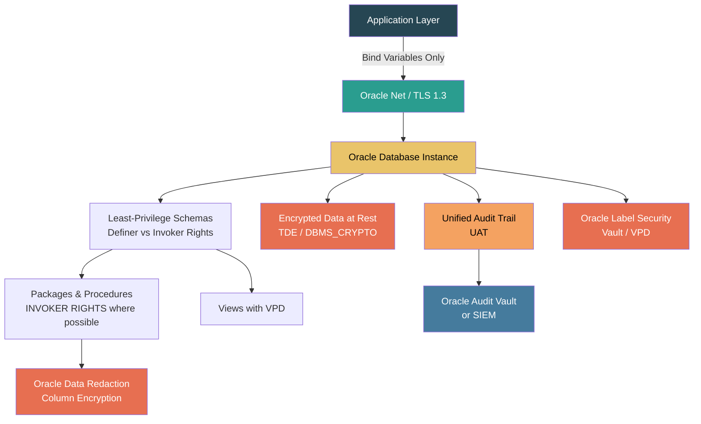
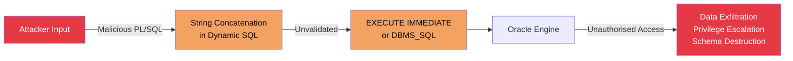
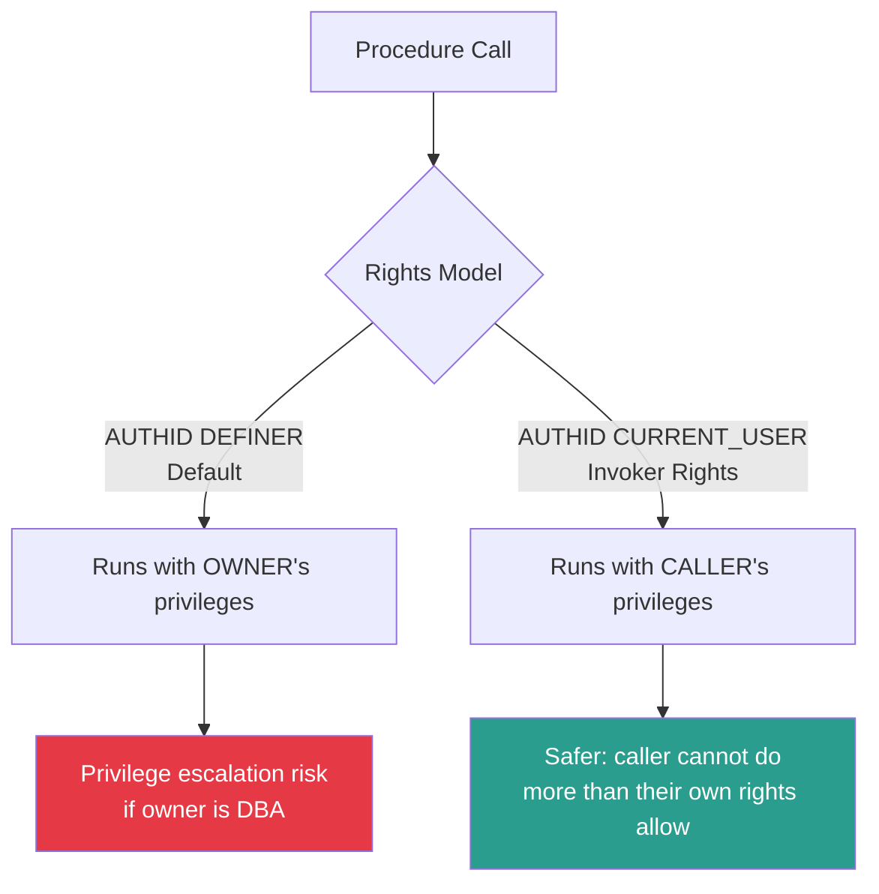
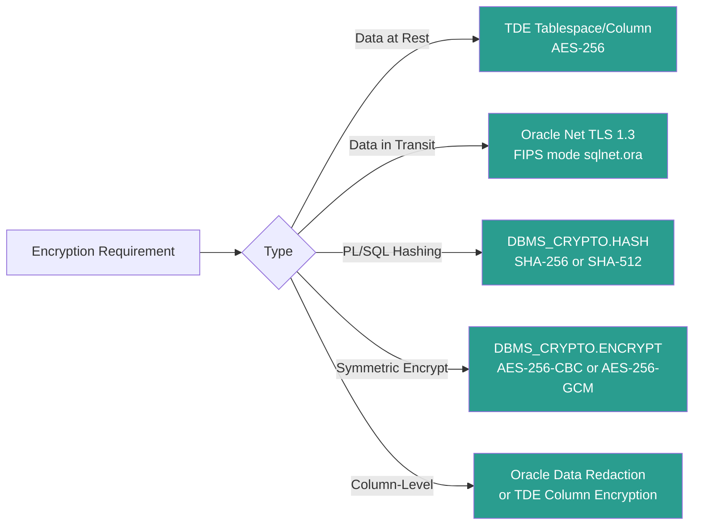
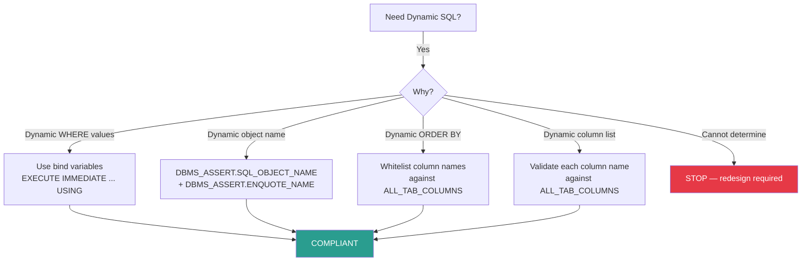

# PL/SQL Security Best Practices Guide

**Document Reference:** SBP-PLSQL-SEC-001  
**Version:** 1.0.0  
**Classification:** OFFICIAL – SENSITIVE  
**Date:** 2026-03-23  
**Author:** SecureByPolicy Standards Authority  
**Review Cycle:** Annual (or upon major standard revision)

---

## Standards Cross-Reference

| Standard | Version | Reference Date |
|---|---|---|
| NIST Cybersecurity Framework | CSF 2.0 | February 26, 2024 |
| NIST SP 800-53 | Rev. 5 (updated Aug 2025) | August 2025 |
| OWASP Top 10 | 2025 (confirmed Jan 2026) | January 2026 |
| DISA STIG Oracle Database 19c | V1R4 | Released January 5, 2026 |
| CIS Oracle Database 23ai Benchmark | v1.1.0 | September 2025 |
| CIS Oracle Database 19c Benchmark | v1.1.0 | Current |
| FIPS 140-3 | Current | Supersedes FIPS 140-2 |

> **Sources:**  
> - NIST CSF 2.0: https://www.nist.gov/cyberframework  
> - NIST SP 800-53 Rev. 5: https://csrc.nist.gov/publications/detail/sp/800-53/rev-5/final  
> - OWASP Top 10:2025: https://owasp.org/Top10/2025/  
> - DISA STIG Oracle 19c V1R4: https://cyber.trackr.live/stig/Oracle_Database_19c/1/4  
> - DISA STIG downloads: https://public.cyber.mil/stigs/  
> - NCP Oracle 19c Checklist: https://ncp.nist.gov/checklist/1275  
> - CIS Oracle Benchmarks: https://www.cisecurity.org/benchmark/oracle_database  
> - FIPS 140-3: https://csrc.nist.gov/publications/detail/fips/140/3/final  
> - Oracle DBSAT 4.0 (STIG-referenced tool): https://blogs.oracle.com/database/dbsat40

---

## Table of Contents

1. [Document Purpose and Scope](#1-document-purpose-and-scope)
2. [Compliance Framework Summary](#2-compliance-framework-summary)
3. [SQL Injection Prevention in PL/SQL](#3-sql-injection-prevention-in-plsql)
4. [Authentication and Authorisation](#4-authentication-and-authorisation)
5. [Least Privilege and Role-Based Access Control](#5-least-privilege-and-role-based-access-control)
6. [Stored Procedures, Packages, and Defensive Coding](#6-stored-procedures-packages-and-defensive-coding)
7. [Data Encryption and Cryptographic Standards](#7-data-encryption-and-cryptographic-standards)
8. [Unified Auditing and Logging](#8-unified-auditing-and-logging)
9. [Error Handling and Information Disclosure](#9-error-handling-and-information-disclosure)
10. [Dynamic SQL Controls](#10-dynamic-sql-controls)
11. [Schema and Object Security](#11-schema-and-object-security)
12. [Database Links and External Access](#12-database-links-and-external-access)
13. [Sensitive Data Handling](#13-sensitive-data-handling)
14. [Oracle Database Configuration Hardening](#14-oracle-database-configuration-hardening)
15. [Compliance Checklist](#15-compliance-checklist)
16. [Appendix A: CWE Reference Table](#appendix-a-cwe-reference-table)
17. [Appendix B: DISA STIG Oracle 19c V1R4 Control Mapping](#appendix-b-disa-stig-oracle-19c-v1r4-control-mapping)
18. [Document Control](#document-control)

---

## 1. Document Purpose and Scope

### 1.1 Purpose

This guide establishes mandatory PL/SQL security practices for development teams building or maintaining database-tier logic in Oracle Database environments. It serves as both a development reference and a compliance checklist aligned to UK Government, US Federal, and international security standards.

PL/SQL presents unique security challenges relative to other languages: its tight integration with the Oracle kernel means that poorly written code can escalate privileges, bypass access controls, or expose data at the database engine level — attacks that application-layer controls cannot prevent.

### 1.2 Scope

This document applies to:

- All PL/SQL code: stored procedures, functions, packages, triggers, types, and anonymous blocks
- Oracle Database versions: 12c, 19c, and 21c/23ai
- Deployment environments: on-premises, hybrid, air-gapped, and UK/US government classified networks
- Development and operational teams handling data at any classification level

### 1.3 Document Audience

| Audience | Usage |
|---|---|
| PL/SQL Developers | Primary reference for secure coding |
| Database Administrators (DBAs) | Configuration hardening and audit |
| Security Engineers | Compliance assessment and gap analysis |
| Technical Architects | Design review and pattern validation |
| Compliance Officers | Audit evidence and traceability |

### 1.4 Security Architecture Overview



---

## 2. Compliance Framework Summary

### 2.1 NIST CSF 2.0 Functions Addressed

| CSF 2.0 Function | Relevant PL/SQL Controls |
|---|---|
| **GV (Govern)** | Definer/invoker rights policy; package security standards; code signing policy |
| **ID (Identify)** | Schema cataloguing; data classification; DBA_OBJECTS inventory |
| **PR (Protect)** | GRANT/REVOKE controls; VPD; TDE; bind variables; invoker rights |
| **DE (Detect)** | Unified Audit Policy; DBMS_FGA (Fine-Grained Auditing); DDL triggers |
| **RS (Respond)** | Audit trail integrity; flashback for data recovery; transaction control |
| **RC (Recover)** | RMAN encrypted backups; flashback database; undo management |

### 2.2 OWASP Top 10:2025 Mapping

| OWASP 2025 Category | PL/SQL Relevance | Primary Controls |
|---|---|---|
| A01 – Broken Access Control | Schema and row-level access | VPD; Oracle Label Security; GRANT/REVOKE |
| A02 – Security Misconfiguration | Default Oracle accounts, open privileges | CIS hardening; DEFAULT passwords; PROFILE |
| A03 – Software Supply Chain Failures | External Java/C procedures | Restrict EXTPROC; library signing |
| A04 – Cryptographic Failures | Weak algorithms via DBMS_CRYPTO | AES-256; SHA-256+; TLS 1.3 |
| A05 – Injection | PL/SQL injection via dynamic SQL | Bind variables; DBMS_ASSERT; whitelist validation |
| A06 – Insecure Design | Definer rights overuse; excessive PUBLIC grants | Invoker rights; schema separation |
| A07 – Authentication Failures | Weak Oracle profiles; DEFAULT passwords | PASSWORD_VERIFY_FUNCTION; profile limits |
| A08 – Data Integrity Failures | Unsigned packages; privilege escalation | Code signing; DDL triggers |
| A09 – Security Logging Failures | Missing Unified Audit policies | Unified Audit; DBMS_FGA; AUDIT_TRAIL |
| A10 – Mishandling of Exceptional Conditions | Bare EXCEPTION WHEN OTHERS | Structured exception handling; DBMS_UTILITY |

### 2.3 DISA STIG Oracle Database 19c V1R4 (Released January 2026) Key Requirements

| STIG Vuln ID | NIST Control | Requirement Summary | Severity |
|---|---|---|---|
| V-270495 | AC-10 | Limit concurrent sessions per account | Medium |
| V-270496 | AC-2 | Automate account management | Medium |
| V-270500 | AU-2 | Define auditable events | Medium |
| V-270504 | AU-3 | Audit records must identify the source user | Medium |
| V-270510 | IA-5 | Password management must use verification function | High |
| V-270515 | SC-8 | Encrypt data in transit (TLS) | High |
| V-270520 | CM-6 | Use DBSAT to assess security posture | Medium |
| V-270525 | AC-3 | Application accounts must follow least privilege | High |
| V-270530 | AU-9 | Protect audit tools from modification | High |
| V-270535 | SC-28 | Encrypt data at rest (TDE) | High |

### 2.4 FIPS 140-3 Cryptographic Requirements in Oracle

FIPS 140-3 is enforced in Oracle via:

- Oracle Advanced Security Option (ASO) operating in FIPS mode
- `SQLNET.FIPS_140` = `TRUE` in `sqlnet.ora`
- `DBMS_CRYPTO` using only FIPS-approved algorithms

**Approved algorithms in PL/SQL (FIPS 140-3):**

| Use Case | Approved | Prohibited |
|---|---|---|
| Symmetric encryption | AES-128, AES-192, AES-256 | DES, 3DES, RC4 |
| Hashing | SHA-256, SHA-384, SHA-512 | MD4, MD5, SHA-1 |
| Asymmetric | RSA-2048+, ECDSA P-256+ | RSA < 2048, DSA < 2048 |
| MAC | HMAC-SHA-256, HMAC-SHA-512 | HMAC-MD5, HMAC-SHA-1 |

---

## 3. SQL Injection Prevention in PL/SQL

SQL injection in PL/SQL is classified under **OWASP A05:2025** and **CWE-89**. Oracle's EXECUTE IMMEDIATE and DBMS_SQL are the primary injection vectors when used with string concatenation.

### 3.1 Threat Model



### 3.2 Bind Variables — Mandatory Pattern

**NEVER** concatenate user-supplied values into SQL or PL/SQL strings.

```plsql
-- ============================================================
-- PROHIBITED: String concatenation with user input
-- CWE-89 | OWASP A05:2025 | DISA V-270525
-- ============================================================

-- BAD: Direct concatenation (DO NOT USE — injection vector)
PROCEDURE get_user_bad (p_username IN VARCHAR2) IS
    v_sql  VARCHAR2(500);
    v_result NUMBER;
BEGIN
    v_sql := 'SELECT COUNT(*) FROM users WHERE username = ''' 
              || p_username || '''';  -- INJECTION VECTOR
    EXECUTE IMMEDIATE v_sql INTO v_result;
END;

-- ============================================================
-- REQUIRED: Bind variables via EXECUTE IMMEDIATE
-- ============================================================

-- GOOD: Bind variable (no injection possible)
PROCEDURE get_user_safe (p_username IN VARCHAR2) IS
    v_result NUMBER;
BEGIN
    EXECUTE IMMEDIATE
        'SELECT COUNT(*) FROM app.users WHERE username = :1'
    INTO v_result
    USING p_username;   -- Bind variable: value never interpreted as SQL
END;
```

### 3.3 Static SQL — Preferred Over Dynamic

Static SQL processed at compile time is the most secure form. Use it whenever the query structure is fixed:

```plsql
-- ============================================================
-- PREFERRED: Static SQL (compile-time binding)
-- NIST SI-10 | CIS Oracle Benchmark Level 2
-- ============================================================

CREATE OR REPLACE PROCEDURE app.usp_get_order_by_id (
    p_order_id  IN  app.orders.order_id%TYPE,
    p_result    OUT SYS_REFCURSOR
)
AUTHID DEFINER
AS
BEGIN
    -- Input validation
    IF p_order_id IS NULL OR p_order_id <= 0 THEN
        RAISE_APPLICATION_ERROR(-20001, 'Invalid order identifier.');
    END IF;

    -- Static SQL: compiled and parsed at creation time
    -- No injection possible regardless of p_order_id value
    OPEN p_result FOR
        SELECT
            o.order_id,
            o.order_date,
            o.total_amount,
            o.order_status
        FROM app.orders o
        WHERE o.order_id   = p_order_id
          AND o.is_deleted = 'N';
END;
/
```

### 3.4 DBMS_ASSERT for Dynamic Object Names

When object names must be dynamic, use Oracle's `DBMS_ASSERT` package to validate them before use:

```plsql
-- ============================================================
-- DBMS_ASSERT for safe dynamic object names
-- OWASP A05:2025 | CWE-89 | CIS Oracle Level 2
-- ============================================================

CREATE OR REPLACE PROCEDURE app.usp_get_table_count (
    p_schema_name IN VARCHAR2,
    p_table_name  IN VARCHAR2,
    p_row_count   OUT NUMBER
)
AUTHID CURRENT_USER   -- Invoker rights: validates against caller's privileges
AS
    v_safe_schema  VARCHAR2(128);
    v_safe_table   VARCHAR2(128);
    v_sql          VARCHAR2(500);
BEGIN
    -- DBMS_ASSERT.SCHEMA_NAME: raises exception if schema does not exist
    v_safe_schema := DBMS_ASSERT.SCHEMA_NAME(p_schema_name);

    -- DBMS_ASSERT.SQL_OBJECT_NAME: raises exception if object does not exist
    v_safe_table  := DBMS_ASSERT.SQL_OBJECT_NAME(
                         UPPER(p_schema_name) || '.' || UPPER(p_table_name)
                     );

    -- DBMS_ASSERT.ENQUOTE_NAME: wraps in double quotes, escapes embedded quotes
    v_sql := 'SELECT COUNT(*) FROM '
              || DBMS_ASSERT.ENQUOTE_NAME(v_safe_schema, FALSE)
              || '.'
              || DBMS_ASSERT.ENQUOTE_NAME(UPPER(p_table_name), FALSE);

    EXECUTE IMMEDIATE v_sql INTO p_row_count;

EXCEPTION
    WHEN OTHERS THEN
        -- Object does not exist or is invalid — return null, log internally
        p_row_count := NULL;
        app.pkg_audit.log_error(
            p_proc    => 'usp_get_table_count',
            p_message => 'Invalid object reference: ' || SQLERRM
        );
END;
/
```

### 3.5 Input Validation Patterns

```plsql
-- ============================================================
-- Input validation utility package
-- NIST SI-10 | OWASP A05:2025
-- ============================================================

CREATE OR REPLACE PACKAGE app.pkg_validate AS

    -- Raise exception if value is null or empty
    PROCEDURE assert_not_null (
        p_value   IN VARCHAR2,
        p_param   IN VARCHAR2 DEFAULT 'parameter'
    );

    -- Raise exception if number outside valid range
    PROCEDURE assert_positive_integer (
        p_value   IN NUMBER,
        p_param   IN VARCHAR2 DEFAULT 'parameter'
    );

    -- Raise exception if string exceeds max length
    PROCEDURE assert_max_length (
        p_value      IN VARCHAR2,
        p_max_length IN PLS_INTEGER,
        p_param      IN VARCHAR2 DEFAULT 'parameter'
    );

    -- Validate that a string matches an allowed-list of values
    -- Never use a blocklist — always use an allowlist
    PROCEDURE assert_in_list (
        p_value       IN VARCHAR2,
        p_allowed     IN SYS.ODCIVARCHAR2LIST,
        p_param       IN VARCHAR2 DEFAULT 'parameter'
    );

END pkg_validate;
/

CREATE OR REPLACE PACKAGE BODY app.pkg_validate AS

    PROCEDURE assert_not_null (p_value IN VARCHAR2, p_param IN VARCHAR2 DEFAULT 'parameter') IS
    BEGIN
        IF p_value IS NULL OR TRIM(p_value) IS NULL THEN
            RAISE_APPLICATION_ERROR(-20100, p_param || ' cannot be null or empty.');
        END IF;
    END;

    PROCEDURE assert_positive_integer (p_value IN NUMBER, p_param IN VARCHAR2 DEFAULT 'parameter') IS
    BEGIN
        IF p_value IS NULL OR p_value <= 0 OR p_value != TRUNC(p_value) THEN
            RAISE_APPLICATION_ERROR(-20101, p_param || ' must be a positive integer.');
        END IF;
    END;

    PROCEDURE assert_max_length (p_value IN VARCHAR2, p_max_length IN PLS_INTEGER, p_param IN VARCHAR2 DEFAULT 'parameter') IS
    BEGIN
        IF p_value IS NOT NULL AND LENGTH(p_value) > p_max_length THEN
            RAISE_APPLICATION_ERROR(-20102, p_param || ' exceeds maximum length of ' || p_max_length || '.');
        END IF;
    END;

    PROCEDURE assert_in_list (p_value IN VARCHAR2, p_allowed IN SYS.ODCIVARCHAR2LIST, p_param IN VARCHAR2 DEFAULT 'parameter') IS
        v_found BOOLEAN := FALSE;
    BEGIN
        FOR i IN 1 .. p_allowed.COUNT LOOP
            IF UPPER(p_value) = UPPER(p_allowed(i)) THEN
                v_found := TRUE;
                EXIT;
            END IF;
        END LOOP;
        IF NOT v_found THEN
            RAISE_APPLICATION_ERROR(-20103, p_param || ' contains an invalid value.');
        END IF;
    END;

END pkg_validate;
/
```

---

## 4. Authentication and Authorisation

### 4.1 Password Profile Controls

**DISA STIG V-270510 | CIS Oracle Level 2 | NIST IA-5**

All Oracle user accounts must be governed by a security profile that enforces password complexity, expiry, and lockout:

```plsql
-- ============================================================
-- Secure password verification function (Oracle 19c+)
-- NIST IA-5 | CIS Oracle Level 2 | DISA V-270510
-- ============================================================

-- Oracle ships ora12c_strong_verify_function — use it
-- or create a custom function meeting these minimums:
--   Length >= 12
--   Mixed case + digits + special characters
--   Cannot reuse last 10 passwords
--   Cannot contain username or database name

CREATE OR REPLACE FUNCTION app.f_password_verify_secure (
    p_username       IN VARCHAR2,
    p_new_password   IN VARCHAR2,
    p_old_password   IN VARCHAR2
) RETURN BOOLEAN
AS
    v_min_length   CONSTANT PLS_INTEGER := 15; -- Government minimum
    v_has_upper    BOOLEAN := FALSE;
    v_has_lower    BOOLEAN := FALSE;
    v_has_digit    BOOLEAN := FALSE;
    v_has_special  BOOLEAN := FALSE;
BEGIN
    -- Length check
    IF LENGTH(p_new_password) < v_min_length THEN
        RAISE_APPLICATION_ERROR(-20001,
            'Password must be at least ' || v_min_length || ' characters.');
    END IF;

    -- Username check (case-insensitive)
    IF INSTR(UPPER(p_new_password), UPPER(p_username)) > 0 THEN
        RAISE_APPLICATION_ERROR(-20002, 'Password cannot contain the username.');
    END IF;

    -- Database name check
    IF INSTR(UPPER(p_new_password), UPPER(ORA_DATABASE_NAME)) > 0 THEN
        RAISE_APPLICATION_ERROR(-20003, 'Password cannot contain the database name.');
    END IF;

    -- Character complexity checks
    FOR i IN 1 .. LENGTH(p_new_password) LOOP
        DECLARE v_c VARCHAR2(1) := SUBSTR(p_new_password, i, 1);
        BEGIN
            IF v_c BETWEEN 'A' AND 'Z' THEN v_has_upper  := TRUE; END IF;
            IF v_c BETWEEN 'a' AND 'z' THEN v_has_lower  := TRUE; END IF;
            IF v_c BETWEEN '0' AND '9' THEN v_has_digit  := TRUE; END IF;
            IF v_c IN ('!','@','#','$','%','^','&','*','(',')','-','_','+','=') THEN
                v_has_special := TRUE;
            END IF;
        END;
    END LOOP;

    IF NOT (v_has_upper AND v_has_lower AND v_has_digit AND v_has_special) THEN
        RAISE_APPLICATION_ERROR(-20004,
            'Password must contain uppercase, lowercase, digit, and special character.');
    END IF;

    RETURN TRUE;
END;
/

-- Create a compliant security profile
CREATE PROFILE secure_app_profile LIMIT
    FAILED_LOGIN_ATTEMPTS      5,        -- Lock after 5 failures
    PASSWORD_LOCK_TIME         1/24,     -- Lock for 1 hour (fraction of day)
    PASSWORD_LIFE_TIME         90,       -- Expire after 90 days
    PASSWORD_REUSE_TIME        365,      -- Cannot reuse for 1 year
    PASSWORD_REUSE_MAX         10,       -- Cannot reuse last 10 passwords
    PASSWORD_GRACE_TIME        7,        -- 7-day warning period
    PASSWORD_VERIFY_FUNCTION   app.f_password_verify_secure,
    SESSIONS_PER_USER          5,        -- DISA V-270495: limit concurrent sessions
    IDLE_TIME                  30,       -- Disconnect idle sessions after 30 min
    CONNECT_TIME               480;      -- Maximum 8-hour session

-- Apply to all non-system accounts
-- ALTER USER app_service_account PROFILE secure_app_profile;
```

### 4.2 Default Account Audit

```plsql
-- ============================================================
-- Identify accounts with default or expired-never passwords
-- CIS Oracle Level 2 | DISA STIG | NIST IA-5
-- ============================================================

SELECT
    u.username,
    u.account_status,
    u.password_versions,
    u.profile,
    u.created,
    u.expiry_date,
    CASE
        WHEN u.password_versions LIKE '%10G%' THEN 'NON-COMPLIANT: Legacy 10G hash present'
        WHEN u.account_status = 'OPEN'
             AND u.expiry_date IS NULL   THEN 'REVIEW: No password expiry'
        ELSE 'OK'
    END AS compliance_note
FROM dba_users u
WHERE u.username NOT IN (
    -- Known Oracle-managed system accounts
    'SYS','SYSTEM','DBSNMP','APPQOSSYS','DBSFWUSER',
    'GGSYS','ANONYMOUS','CTXSYS','DVSYS','DVF',
    'GSMADMIN_INTERNAL','MDSYS','OLAPSYS','ORDSYS',
    'OUTLN','REMOTE_SCHEDULER_AGENT','SI_INFORMTN_SCHEMA',
    'SYS$UMF','SYSBACKUP','SYSDG','SYSKM','SYSRAC',
    'WMSYS','XDB','XS$NULL','AUDSYS','OJVMSYS',
    'LBACSYS','DVSYS','ORDPLUGINS','ORDDATA',
    'APEX_PUBLIC_USER'
)
ORDER BY u.account_status, u.username;
```

### 4.3 Privilege Review Query

```plsql
-- ============================================================
-- Audit system privileges — identify over-privileged accounts
-- NIST AC-6 | CIS Oracle Level 2
-- ============================================================

-- Users with ANY system privilege (highly dangerous)
SELECT grantee, privilege, admin_option
FROM   dba_sys_privs
WHERE  privilege LIKE '%ANY%'
  AND  grantee NOT IN ('SYS','DBA','DATAPUMP_EXP_FULL_DATABASE',
                        'DATAPUMP_IMP_FULL_DATABASE','IMP_FULL_DATABASE',
                        'EXP_FULL_DATABASE')
ORDER BY grantee, privilege;

-- Users granted DBA role
SELECT grantee, granted_role, admin_option, default_role
FROM   dba_role_privs
WHERE  granted_role = 'DBA'
  AND  grantee NOT IN ('SYS','SYSTEM')
ORDER BY grantee;
```

---

## 5. Least Privilege and Role-Based Access Control

### 5.1 Definer Rights vs Invoker Rights

This is one of the most critical PL/SQL security decisions. It controls which user's privileges are used when a procedure executes.



```plsql
-- ============================================================
-- AUTHID CURRENT_USER (Invoker Rights) — preferred for
-- general utility procedures accessed by multiple users
-- NIST AC-3 | OWASP A06:2025 | CIS Oracle Level 2
-- ============================================================

-- RISKY: Definer rights — caller inherits owner's full privileges
CREATE OR REPLACE PROCEDURE risky_proc
AUTHID DEFINER  -- DEFAULT — runs as the procedure owner
AS BEGIN
    -- If owner is DBA, any caller temporarily gains DBA access here
    NULL;
END;

-- SAFER: Invoker rights — caller uses only their own privileges
CREATE OR REPLACE PROCEDURE app.usp_get_my_records (
    p_results OUT SYS_REFCURSOR
)
AUTHID CURRENT_USER   -- Caller's privileges only
AS
BEGIN
    -- If caller cannot SELECT on app.records, this will fail appropriately
    OPEN p_results FOR
        SELECT record_id, record_data
        FROM   app.records
        WHERE  owner_user = SYS_CONTEXT('USERENV', 'SESSION_USER');
END;
/

-- NOTE: Use AUTHID DEFINER ONLY when the procedure MUST perform
--       privileged operations on behalf of a less-privileged caller,
--       and the privilege is explicitly documented and justified.
```

### 5.2 Schema Separation Pattern

```plsql
-- ============================================================
-- Schema separation: data owner vs application schema
-- NIST AC-3, AC-6 | CIS Oracle Level 2
-- ============================================================

-- Pattern:
--   DATA_OWNER schema  — owns tables, grants no direct access
--   APP_SCHEMA         — owns procedures, granted access to data owner tables
--   APP_ROLE           — granted EXECUTE on app procedures only
--   All application users — assigned APP_ROLE, no direct table access

-- Step 1: Data owner grants to app schema
GRANT SELECT, INSERT, UPDATE ON data_owner.orders     TO app_schema;
GRANT SELECT, INSERT, UPDATE ON data_owner.customers   TO app_schema;
-- Note: DELETE only where explicitly required and justified

-- Step 2: App schema creates wrappers
CREATE OR REPLACE PROCEDURE app_schema.usp_get_order (
    p_order_id IN NUMBER,
    p_result   OUT SYS_REFCURSOR
)
AUTHID DEFINER   -- Runs as app_schema, which has data grants
AS
BEGIN
    app.pkg_validate.assert_positive_integer(p_order_id, 'p_order_id');
    OPEN p_result FOR
        SELECT * FROM data_owner.orders WHERE order_id = p_order_id;
END;
/

-- Step 3: Grant execute only (not table access) to application role
GRANT EXECUTE ON app_schema.usp_get_order TO app_role;

-- Step 4: Revoke direct table access from all non-owner users
REVOKE SELECT, INSERT, UPDATE, DELETE ON data_owner.orders FROM PUBLIC;
REVOKE SELECT, INSERT, UPDATE, DELETE ON data_owner.orders FROM app_user;
```

### 5.3 Virtual Private Database (VPD)

```plsql
-- ============================================================
-- VPD (Oracle Fine-Grained Access Control) for row-level security
-- NIST AC-3(3) | OWASP A01:2025 | CIS Oracle Level 2
-- ============================================================

-- Policy function: restricts each user to their own tenant
CREATE OR REPLACE FUNCTION app.fn_tenant_policy (
    p_schema IN VARCHAR2,
    p_object IN VARCHAR2
) RETURN VARCHAR2
AS
    v_tenant_id NUMBER;
BEGIN
    -- Read tenant from application context (set at login)
    v_tenant_id := SYS_CONTEXT('APP_CTX', 'TENANT_ID');

    -- System accounts bypass VPD
    IF SYS_CONTEXT('USERENV', 'SESSION_USER') IN ('SYS', 'SYSTEM', 'APP_ADMIN') THEN
        RETURN NULL;  -- No restriction
    END IF;

    IF v_tenant_id IS NULL THEN
        -- No tenant context — deny all rows
        RETURN '1=0';
    END IF;

    RETURN 'tenant_id = ' || v_tenant_id;
END;
/

-- Apply VPD policy to the orders table
BEGIN
    DBMS_RLS.ADD_POLICY (
        object_schema    => 'DATA_OWNER',
        object_name      => 'ORDERS',
        policy_name      => 'TENANT_ISOLATION',
        function_schema  => 'APP',
        policy_function  => 'FN_TENANT_POLICY',
        statement_types  => 'SELECT, INSERT, UPDATE, DELETE',
        update_check     => TRUE,   -- Enforce on UPDATE too
        enable           => TRUE,
        policy_type      => DBMS_RLS.SHARED_CONTEXT_SENSITIVE
    );
END;
/

-- Set application context at session start (from application layer)
-- EXEC DBMS_SESSION.SET_CONTEXT('APP_CTX', 'TENANT_ID', 42);
```

---

## 6. Stored Procedures, Packages, and Defensive Coding

### 6.1 Standard Secure Package Template

```plsql
-- ============================================================
-- Secure Package Template
-- All production PL/SQL packages must follow this pattern
-- NIST SI-10, AC-3 | CIS Oracle Level 2 | DISA STIG
-- ============================================================

-- Package Specification
CREATE OR REPLACE PACKAGE app.pkg_orders AS

    -- Public API — only expose what is needed
    PROCEDURE create_order (
        p_customer_id  IN  NUMBER,
        p_amount       IN  NUMBER,
        p_order_id     OUT NUMBER
    );

    PROCEDURE get_order_status (
        p_order_id  IN  NUMBER,
        p_status    OUT VARCHAR2
    );

    -- Private implementation procedures are NOT declared here
    -- They are only visible within the package body

END pkg_orders;
/

-- Package Body
CREATE OR REPLACE PACKAGE BODY app.pkg_orders AS

    -- --------------------------------------------------------
    -- PRIVATE: Internal audit logger (not in spec)
    -- --------------------------------------------------------
    PROCEDURE p_log_audit (
        p_action  IN VARCHAR2,
        p_entity  IN VARCHAR2,
        p_detail  IN VARCHAR2 DEFAULT NULL
    ) IS
        PRAGMA AUTONOMOUS_TRANSACTION;  -- Write audit without affecting main TX
    BEGIN
        INSERT INTO app.audit_log (
            log_time, session_user, action, entity, detail
        ) VALUES (
            SYSTIMESTAMP,
            SYS_CONTEXT('USERENV','SESSION_USER'),
            p_action, p_entity, p_detail
        );
        COMMIT;
    EXCEPTION
        WHEN OTHERS THEN
            NULL;  -- Never let audit failure break application flow
    END;

    -- --------------------------------------------------------
    -- PUBLIC: Create Order
    -- --------------------------------------------------------
    PROCEDURE create_order (
        p_customer_id  IN  NUMBER,
        p_amount       IN  NUMBER,
        p_order_id     OUT NUMBER
    )
    IS
    BEGIN
        -- Input validation
        app.pkg_validate.assert_positive_integer(p_customer_id, 'p_customer_id');

        IF p_amount IS NULL OR p_amount <= 0 OR p_amount > 999999.99 THEN
            RAISE_APPLICATION_ERROR(-20010, 'Order amount is outside acceptable range.');
        END IF;

        -- Business logic
        INSERT INTO app.orders (customer_id, amount, order_status, created_at)
        VALUES (p_customer_id, p_amount, 'PENDING', SYSTIMESTAMP)
        RETURNING order_id INTO p_order_id;

        -- Internal audit (autonomous transaction)
        p_log_audit('CREATE_ORDER', 'ORDERS', 'order_id=' || p_order_id);

    EXCEPTION
        WHEN OTHERS THEN
            -- Log internally with detail, return generic message
            p_log_audit('CREATE_ORDER_ERROR', 'ORDERS',
                        'customer_id=' || p_customer_id || ' err=' || SQLERRM);
            RAISE_APPLICATION_ERROR(-20099,
                'Order creation failed. Contact your administrator.');
    END;

    -- --------------------------------------------------------
    -- PUBLIC: Get Order Status
    -- --------------------------------------------------------
    PROCEDURE get_order_status (
        p_order_id  IN  NUMBER,
        p_status    OUT VARCHAR2
    ) IS
    BEGIN
        app.pkg_validate.assert_positive_integer(p_order_id, 'p_order_id');

        SELECT order_status
        INTO   p_status
        FROM   app.orders
        WHERE  order_id   = p_order_id
          AND  is_deleted = 'N';

    EXCEPTION
        WHEN NO_DATA_FOUND THEN
            -- Do not reveal existence or non-existence
            p_status := NULL;
        WHEN OTHERS THEN
            p_log_audit('GET_STATUS_ERROR', 'ORDERS',
                        'order_id=' || p_order_id || ' err=' || SQLERRM);
            RAISE_APPLICATION_ERROR(-20099, 'Status retrieval failed.');
    END;

END pkg_orders;
/
```

### 6.2 WRAP Utility for Code Obfuscation

```plsql
-- ============================================================
-- Oracle WRAP: obfuscate package bodies containing sensitive logic
-- NIST SC-28 | CIS Oracle Level 2
-- IMPORTANT: WRAP is obfuscation, NOT encryption.
--            Source MUST be maintained in version control.
-- ============================================================

-- Run from command line (not inside SQL*Plus):
-- wrap iname=pkg_orders_body.sql oname=pkg_orders_body_wrapped.plb

-- Or use DBMS_DDL.WRAP for programmatic wrapping:
DECLARE
    v_source CLOB := '
        CREATE OR REPLACE PACKAGE BODY app.pkg_sensitive AS
            -- package body content
        END;
    ';
BEGIN
    DBMS_DDL.CREATE_WRAPPED(v_source);
END;
/

-- Verify package is wrapped
SELECT object_name, object_type, status
FROM   user_objects
WHERE  object_type IN ('PACKAGE BODY')
  AND  object_name = 'PKG_SENSITIVE';
-- View pkg source to confirm it is wrapped:
-- SELECT text FROM dba_source WHERE name = 'PKG_SENSITIVE' AND type = 'PACKAGE BODY';
```

---

## 7. Data Encryption and Cryptographic Standards

### 7.1 Approved Algorithms (FIPS 140-3)



### 7.2 Transparent Data Encryption (TDE)

```plsql
-- ============================================================
-- TDE: Encrypt tablespace at rest
-- DISA V-270535 | NIST SC-28 | FIPS 140-3
-- ============================================================

-- Step 1: Configure TDE wallet (run as SYSDBA)
-- administer key management create keystore '/opt/oracle/wallet' identified by "WalletPass!";
-- administer key management set keystore open identified by "WalletPass!";
-- administer key management set key identified by "WalletPass!" with backup;

-- Step 2: Encrypt new tablespace (AES256 is FIPS 140-3 compliant)
CREATE TABLESPACE secure_data
    DATAFILE '/opt/oracle/oradata/secure_data01.dbf' SIZE 100M
    ENCRYPTION USING 'AES256'
    DEFAULT STORAGE (ENCRYPT);

-- Step 3: Encrypt existing tablespace online (Oracle 12c+)
-- ALTER TABLESPACE existing_ts ENCRYPTION ONLINE USING 'AES256' ENCRYPT;

-- Step 4: Verify TDE status
SELECT
    ts.name            AS tablespace_name,
    et.encryptedts     AS is_encrypted,
    et.encryptionalg   AS algorithm
FROM v$tablespace ts
JOIN v$encrypted_tablespaces et ON ts.ts# = et.ts#
ORDER BY ts.name;
```

### 7.3 DBMS_CRYPTO — Approved PL/SQL Encryption

```plsql
-- ============================================================
-- DBMS_CRYPTO: FIPS 140-3 compliant encryption in PL/SQL
-- NIST SC-13, SC-28 | FIPS 140-3 | CIS Oracle Level 2
-- ============================================================

CREATE OR REPLACE PACKAGE app.pkg_crypto AS

    -- Encrypt data using AES-256-CBC (FIPS 140-3 approved)
    FUNCTION encrypt_data (
        p_plaintext  IN RAW,
        p_key        IN RAW    -- Must be 32 bytes for AES-256
    ) RETURN RAW;

    -- Decrypt data
    FUNCTION decrypt_data (
        p_ciphertext IN RAW,
        p_key        IN RAW
    ) RETURN RAW;

    -- Compute SHA-512 hash (FIPS 140-3 approved)
    FUNCTION hash_sha512 (p_data IN RAW) RETURN RAW;

    -- Compute HMAC-SHA-256 (FIPS 140-3 approved MAC)
    FUNCTION hmac_sha256 (
        p_data IN RAW,
        p_key  IN RAW
    ) RETURN RAW;

END pkg_crypto;
/

CREATE OR REPLACE PACKAGE BODY app.pkg_crypto AS

    -- AES-256 in CBC mode with PKCS5 padding
    -- DBMS_CRYPTO.ENCRYPT_AES256 = 6 (AES-256)
    -- DBMS_CRYPTO.CHAIN_CBC      = 256
    -- DBMS_CRYPTO.PAD_PKCS5      = 4096
    c_algorithm CONSTANT PLS_INTEGER :=
        DBMS_CRYPTO.ENCRYPT_AES256
        + DBMS_CRYPTO.CHAIN_CBC
        + DBMS_CRYPTO.PAD_PKCS5;

    FUNCTION encrypt_data (p_plaintext IN RAW, p_key IN RAW) RETURN RAW IS
    BEGIN
        IF p_key IS NULL OR UTIMESTAMP IS NULL THEN
            RAISE_APPLICATION_ERROR(-20200, 'Encryption key cannot be null.');
        END IF;
        IF UTL_RAW.LENGTH(p_key) <> 32 THEN
            RAISE_APPLICATION_ERROR(-20201, 'AES-256 requires a 32-byte key.');
        END IF;
        RETURN DBMS_CRYPTO.ENCRYPT(
            src => p_plaintext,
            typ => c_algorithm,
            key => p_key
        );
    END;

    FUNCTION decrypt_data (p_ciphertext IN RAW, p_key IN RAW) RETURN RAW IS
    BEGIN
        RETURN DBMS_CRYPTO.DECRYPT(
            src => p_ciphertext,
            typ => c_algorithm,
            key => p_key
        );
    EXCEPTION
        WHEN OTHERS THEN
            -- Do not expose decryption errors — they may aid oracle attacks
            RAISE_APPLICATION_ERROR(-20299, 'Decryption failed.');
    END;

    FUNCTION hash_sha512 (p_data IN RAW) RETURN RAW IS
    BEGIN
        -- DBMS_CRYPTO.HASH_SH512 = FIPS 140-3 approved
        RETURN DBMS_CRYPTO.HASH(p_data, DBMS_CRYPTO.HASH_SH512);
    END;

    FUNCTION hmac_sha256 (p_data IN RAW, p_key IN RAW) RETURN RAW IS
    BEGIN
        -- DBMS_CRYPTO.HMAC_SH256 = FIPS 140-3 approved MAC
        RETURN DBMS_CRYPTO.MAC(p_data, DBMS_CRYPTO.HMAC_SH256, p_key);
    END;

END pkg_crypto;
/
```

### 7.4 Prohibited Algorithm Audit

```plsql
-- ============================================================
-- Detect use of prohibited cryptographic algorithms in source
-- FIPS 140-3 | NIST SC-13 | OWASP A04:2025
-- ============================================================

-- Scan PL/SQL source for prohibited algorithm constants
SELECT
    owner,
    name       AS object_name,
    type       AS object_type,
    line,
    text       AS source_line
FROM dba_source
WHERE UPPER(text) LIKE '%HASH_MD4%'
   OR UPPER(text) LIKE '%HASH_MD5%'
   OR UPPER(text) LIKE '%HASH_SH1%'    -- SHA-1
   OR UPPER(text) LIKE '%ENCRYPT_DES%'
   OR UPPER(text) LIKE '%ENCRYPT_3DES%'
   OR UPPER(text) LIKE '%ENCRYPT_RC4%'
   OR UPPER(text) LIKE '%DBMS_OBFUSCATION_TOOLKIT%'  -- Deprecated, non-FIPS
ORDER BY owner, name, line;
-- Any rows returned = NON-COMPLIANT; remediation required
```

---

## 8. Unified Auditing and Logging

Oracle Unified Auditing (available from 12c R2, mandatory recommended in 19c+) replaces the legacy `AUDIT` statement and provides tamper-resistant, structured audit records.

### 8.1 Enable Unified Auditing

```plsql
-- ============================================================
-- Verify Unified Auditing is enabled
-- DISA V-270500 | NIST AU-2 | CIS Oracle Level 2
-- ============================================================

SELECT value FROM v$option WHERE parameter = 'Unified Auditing';
-- Expected: TRUE
-- If FALSE: Unified Auditing must be enabled at link time
-- (requires database restart with ORACLE_HOME/bin/oraudit relink)
```

### 8.2 Mandatory Audit Policies

```plsql
-- ============================================================
-- Unified Audit Policies — mandatory baseline
-- DISA V-270500, V-270504 | NIST AU-2, AU-3
-- ============================================================

-- Policy 1: Logon and logoff events
CREATE AUDIT POLICY pol_logon_events
    ACTIONS LOGON, LOGOFF;

ALTER AUDIT POLICY pol_logon_events CONDITION
    'SYS_CONTEXT(''USERENV'', ''SESSION_USER'') NOT IN (''SYS'')'
    EVALUATE PER SESSION;

AUDIT POLICY pol_logon_events;

-- Policy 2: Failed login attempts
CREATE AUDIT POLICY pol_failed_logins
    ACTIONS LOGON;

AUDIT POLICY pol_failed_logins WHENEVER NOT SUCCESSFUL;

-- Policy 3: Privileged DDL changes
CREATE AUDIT POLICY pol_ddl_changes
    ACTIONS
        CREATE TABLE, ALTER TABLE, DROP TABLE,
        CREATE INDEX, DROP INDEX,
        CREATE PROCEDURE, ALTER PROCEDURE, DROP PROCEDURE,
        CREATE PACKAGE, ALTER PACKAGE, DROP PACKAGE,
        GRANT, REVOKE,
        CREATE USER, ALTER USER, DROP USER;

AUDIT POLICY pol_ddl_changes;

-- Policy 4: PL/SQL execution on sensitive packages
-- DISA V-270500: all program initiations must be audited
CREATE AUDIT POLICY pol_sensitive_exec
    ACTIONS EXECUTE ON app.pkg_orders,
    ACTIONS EXECUTE ON app.pkg_crypto,
    ACTIONS EXECUTE ON app.pkg_validate;

AUDIT POLICY pol_sensitive_exec;

-- Policy 5: DML on sensitive tables
CREATE AUDIT POLICY pol_sensitive_dml
    ACTIONS
        SELECT, INSERT, UPDATE, DELETE
        ON data_owner.customers,
        SELECT, INSERT, UPDATE, DELETE
        ON data_owner.payment_data,
        SELECT, INSERT, UPDATE, DELETE
        ON data_owner.personal_info;

AUDIT POLICY pol_sensitive_dml;
```

### 8.3 Fine-Grained Auditing (DBMS_FGA)

```plsql
-- ============================================================
-- Fine-Grained Auditing: audit when sensitive columns are accessed
-- NIST AU-2(4) | DISA STIG | CIS Oracle Level 2
-- ============================================================

BEGIN
    DBMS_FGA.ADD_POLICY (
        object_schema   => 'DATA_OWNER',
        object_name     => 'PERSONAL_INFO',
        policy_name     => 'FGA_NATIONAL_ID_ACCESS',
        audit_column    => 'NATIONAL_ID_NUMBER',  -- Sensitive column
        audit_condition => NULL,                   -- Always audit access
        statement_types => 'SELECT',
        audit_column_opts => DBMS_FGA.ANY_COLUMNS,
        handler_schema  => 'APP',
        handler_module  => 'PKG_AUDIT.ALERT_SENSITIVE_ACCESS',
        enable          => TRUE
    );
END;
/
```

### 8.4 Application-Level Audit Log Table

```plsql
-- ============================================================
-- Application audit table with tamper-evident design
-- NIST AU-3, AU-9 | DISA V-270530
-- ============================================================

CREATE TABLE app.audit_log (
    log_id          NUMBER          GENERATED ALWAYS AS IDENTITY PRIMARY KEY,
    log_time        TIMESTAMP(6)    DEFAULT SYSTIMESTAMP  NOT NULL,
    db_name         VARCHAR2(30)    DEFAULT ORA_DATABASE_NAME NOT NULL,
    instance_name   VARCHAR2(30)    DEFAULT SYS_CONTEXT('USERENV','INSTANCE_NAME') NOT NULL,
    session_user    VARCHAR2(128)   DEFAULT SYS_CONTEXT('USERENV','SESSION_USER') NOT NULL,
    os_user         VARCHAR2(128)   DEFAULT SYS_CONTEXT('USERENV','OS_USER'),
    host_name       VARCHAR2(256)   DEFAULT SYS_CONTEXT('USERENV','HOST') NOT NULL,
    ip_address      VARCHAR2(64)    DEFAULT SYS_CONTEXT('USERENV','IP_ADDRESS'),
    client_program  VARCHAR2(256)   DEFAULT SYS_CONTEXT('USERENV','MODULE'),
    action          VARCHAR2(100)   NOT NULL,
    entity          VARCHAR2(128)   NOT NULL,
    detail          VARCHAR2(4000),
    old_values      CLOB,           -- Before-image (JSON or XML)
    new_values      CLOB,           -- After-image (JSON or XML)
    row_hash        RAW(32)         -- SHA-256 of the log row for tamper detection
)
TABLESPACE secure_data   -- TDE-encrypted tablespace
ROW MOVEMENT DISABLE;

-- Revoke delete from all application users (audit rows must be immutable)
REVOKE DELETE ON app.audit_log FROM PUBLIC;
REVOKE UPDATE ON app.audit_log FROM PUBLIC;

-- Grant insert to internal audit procedure only (via AUTHID DEFINER package)
GRANT INSERT ON app.audit_log TO app_schema;
```

---

## 9. Error Handling and Information Disclosure

### 9.1 Secure Exception Handling Pattern

**OWASP A10:2025 | NIST SI-11 | CIS Oracle Level 2**

PL/SQL exceptions must never expose internal state (SQL error codes, line numbers, table names, column names, or stack traces) to external callers.

```plsql
-- ============================================================
-- Secure exception handling — the mandatory pattern
-- OWASP A10:2025 | NIST SI-11
-- ============================================================

CREATE OR REPLACE PROCEDURE app.usp_process_payment (
    p_order_id  IN  NUMBER,
    p_amount    IN  NUMBER
)
AUTHID DEFINER
AS
    v_order_status  VARCHAR2(20);
    v_err_code      NUMBER;
    v_err_msg       VARCHAR2(4000);
BEGIN
    -- Input validation first (never catch validation errors silently)
    app.pkg_validate.assert_positive_integer(p_order_id, 'p_order_id');

    IF p_amount IS NULL OR p_amount <= 0 THEN
        RAISE_APPLICATION_ERROR(-20010, 'Payment amount must be positive.');
    END IF;

    -- Business logic
    SELECT order_status INTO v_order_status
    FROM   app.orders
    WHERE  order_id = p_order_id
      AND  is_deleted = 'N';

    -- State validation
    IF v_order_status != 'PENDING' THEN
        RAISE_APPLICATION_ERROR(-20011, 'Order is not in a payable state.');
    END IF;

    UPDATE app.orders
    SET    order_status   = 'PROCESSING',
           payment_amount = p_amount,
           updated_at     = SYSTIMESTAMP
    WHERE  order_id = p_order_id;

    COMMIT;

EXCEPTION
    WHEN NO_DATA_FOUND THEN
        -- Do not reveal whether order exists — return same generic message
        RAISE_APPLICATION_ERROR(-20099, 'Operation could not be completed.');

    WHEN OTHERS THEN
        ROLLBACK;
        -- Capture internal error details for administrators
        v_err_code := SQLCODE;
        v_err_msg  := SUBSTR(SQLERRM, 1, 4000);

        -- Internal log via autonomous transaction
        BEGIN
            INSERT INTO app.audit_log (action, entity, detail)
            VALUES ('PAYMENT_ERROR', 'ORDERS',
                    'order_id=' || p_order_id
                    || ' errcode=' || v_err_code
                    || ' errmsg='  || v_err_msg);
            COMMIT;
        EXCEPTION
            WHEN OTHERS THEN NULL;  -- Audit failure must not cascade
        END;

        -- Generic message to caller — no internal details
        RAISE_APPLICATION_ERROR(-20099,
            'Payment processing failed. Reference error log for details.');
END;
/
```

### 9.2 Prohibited Exception Patterns

```plsql
-- ============================================================
-- PROHIBITED exception patterns
-- ============================================================

-- BAD: Exposes SQLERRM to caller (reveals schema, object names)
EXCEPTION WHEN OTHERS THEN
    RAISE_APPLICATION_ERROR(-20001, SQLERRM);  -- NEVER DO THIS

-- BAD: Empty catch — silently swallows errors (fail-open)
EXCEPTION WHEN OTHERS THEN
    NULL;   -- NEVER for business logic (OK only in audit logger)

-- BAD: Re-raise with RAISE (propagates original Oracle error with object names)
EXCEPTION WHEN OTHERS THEN
    RAISE;  -- May expose internal object names in error message

-- BAD: DBMS_OUTPUT in production procedures (visible in some clients)
EXCEPTION WHEN OTHERS THEN
    DBMS_OUTPUT.PUT_LINE('Error: ' || SQLERRM);  -- NEVER in production

-- BAD: UTL_FILE logging without access controls (file-based information leakage)
-- Only use UTL_FILE if the target directory has restricted OS permissions
```

---

## 10. Dynamic SQL Controls

### 10.1 Safe Dynamic SQL Decision Tree



### 10.2 DBMS_SQL for Complex Dynamic Queries

```plsql
-- ============================================================
-- DBMS_SQL for complex dynamic queries with bind variables
-- OWASP A05:2025 | CWE-89
-- ============================================================

CREATE OR REPLACE PROCEDURE app.usp_search_orders_dynamic (
    p_status       IN VARCHAR2,
    p_customer_id  IN NUMBER DEFAULT NULL,
    p_date_from    IN DATE   DEFAULT NULL,
    p_date_to      IN DATE   DEFAULT NULL,
    p_results      OUT SYS_REFCURSOR
)
AUTHID DEFINER
AS
    v_cursor    INTEGER;
    v_sql       CLOB;
    v_result    INTEGER;

    -- Whitelist for status values
    c_valid_statuses CONSTANT SYS.ODCIVARCHAR2LIST :=
        SYS.ODCIVARCHAR2LIST('PENDING','PROCESSING','COMPLETE','CANCELLED');
BEGIN
    -- Validate status against whitelist
    app.pkg_validate.assert_in_list(p_status, c_valid_statuses, 'p_status');

    -- Build query with bind variables only — no concatenated values
    v_sql := 'SELECT order_id, order_date, total_amount, order_status
              FROM app.orders
              WHERE order_status = :p_status
                AND is_deleted   = ''N''';

    -- Conditionally add predicates — only for known safe column names
    IF p_customer_id IS NOT NULL THEN
        app.pkg_validate.assert_positive_integer(p_customer_id, 'p_customer_id');
        v_sql := v_sql || ' AND customer_id = :p_cust_id';
    END IF;

    IF p_date_from IS NOT NULL THEN
        v_sql := v_sql || ' AND order_date >= :p_date_from';
    END IF;

    IF p_date_to IS NOT NULL THEN
        v_sql := v_sql || ' AND order_date <= :p_date_to';
    END IF;

    v_sql := v_sql || ' ORDER BY order_date DESC';

    -- Use DBMS_SQL for full bind variable control
    v_cursor := DBMS_SQL.OPEN_CURSOR;
    DBMS_SQL.PARSE(v_cursor, v_sql, DBMS_SQL.NATIVE);

    -- Bind all values as typed parameters (injection-proof)
    DBMS_SQL.BIND_VARIABLE(v_cursor, ':p_status', p_status);

    IF p_customer_id IS NOT NULL THEN
        DBMS_SQL.BIND_VARIABLE(v_cursor, ':p_cust_id', p_customer_id);
    END IF;

    IF p_date_from IS NOT NULL THEN
        DBMS_SQL.BIND_VARIABLE(v_cursor, ':p_date_from', p_date_from);
    END IF;

    IF p_date_to IS NOT NULL THEN
        DBMS_SQL.BIND_VARIABLE(v_cursor, ':p_date_to', p_date_to);
    END IF;

    -- Convert to REF CURSOR for caller
    p_results := DBMS_SQL.TO_REFCURSOR(v_cursor);

EXCEPTION
    WHEN OTHERS THEN
        IF DBMS_SQL.IS_OPEN(v_cursor) THEN
            DBMS_SQL.CLOSE_CURSOR(v_cursor);
        END IF;
        RAISE_APPLICATION_ERROR(-20099, 'Search operation failed.');
END;
/
```

---

## 11. Schema and Object Security

### 11.1 PUBLIC Synonym and Grant Audit

```plsql
-- ============================================================
-- Audit PUBLIC grants and synonyms — high risk if overused
-- NIST AC-6 | CIS Oracle Level 2
-- ============================================================

-- Find objects granted to PUBLIC
SELECT
    grantee,
    owner,
    table_name      AS object_name,
    privilege,
    grantable
FROM dba_tab_privs
WHERE grantee = 'PUBLIC'
  AND owner NOT IN ('SYS','SYSTEM','OUTLN','MDSYS','CTXSYS','XDB',
                     'WMSYS','EXFSYS','DBSNMP','APEX_PUBLIC_USER')
ORDER BY owner, table_name;
-- Review all rows — PUBLIC grants should be minimal

-- Find PUBLIC synonyms pointing to application objects
SELECT
    ps.synonym_name,
    ps.table_owner,
    ps.table_name,
    ps.db_link
FROM dba_synonyms ps
WHERE ps.owner = 'PUBLIC'
  AND ps.table_owner NOT IN ('SYS','SYSTEM','OUTLN','MDSYS','CTXSYS')
ORDER BY ps.table_owner, ps.synonym_name;
```

### 11.2 Directory Object Controls

```plsql
-- ============================================================
-- Directory objects — restrict access
-- NIST AC-3 | CIS Oracle Level 2
-- Oracle DIRECTORY objects control file system access via UTL_FILE
-- ============================================================

-- Inventory all directory objects
SELECT
    owner,
    directory_name,
    directory_path
FROM dba_directories
ORDER BY directory_name;

-- Audit who has access to directories
SELECT
    grantee,
    owner,
    table_name  AS directory_name,
    privilege
FROM dba_tab_privs
WHERE owner = 'SYS'
  AND table_name IN (SELECT directory_name FROM dba_directories)
ORDER BY table_name, grantee;
-- READ and WRITE on directories should be restricted to specific named accounts
-- Never grant to PUBLIC
```

### 11.3 Java Stored Procedures and External Procedures

```plsql
-- ============================================================
-- Java and external procedure controls — high attack surface
-- DISA STIG | NIST CM-7 | CIS Oracle Level 2
-- ============================================================

-- Audit Java permission grants
SELECT
    grantee,
    type_schema,
    type_name,
    name,
    action
FROM dba_java_policy
WHERE grantee NOT IN ('SYS','JAVA_ADMIN','JAVA_DEPLOY')
ORDER BY grantee;

-- Check for external procedure listeners (EXTPROC)
-- These should be disabled unless explicitly required
SELECT
    name,
    value
FROM v$parameter
WHERE name IN ('enable_dnfs_server', 'allow_global_dblinks');

-- Verify no EXECUTE ANY PROCEDURE is granted to application users
SELECT grantee, privilege, admin_option
FROM dba_sys_privs
WHERE privilege = 'EXECUTE ANY PROCEDURE'
  AND grantee NOT IN ('SYS','SYSTEM','DBA','EXECUTE_CATALOG_ROLE')
ORDER BY grantee;
-- Any rows = NON-COMPLIANT
```

---

## 12. Database Links and External Access

### 12.1 Database Link Audit and Control

**NIST SC-7 | CIS Oracle Level 2 | DISA STIG**

Database links (DB Links) allow SQL to traverse to remote databases. They represent a lateral movement risk and must be minimised.

```plsql
-- ============================================================
-- Audit all database links
-- NIST SC-7 | CIS Oracle Level 2
-- ============================================================

-- All DB links in the database
SELECT
    owner,
    db_link,
    username,
    host,
    created
FROM dba_db_links
ORDER BY owner, db_link;

-- Public DB links are the highest risk
SELECT db_link, username, host, created
FROM dba_db_links
WHERE owner = 'PUBLIC';
-- Any PUBLIC DB links = review required; should be owner-specific

-- Test if DB links are being used in queries
SELECT
    s.sql_text,
    s.executions,
    s.parsing_schema_name
FROM v$sql s
WHERE UPPER(s.sql_text) LIKE '%@%'   -- @ indicates DB link usage
  AND s.parsing_schema_name NOT IN ('SYS','SYSTEM')
ORDER BY s.executions DESC;
```

### 12.2 UTL_TCP, UTL_HTTP, UTL_SMTP Controls

```plsql
-- ============================================================
-- Network packages: restrict to named accounts only
-- NIST SC-7 | CIS Oracle Level 2 | DISA STIG
-- ============================================================

-- Audit who can use outbound network packages
SELECT grantee, privilege
FROM dba_tab_privs
WHERE table_name IN ('UTL_TCP','UTL_HTTP','UTL_SMTP','UTL_FILE',
                      'UTL_MAIL','DBMS_LDAP','HTTPURITYPE')
ORDER BY table_name, grantee;
-- Should be empty for PUBLIC; only named service accounts

-- If UTL_HTTP is needed: restrict via Access Control List (ACL)
BEGIN
    DBMS_NETWORK_ACL_ADMIN.CREATE_ACL (
        acl         => 'http_access.xml',
        description => 'HTTP access for ETL service',
        principal   => 'ETL_SERVICE_ACCOUNT',
        is_grant    => TRUE,
        privilege   => 'connect'
    );
    DBMS_NETWORK_ACL_ADMIN.ASSIGN_ACL (
        acl  => 'http_access.xml',
        host => 'api.internal.gov.uk',   -- Specific host only — not wildcard
        lower_port => 443,
        upper_port => 443
    );
    COMMIT;
END;
/
```

---

## 13. Sensitive Data Handling

### 13.1 Oracle Data Redaction

```plsql
-- ============================================================
-- Oracle Data Redaction (Enterprise Edition)
-- NIST SC-28 | CIS Oracle Level 2
-- NOTE: Redaction is a display control, not encryption.
--       Always use TDE/DBMS_CRYPTO for actual data protection.
-- ============================================================

BEGIN
    -- Full redaction of national ID for non-privileged users
    DBMS_REDACT.ADD_POLICY (
        object_schema       => 'DATA_OWNER',
        object_name         => 'PERSONAL_INFO',
        column_name         => 'NATIONAL_ID_NUMBER',
        policy_name         => 'REDACT_NATIONAL_ID',
        function_type       => DBMS_REDACT.FULL,
        expression          => 'SYS_CONTEXT(''USERENV'',''SESSION_USER'')
                                NOT IN (''DATA_ADMIN'', ''AUDIT_READER'')'
    );

    -- Partial redaction of phone number
    DBMS_REDACT.ADD_POLICY (
        object_schema       => 'DATA_OWNER',
        object_name         => 'PERSONAL_INFO',
        column_name         => 'PHONE_NUMBER',
        policy_name         => 'REDACT_PHONE',
        function_type       => DBMS_REDACT.PARTIAL,
        function_parameters => 'VVVVFVVVVFVVVV,VVVV-VVVV-VVVV,*,1,8',
        expression          => 'SYS_CONTEXT(''USERENV'',''SESSION_USER'')
                                NOT IN (''DATA_ADMIN'')'
    );
END;
/
```

### 13.2 Flashback Data Archive for Audit Lineage

```plsql
-- ============================================================
-- Flashback Data Archive (Total Recall)
-- Provides immutable historical record of all DML changes
-- NIST AU-9, SI-12 | CIS Oracle Level 2
-- ============================================================

-- Create a dedicated FDA tablespace
-- CREATE TABLESPACE fda_archive DATAFILE '...' ENCRYPTION USING 'AES256' ENCRYPT;

-- Create Flashback Data Archive (retain 5 years for government requirements)
CREATE FLASHBACK ARCHIVE govuk_fda
    TABLESPACE fda_archive
    QUOTA 50G
    RETENTION 1825;   -- 5 years in days (UK Government records retention)

-- Enable on sensitive tables
ALTER TABLE data_owner.personal_info    FLASHBACK ARCHIVE govuk_fda;
ALTER TABLE data_owner.financial_records FLASHBACK ARCHIVE govuk_fda;
ALTER TABLE data_owner.audit_trail      FLASHBACK ARCHIVE govuk_fda;

-- Query historical state of a record
SELECT *
FROM data_owner.personal_info
    AS OF TIMESTAMP TO_TIMESTAMP('2025-01-01 12:00:00', 'YYYY-MM-DD HH24:MI:SS')
WHERE person_id = 12345;
```

### 13.3 Sensitive Data Discovery

```plsql
-- ============================================================
-- Identify potentially sensitive data in schema
-- NIST RA-2 | CIS Oracle Level 2
-- ============================================================

-- Columns whose names suggest sensitive content
SELECT
    owner,
    table_name,
    column_name,
    data_type,
    data_length
FROM dba_tab_columns
WHERE owner NOT IN ('SYS','SYSTEM','MDSYS','CTXSYS','XDB','WMSYS',
                     'OUTLN','DBSNMP','AUDSYS','APEX_PUBLIC_USER')
  AND (
        UPPER(column_name) LIKE '%PASSWORD%'
     OR UPPER(column_name) LIKE '%PASSWD%'
     OR UPPER(column_name) LIKE '%SECRET%'
     OR UPPER(column_name) LIKE '%NATIONAL_ID%'
     OR UPPER(column_name) LIKE '%NI_NUMBER%'
     OR UPPER(column_name) LIKE '%CREDIT_CARD%'
     OR UPPER(column_name) LIKE '%CARD_NUMBER%'
     OR UPPER(column_name) LIKE '%SSN%'
     OR UPPER(column_name) LIKE '%BIOMETRIC%'
     OR UPPER(column_name) LIKE '%PASSPORT%'
  )
ORDER BY owner, table_name, column_name;
-- All results: verify column is encrypted or redacted
```

---

## 14. Oracle Database Configuration Hardening

### 14.1 Mandatory Parameter Checks

```plsql
-- ============================================================
-- Critical parameter audit
-- CIS Oracle Level 2 | DISA STIG | NIST CM-6, CM-7
-- ============================================================

SELECT
    name,
    value,
    CASE name
        WHEN 'audit_trail'              THEN CASE value WHEN 'DB,EXTENDED' THEN 'COMPLIANT' ELSE 'REVIEW REQUIRED' END
        WHEN 'audit_sys_operations'     THEN CASE value WHEN 'TRUE'       THEN 'COMPLIANT' ELSE 'NON-COMPLIANT' END
        WHEN 'os_authent_prefix'        THEN CASE value WHEN 'OPS$'       THEN 'NON-COMPLIANT' ELSE 'COMPLIANT' END
        WHEN 'remote_os_authent'        THEN CASE value WHEN 'FALSE'      THEN 'COMPLIANT' ELSE 'NON-COMPLIANT (CAT I)' END
        WHEN 'remote_os_roles'          THEN CASE value WHEN 'FALSE'      THEN 'COMPLIANT' ELSE 'NON-COMPLIANT' END
        WHEN 'sql92_security'           THEN CASE value WHEN 'TRUE'       THEN 'COMPLIANT' ELSE 'NON-COMPLIANT' END
        WHEN 'o7_dictionary_accessibility' THEN CASE value WHEN 'FALSE'   THEN 'COMPLIANT' ELSE 'NON-COMPLIANT' END
        WHEN 'utl_file_dir'             THEN CASE value WHEN ''           THEN 'COMPLIANT' ELSE 'NON-COMPLIANT: Use DIRECTORY objects' END
        WHEN 'global_names'             THEN CASE value WHEN 'TRUE'       THEN 'COMPLIANT' ELSE 'REVIEW REQUIRED' END
        ELSE 'INFORMATIONAL'
    END AS compliance_status
FROM v$parameter
WHERE name IN (
    'audit_trail',
    'audit_sys_operations',
    'os_authent_prefix',
    'remote_os_authent',
    'remote_os_roles',
    'sql92_security',
    'o7_dictionary_accessibility',
    'utl_file_dir',
    'global_names'
)
ORDER BY name;
```

### 14.2 Default Account Status Check

```plsql
-- ============================================================
-- Verify all Oracle default accounts are locked and expired
-- CIS Oracle Level 2 | DISA STIG | NIST IA-5
-- ============================================================

SELECT
    username,
    account_status,
    expiry_date,
    profile
FROM dba_users
WHERE username IN (
    -- Known Oracle-shipped accounts that must be locked
    'ANONYMOUS','APEX_PUBLIC_USER','CTXSYS','DBSNMP',
    'DIP','DVSYS','DVF','EXDSYS','FLOWS_FILES',
    'MDDATA','MDSYS','MGMT_VIEW','OJVMSYS','OLAPSYS',
    'ORDDATA','ORDSYS','ORDPLUGINS','OUTLN','OWBSYS',
    'OWBSYS_AUDIT','SCOTT','SI_INFORMTN_SCHEMA',
    'SPATIAL_CSW_ADMIN_USR','SPATIAL_WFS_ADMIN_USR',
    'SYS$UMF','SYSBACKUP','SYSDG','SYSKM','SYSRAC',
    'TSMSYS','WK_TEST','WKPROXY','WKSYS','WMSYS',
    'XDB','XS$NULL'
)
  AND account_status NOT LIKE '%LOCKED%'   -- Should all be locked
ORDER BY username;
-- Any rows = NON-COMPLIANT
```

### 14.3 Transport Encryption Verification

```plsql
-- ============================================================
-- Verify Oracle Net encryption is active
-- DISA V-270515 | NIST SC-8 | FIPS 140-3
-- ============================================================

-- Check current session encryption
SELECT
    sys_context('USERENV','NETWORK_PROTOCOL')  AS protocol,
    sys_context('USERENV','NETWORK_SERVICE_BANNER') AS encryption_banner
FROM dual;

-- Check all active sessions for encryption status
SELECT
    s.sid,
    s.serial#,
    s.username,
    s.machine,
    nc.network_service_banner
FROM v$session s
JOIN v$session_connect_info nc ON s.sid = nc.sid
WHERE nc.network_service_banner LIKE '%Encryption%'
  AND s.type = 'USER'
ORDER BY s.username;
-- Verify all non-system sessions show encryption
```

---

## 15. Compliance Checklist

### 15.1 Developer Checklist — Pre-Code Review

| # | Control | Standard | Status |
|---|---|---|---|
| 1 | All user inputs validated before use | NIST SI-10 | ☐ |
| 2 | No string concatenation with user input in EXECUTE IMMEDIATE | OWASP A05:2025 | ☐ |
| 3 | Bind variables used for all dynamic SQL values | CWE-89 | ☐ |
| 4 | DBMS_ASSERT applied to all dynamic object names | CWE-89 | ☐ |
| 5 | EXCEPTION WHEN OTHERS logs internally, returns generic message | OWASP A10:2025 | ☐ |
| 6 | No RAISE of SQLERRM to caller | NIST SI-11 | ☐ |
| 7 | AUTHID CURRENT_USER used where possible | NIST AC-3 | ☐ |
| 8 | AUTHID DEFINER use documented and justified | OWASP A06:2025 | ☐ |
| 9 | No prohibited algorithms (MD5, SHA-1, DES, RC4) | FIPS 140-3 | ☐ |
| 10 | No hardcoded credentials or secrets | NIST IA-5 | ☐ |
| 11 | Minimum permissions granted (EXECUTE only, where possible) | NIST AC-6 | ☐ |
| 12 | Sensitive columns identified and protected (TDE/Redaction) | NIST RA-2 | ☐ |
| 13 | Unified Audit policies configured for new procedures | NIST AU-2 | ☐ |
| 14 | VPD policy applied to multi-tenant or classified data | OWASP A01:2025 | ☐ |
| 15 | No EXECUTE ANY PROCEDURE or ANY TABLE privilege assigned | NIST AC-6 | ☐ |
| 16 | Private package procedures not exposed in package spec | CIS Oracle L2 | ☐ |
| 17 | AUTONOMOUS_TRANSACTION used for audit logging only | CIS Oracle L2 | ☐ |

### 15.2 DBA / Operations Hardening Checklist

| # | Control | Standard | STIG ID | Status |
|---|---|---|---|---|
| 1 | Unified Auditing enabled | CIS L2 | V-270500 | ☐ |
| 2 | All default accounts locked and expired | CIS L2 | DISA STIG | ☐ |
| 3 | REMOTE_OS_AUTHENT = FALSE | CIS L2 | DISA STIG | ☐ |
| 4 | O7_DICTIONARY_ACCESSIBILITY = FALSE | CIS L2 | DISA STIG | ☐ |
| 5 | SQL92_SECURITY = TRUE | CIS L2 | DISA STIG | ☐ |
| 6 | TDE enabled on all application tablespaces | DISA CAT I | V-270535 | ☐ |
| 7 | TLS 1.3/1.2 enforced for Oracle Net | DISA CAT I | V-270515 | ☐ |
| 8 | FIPS mode enabled in sqlnet.ora | FIPS 140-3 | — | ☐ |
| 9 | Password profiles applied to all accounts | CIS L2 | V-270510 | ☐ |
| 10 | No PUBLIC grants on application objects | NIST AC-6 | — | ☐ |
| 11 | PUBLIC DB links removed | NIST SC-7 | — | ☐ |
| 12 | UTL_HTTP/TCP/SMTP restricted via ACL | NIST SC-7 | — | ☐ |
| 13 | EXTPROC disabled unless required | CIS L2 | — | ☐ |
| 14 | UTL_FILE_DIR parameter empty (use DIRECTORY objects) | CIS L2 | — | ☐ |
| 15 | DBSAT assessment run and findings remediated | DISA | V-270520 | ☐ |

### 15.3 Periodic Review Checklist

| Frequency | Activity | Standard |
|---|---|---|
| Daily | Review failed login audit events; alert on threshold breach | NIST AU-6 |
| Weekly | Review DDL change audit trail from Unified Audit | NIST CM-3 |
| Monthly | Privilege review: DBA_SYS_PRIVS, DBA_ROLE_PRIVS | NIST AC-2 |
| Quarterly | Full CIS Benchmark assessment against Oracle 19c/23ai | CIS Level 2 |
| Quarterly | DBSAT run and report review | DISA V-270520 |
| Quarterly | TDE wallet and certificate rotation review | NIST SC-12 |
| Annually | Full DISA STIG assessment against Oracle 19c V1R4 | DISA STIG |
| On Change | Review VPD and RLS policies after schema changes | NIST CM-4 |

---

## Appendix A: CWE Reference Table

| CWE | Description | PL/SQL Risk | Section |
|---|---|---|---|
| CWE-89 | SQL Injection | EXECUTE IMMEDIATE with concatenation | §3 |
| CWE-250 | Execution with Unnecessary Privileges | AUTHID DEFINER overuse; DBA grants | §5 |
| CWE-272 | Least Privilege Violation | ANY privileges; PUBLIC grants | §5, §11 |
| CWE-285 | Improper Authorisation | Missing VPD; schema separation failure | §5 |
| CWE-306 | Missing Authentication | Weak profiles; DEFAULT passwords | §4 |
| CWE-311 | Missing Encryption of Sensitive Data | No TDE; plain-text sensitive columns | §7 |
| CWE-327 | Use of Broken Cryptographic Algorithm | MD5, SHA-1, DES, RC4 via DBMS_CRYPTO | §7 |
| CWE-532 | Sensitive Information in Log | SQLERRM or stack trace in audit log | §9 |
| CWE-209 | Information Exposure via Error Messages | RAISE_APPLICATION_ERROR(SQLERRM) | §9 |
| CWE-732 | Incorrect Permission Assignment | PUBLIC grants, missing REVOKE | §11 |

---

## Appendix B: DISA STIG Oracle 19c V1R4 Control Mapping

| STIG Vuln ID | Severity | NIST Control | Section Addressed | PL/SQL Control |
|---|---|---|---|---|
| V-270495 | Medium | AC-10 | §4 | SESSIONS_PER_USER in PROFILE |
| V-270496 | Medium | AC-2 | §4 | Account lifecycle management |
| V-270500 | Medium | AU-2 | §8 | Unified Audit Policy definitions |
| V-270504 | Medium | AU-3 | §8 | Audit record user identification |
| V-270510 | High | IA-5 | §4 | PASSWORD_VERIFY_FUNCTION in PROFILE |
| V-270515 | High | SC-8 | §14 | Oracle Net TLS 1.3 enforcement |
| V-270520 | Medium | CM-6 | §14 | DBSAT assessment compliance |
| V-270525 | High | AC-3 | §5 | Least privilege; no ANY privileges |
| V-270530 | High | AU-9 | §8 | Audit log immutability (REVOKE DELETE) |
| V-270535 | High | SC-28 | §7 | TDE tablespace encryption |

---

## Document Control

| Field | Value |
|---|---|
| Document ID | SBP-PLSQL-SEC-001 |
| Version | 1.0.0 |
| Status | ACTIVE |
| Created | 2026-03-23 |
| Next Review | 2027-03-23 |
| Owner | SecureByPolicy Standards Authority |
| Distribution | Development, DBA, Security, Compliance |
| Related Document | SBP-TSQL-SEC-001 (T-SQL Security Best Practices) |

### Revision History

| Version | Date | Author | Changes |
|---|---|---|---|
| 1.0.0 | 2026-03-23 | SecureByPolicy | Initial release |

### Standards Sources (Manual Verification)

| Standard | URL | Date Verified |
|---|---|---|
| NIST CSF 2.0 | https://www.nist.gov/cyberframework | 2026-03-23 |
| NIST SP 800-53 Rev 5 | https://csrc.nist.gov/publications/detail/sp/800-53/rev-5/final | 2026-03-23 |
| OWASP Top 10:2025 | https://owasp.org/Top10/2025/ | 2026-03-23 |
| DISA STIG Oracle 19c V1R4 | https://cyber.trackr.live/stig/Oracle_Database_19c/1/4 | 2026-03-23 |
| DISA STIG downloads | https://public.cyber.mil/stigs/ | 2026-03-23 |
| NCP Oracle 19c Checklist | https://ncp.nist.gov/checklist/1275 | 2026-03-23 |
| CIS Oracle Database 23ai v1.1.0 | https://www.cisecurity.org/benchmark/oracle_database | 2026-03-23 |
| FIPS 140-3 | https://csrc.nist.gov/publications/detail/fips/140/3/final | 2026-03-23 |
| Oracle DBSAT 4.0 | https://blogs.oracle.com/database/dbsat40 | 2026-03-23 |

---

*This document is classified OFFICIAL – SENSITIVE. Handle in accordance with organisational information governance policy.*
