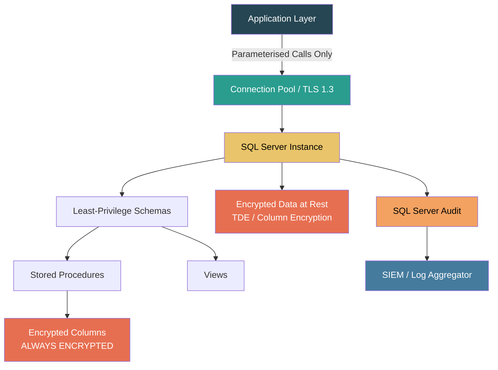
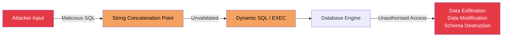
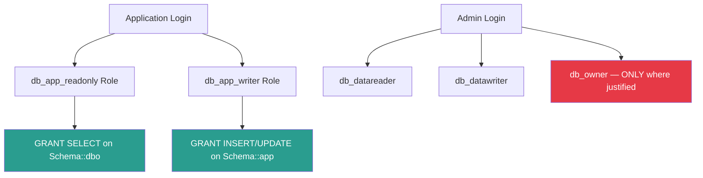
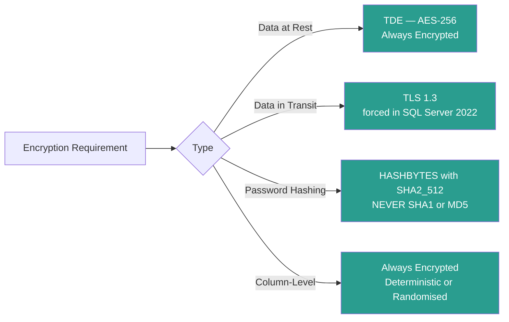
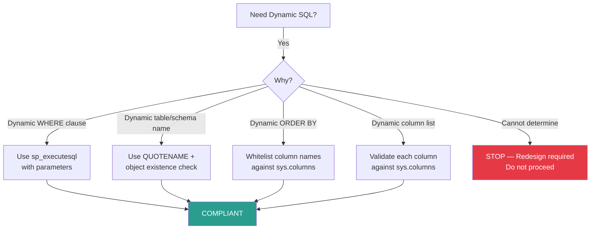

# T-SQL Security Best Practices Guide

**Document Reference:** SBP-TSQL-SEC-001  
**Version:** 1.0.0  
**Classification:** OFFICIAL – SENSITIVE  
**Date:** 2026-03-23  
**Author:** SecureByPolicy Standards Authority  
**Review Cycle:** Annual (or upon major standard revision)

---

## Standards Cross-Reference

| Standard | Version | Reference Date |
|---|---|---|
| NIST Cybersecurity Framework | CSF 2.0 | February 26, 2024 |
| NIST SP 800-53 | Rev. 5 (updated Aug 2025) | August 2025 |
| OWASP Top 10 | 2025 (confirmed Jan 2026) | January 2026 |
| DISA STIG SQL Server 2022 | v1r1 | November 2025 |
| CIS Microsoft SQL Server Benchmark | Level 2 | Current |
| FIPS 140-3 | Current | Supersedes FIPS 140-2 |
| DISA STIG SQL Server 2016 | v3r2 | December 2024 |

> **Sources:**  
> - NIST CSF 2.0: https://www.nist.gov/cyberframework  
> - NIST SP 800-53 Rev. 5: https://csrc.nist.gov/publications/detail/sp/800-53/rev-5/final  
> - OWASP Top 10:2025: https://owasp.org/Top10/2025/  
> - DISA STIG SQL Server 2022: https://public.cyber.mil/stigs/  
> - NCP SQL Server 2022 Checklist: https://ncp.nist.gov/checklist/1292  
> - CIS Benchmarks: https://www.cisecurity.org/benchmark/microsoft_sql_server  
> - FIPS 140-3: https://csrc.nist.gov/publications/detail/fips/140/3/final

---

## Table of Contents

1. [Document Purpose and Scope](#1-document-purpose-and-scope)
2. [Compliance Framework Summary](#2-compliance-framework-summary)
3. [SQL Injection Prevention](#3-sql-injection-prevention)
4. [Authentication and Authorisation](#4-authentication-and-authorisation)
5. [Least Privilege and Role-Based Access Control](#5-least-privilege-and-role-based-access-control)
6. [Stored Procedures and Defensive Coding](#6-stored-procedures-and-defensive-coding)
7. [Data Encryption and Cryptographic Standards](#7-data-encryption-and-cryptographic-standards)
8. [Auditing and Logging](#8-auditing-and-logging)
9. [Error Handling and Information Disclosure](#9-error-handling-and-information-disclosure)
10. [Dynamic SQL Controls](#10-dynamic-sql-controls)
11. [Schema and Object Security](#11-schema-and-object-security)
12. [Linked Servers and External Connections](#12-linked-servers-and-external-connections)
13. [Sensitive Data Handling](#13-sensitive-data-handling)
14. [SQL Server Configuration Hardening](#14-sql-server-configuration-hardening)
15. [Compliance Checklist](#15-compliance-checklist)
16. [Appendix A: CWE Reference Table](#appendix-a-cwe-reference-table)
17. [Appendix B: STIG Control Mapping](#appendix-b-stig-control-mapping)
18. [Document Control](#document-control)

---

## 1. Document Purpose and Scope

### 1.1 Purpose

This guide establishes mandatory T-SQL security practices for development teams constructing or maintaining database-tier logic in Microsoft SQL Server environments. It serves as both a development reference and an audit compliance checklist aligned to UK Government, US Federal, and international security standards.

### 1.2 Scope

This document applies to:

- All T-SQL code including stored procedures, views, functions, triggers, and ad-hoc queries
- SQL Server versions: 2016, 2019, and 2022
- Deployment environments: on-premises, hybrid, air-gapped, and government classified networks
- Development and operational teams handling data at any classification level

### 1.3 Document Audience

| Audience | Usage |
|---|---|
| T-SQL Developers | Primary reference for secure coding |
| Database Administrators | Configuration hardening and audit |
| Security Engineers | Compliance assessment and gap analysis |
| Technical Architects | Design review and pattern validation |
| Compliance Officers | Audit evidence and traceability |

### 1.4 Architecture Diagram



---

## 2. Compliance Framework Summary

### 2.1 NIST CSF 2.0 Functions Addressed

CSF 2.0 introduced six core functions. T-SQL security practices directly support the following subcategories:

| CSF 2.0 Function | Relevant T-SQL Controls |
|---|---|
| **GV (Govern)** | Policy enforcement via database roles; security standards embedded in DDL/DML templates |
| **ID (Identify)** | Schema documentation; data classification labels; asset inventory via system catalogues |
| **PR (Protect)** | Access control (GRANT/DENY/REVOKE); encryption (TDE, Always Encrypted); parameterised queries |
| **DE (Detect)** | SQL Server Audit; Extended Events; DDL triggers for change detection |
| **RS (Respond)** | Audit trail integrity; incident-ready audit logs; transaction isolation |
| **RC (Recover)** | Transaction management; point-in-time restore capability; backup encryption |

### 2.2 OWASP Top 10:2025 Mapping

| OWASP 2025 Category | T-SQL Relevance | Primary Controls |
|---|---|---|
| A01 – Broken Access Control | Schema-level and row-level security | DENY, Row-Level Security, column permissions |
| A02 – Security Misconfiguration | SQL Server default config hardening | Surface Area Configuration, disabled features |
| A03 – Software Supply Chain Failures | Third-party assemblies (CLR) | CLR strict security; signed assemblies only |
| A04 – Cryptographic Failures | Weak algorithms in T-SQL | SHA-256+, AES-256, TLS 1.3, Always Encrypted |
| A05 – Injection | SQL injection via T-SQL | Parameterised queries; sp_executesql; QUOTENAME |
| A06 – Insecure Design | Poor schema/permission design | Least privilege; schema separation |
| A07 – Authentication Failures | SQL login vulnerabilities | Windows Auth; MFA; password policies |
| A08 – Data Integrity Failures | Unsigned procedures/assemblies | Code signing; DDL triggers |
| A09 – Security Logging Failures | Missing or inadequate audit | SQL Server Audit; C2 audit mode |
| A10 – Mishandling of Exceptional Conditions | Unhandled T-SQL exceptions leaking data | TRY/CATCH; generic error messages |

### 2.3 DISA STIG SQL Server 2022 (v1r1) Key Requirements

The DISA STIG for SQL Server 2022 (V1R1, November 2025) mandates the following high-severity (CAT I) controls relevant to T-SQL development:

| STIG ID | Requirement Summary | Severity |
|---|---|---|
| SQL6-D0-000100 | SQL Server must protect audit tools from unauthorised access | CAT I |
| SQL6-D0-001000 | Audit records must identify the user who caused the event | CAT I |
| SQL6-D0-001200 | SA account must be renamed or disabled | CAT I |
| SQL6-D0-001300 | Windows authentication must be the default | CAT I |
| SQL6-D0-001700 | Data at rest must be encrypted | CAT I |
| SQL6-D0-003000 | CLR must be disabled unless required | CAT II |
| SQL6-D0-003100 | xp_cmdshell must be disabled | CAT I |
| SQL6-D0-004000 | TLS 1.2+ must be used for data in transit | CAT I |

### 2.4 FIPS 140-3 Cryptographic Requirements

FIPS 140-3 (effective September 2019, mandatory for US Federal systems) requires:

- All cryptographic modules to be validated against FIPS 140-3 standards
- Approved algorithms only: AES-128/192/256, SHA-256/384/512, RSA-2048+, ECDSA P-256+
- **Prohibited algorithms (never use in T-SQL):** MD5, SHA-1, DES, 3DES, RC4, RC2

SQL Server FIPS compliance is enabled at the Windows OS level via Group Policy. T-SQL developers must avoid deprecated algorithm references in code regardless of OS setting.

---

## 3. SQL Injection Prevention

SQL injection is classified under **OWASP A05:2025 (Injection)** and **CWE-89**. It remains the most directly exploitable T-SQL vulnerability.

### 3.1 Threat Model



### 3.2 Parameterised Queries — Mandatory Pattern

**NEVER** concatenate user-supplied input into SQL strings.

```sql
-- ============================================================
-- PROHIBITED: String concatenation with user input
-- CWE-89 | OWASP A05:2025 | DISA SQL6-D0-013800
-- ============================================================

-- BAD: Direct string concatenation (DO NOT USE)
DECLARE @UserId NVARCHAR(50) = '1 OR 1=1--';
DECLARE @BadQuery NVARCHAR(500);
SET @BadQuery = 'SELECT * FROM dbo.Users WHERE UserId = ' + @UserId;
EXEC(@BadQuery);  -- INJECTION VECTOR

-- ============================================================
-- REQUIRED: sp_executesql with typed parameters
-- ============================================================

-- GOOD: Parameterised execution
DECLARE @UserIdParam INT = 42;
DECLARE @SafeQuery NVARCHAR(500);

SET @SafeQuery = N'SELECT UserId, UserName, Email
                   FROM dbo.Users
                   WHERE UserId = @UserId
                     AND IsActive = 1';

EXEC sp_executesql
    @SafeQuery,
    N'@UserId INT',
    @UserId = @UserIdParam;
```

### 3.3 Stored Procedure Pattern — Preferred Over Ad-Hoc SQL

Stored procedures with fixed parameter types are the primary defence against injection:

```sql
-- ============================================================
-- SECURE STORED PROCEDURE TEMPLATE
-- NIST SP 800-53 SI-10 | CIS SQL Server Benchmark L2
-- ============================================================

CREATE OR ALTER PROCEDURE dbo.usp_GetUserById
    @UserId      INT,               -- Strongly typed: no injection possible
    @IsActive    BIT = 1            -- Default to active users only
AS
BEGIN
    SET NOCOUNT ON;
    SET XACT_ABORT ON;             -- Auto-rollback on error

    -- Input validation: reject obviously invalid values
    IF @UserId IS NULL OR @UserId <= 0
    BEGIN
        RAISERROR('Invalid user identifier.', 16, 1);
        RETURN;
    END;

    SELECT
        u.UserId,
        u.UserName,
        u.Email,
        u.CreatedDate
    FROM dbo.Users AS u
    WHERE u.UserId   = @UserId
      AND u.IsActive = @IsActive;
END;
GO
```

### 3.4 QUOTENAME for Dynamic Object Names

When object names (table names, column names, schema names) must be dynamic, use `QUOTENAME()`:

```sql
-- ============================================================
-- Dynamic object names — use QUOTENAME to neutralise injection
-- OWASP A05:2025 | CWE-89
-- ============================================================

CREATE OR ALTER PROCEDURE dbo.usp_GetSchemaTableCount
    @SchemaName SYSNAME,   -- SYSNAME = NVARCHAR(128), NOT NULL
    @TableName  SYSNAME
AS
BEGIN
    SET NOCOUNT ON;
    SET XACT_ABORT ON;

    -- Validate that schema/table exist before constructing query
    IF NOT EXISTS (
        SELECT 1
        FROM sys.tables t
        JOIN sys.schemas s ON t.schema_id = s.schema_id
        WHERE s.name = @SchemaName
          AND t.name = @TableName
    )
    BEGIN
        RAISERROR('Specified object does not exist.', 16, 1);
        RETURN;
    END;

    DECLARE @SQL NVARCHAR(500);

    -- QUOTENAME wraps identifier in brackets and escapes embedded brackets
    SET @SQL = N'SELECT COUNT(*) AS RowCount FROM '
               + QUOTENAME(@SchemaName)
               + N'.'
               + QUOTENAME(@TableName);

    EXEC sp_executesql @SQL;
END;
GO
```

### 3.5 Input Validation Patterns

```sql
-- ============================================================
-- Defensive input validation for common types
-- NIST SI-10 | OWASP A05:2025
-- ============================================================

CREATE OR ALTER PROCEDURE dbo.usp_SearchProducts
    @SearchTerm  NVARCHAR(100),
    @CategoryId  INT,
    @MaxPrice    DECIMAL(10, 2)
AS
BEGIN
    SET NOCOUNT ON;
    SET XACT_ABORT ON;

    -- Validate string length and reject null/empty
    IF @SearchTerm IS NULL OR LEN(LTRIM(RTRIM(@SearchTerm))) = 0
    BEGIN
        RAISERROR('Search term cannot be null or empty.', 16, 1);
        RETURN;
    END;

    -- Reject strings that are suspiciously long (potential buffer/injection probe)
    IF LEN(@SearchTerm) > 100
    BEGIN
        RAISERROR('Search term exceeds maximum length.', 16, 1);
        RETURN;
    END;

    -- Validate numeric ranges
    IF @CategoryId <= 0
    BEGIN
        RAISERROR('Category ID must be a positive integer.', 16, 1);
        RETURN;
    END;

    IF @MaxPrice < 0 OR @MaxPrice > 999999.99
    BEGIN
        RAISERROR('Price is outside acceptable range.', 16, 1);
        RETURN;
    END;

    -- Safe parameterised query: LIKE with parameter, not concatenation
    SELECT
        p.ProductId,
        p.ProductName,
        p.Price,
        c.CategoryName
    FROM dbo.Products      AS p
    JOIN dbo.Categories    AS c ON p.CategoryId = c.CategoryId
    WHERE p.CategoryId = @CategoryId
      AND p.Price      <= @MaxPrice
      AND p.ProductName LIKE N'%' + @SearchTerm + N'%'  -- parameter, not concat
      AND p.IsDeleted  = 0;
END;
GO
```

---

## 4. Authentication and Authorisation

### 4.1 Authentication Mode

**DISA STIG SQL6-D0-001300 (CAT I):** Windows Authentication (Integrated Security) must be the default authentication mode. Mixed Mode is only permitted when a specific business requirement exists and is formally documented.

```sql
-- ============================================================
-- Verify authentication mode (run as DBA)
-- DISA STIG SQL6-D0-001300
-- ============================================================

SELECT
    SERVERPROPERTY('IsIntegratedSecurityOnly') AS WindowsAuthOnly,
    -- 1 = Windows Auth only (required)
    -- 0 = Mixed Mode (must be justified)
    CASE SERVERPROPERTY('IsIntegratedSecurityOnly')
        WHEN 1 THEN 'COMPLIANT: Windows Authentication only'
        WHEN 0 THEN 'NON-COMPLIANT: Mixed Mode active — review required'
    END AS ComplianceStatus;
```

### 4.2 SA Account Controls

```sql
-- ============================================================
-- DISA STIG SQL6-D0-001200 (CAT I)
-- SA account must be renamed and/or disabled
-- ============================================================

-- Rename SA login (run once during hardening)
-- ALTER LOGIN [sa] WITH NAME = [svc_disabled_sa];

-- Disable the SA (or renamed) account
-- ALTER LOGIN [sa] DISABLE;

-- Verify SA status
SELECT
    name,
    is_disabled,
    type_desc
FROM sys.server_principals
WHERE name = 'sa'
   OR principal_id = 1;
```

### 4.3 Password Policy Enforcement

```sql
-- ============================================================
-- Password policy for SQL logins (where Mixed Mode is required)
-- CIS SQL Server Benchmark Level 2
-- NIST SP 800-53 IA-5
-- ============================================================

-- When creating SQL logins, always enforce policy
CREATE LOGIN [AppServiceAccount]
WITH PASSWORD          = 'Use_A_Vault_Not_This_Placeholder!',
     CHECK_POLICY      = ON,   -- Enforce Windows password policy
     CHECK_EXPIRATION  = ON,   -- Enforce password expiration
     DEFAULT_DATABASE  = [ApplicationDB];

-- Verify policy settings on all SQL logins
SELECT
    name,
    is_policy_checked,
    is_expiration_checked,
    is_disabled
FROM sys.sql_logins
WHERE is_policy_checked  = 0
   OR is_expiration_checked = 0
ORDER BY name;
-- Any rows returned = non-compliant
```

### 4.4 Login Audit

```sql
-- ============================================================
-- Identify logins without policy compliance
-- CIS Level 2 | NIST IA-5
-- ============================================================

SELECT
    sp.name                 AS LoginName,
    sp.type_desc            AS LoginType,
    sl.is_policy_checked    AS PolicyChecked,
    sl.is_expiration_checked AS ExpirationChecked,
    sp.is_disabled          AS IsDisabled,
    sp.create_date          AS CreatedDate,
    sp.modify_date          AS LastModified
FROM sys.server_principals AS sp
LEFT JOIN sys.sql_logins   AS sl ON sp.principal_id = sl.principal_id
WHERE sp.type IN ('S', 'U', 'G')  -- SQL, Windows user, Windows group
ORDER BY sp.name;
```

---

## 5. Least Privilege and Role-Based Access Control

### 5.1 Principle of Least Privilege

**NIST SP 800-53 AC-6 | DISA STIG | CIS Benchmark Level 2**

No login, user, or application service account should hold more privilege than is required to perform its defined function.



### 5.2 Schema-Based Permission Separation

```sql
-- ============================================================
-- Schema separation pattern
-- NIST AC-3, AC-6 | CIS SQL Server L2
-- ============================================================

-- Create functional schemas
CREATE SCHEMA app   AUTHORIZATION dbo;  -- Application data
CREATE SCHEMA ref   AUTHORIZATION dbo;  -- Reference / lookup data
CREATE SCHEMA audit AUTHORIZATION dbo;  -- Audit tables (restricted write)
CREATE SCHEMA temp  AUTHORIZATION dbo;  -- Temporary/staging data
GO

-- Create application roles
CREATE ROLE db_app_reader;
CREATE ROLE db_app_writer;
CREATE ROLE db_audit_reader;
GO

-- Grant minimum required permissions per schema
GRANT SELECT           ON SCHEMA::app   TO db_app_reader;
GRANT SELECT           ON SCHEMA::ref   TO db_app_reader;

GRANT SELECT, INSERT, UPDATE ON SCHEMA::app TO db_app_writer;
-- Note: DELETE requires explicit justification

GRANT SELECT           ON SCHEMA::audit TO db_audit_reader;
-- No WRITE on audit schema from application roles

-- Explicitly deny direct table access — force use of procedures
DENY SELECT ON SCHEMA::app TO db_app_writer;  -- Use procedures, not tables
GO
```

### 5.3 Granting Execute on Stored Procedures Only

```sql
-- ============================================================
-- Preferred pattern: applications access data only via
-- stored procedures — never via direct table permissions
-- NIST AC-3 | OWASP A01:2025 | CIS Level 2
-- ============================================================

-- Grant execute on individual procedures
GRANT EXECUTE ON dbo.usp_GetUserById        TO db_app_reader;
GRANT EXECUTE ON dbo.usp_SearchProducts     TO db_app_reader;
GRANT EXECUTE ON dbo.usp_CreateOrder        TO db_app_writer;
GRANT EXECUTE ON dbo.usp_UpdateOrderStatus  TO db_app_writer;

-- Revoke table-level permissions from application users
REVOKE SELECT, INSERT, UPDATE, DELETE ON dbo.Users  FROM db_app_reader;
REVOKE SELECT, INSERT, UPDATE, DELETE ON dbo.Orders FROM db_app_writer;
GO
```

### 5.4 Row-Level Security

```sql
-- ============================================================
-- Row-Level Security for multi-tenant or classified data
-- NIST AC-3(3) | OWASP A01:2025
-- ============================================================

-- Create the security predicate function
CREATE OR ALTER FUNCTION dbo.fn_TenantSecurityPredicate
(
    @TenantId INT
)
RETURNS TABLE
WITH SCHEMABINDING
AS
RETURN
(
    SELECT 1 AS Result
    WHERE
        -- Allow system accounts full access
        IS_MEMBER('db_owner') = 1
        OR
        -- Restrict regular users to their tenant
        @TenantId = CAST(SESSION_CONTEXT(N'TenantId') AS INT)
);
GO

-- Apply RLS policy to table
CREATE SECURITY POLICY dbo.TenantIsolationPolicy
ADD FILTER PREDICATE dbo.fn_TenantSecurityPredicate(TenantId)
    ON dbo.Orders,
ADD BLOCK  PREDICATE dbo.fn_TenantSecurityPredicate(TenantId)
    ON dbo.Orders AFTER INSERT
WITH (STATE = ON);
GO

-- Application sets context at session start
EXEC sp_set_session_context N'TenantId', 42, @read_only = 1;
```

---

## 6. Stored Procedures and Defensive Coding

### 6.1 Standard Secure Procedure Template

```sql
-- ============================================================
-- Secure Stored Procedure Template
-- All production procedures must follow this pattern
-- NIST SI-10, AC-3 | CIS SQL Server L2 | DISA STIG
-- ============================================================

CREATE OR ALTER PROCEDURE dbo.usp_[ProcedureName]
    -- Strongly typed parameters with appropriate lengths
    @Param1 INT,
    @Param2 NVARCHAR(200)
AS
BEGIN
    -- Suppress row count messages (reduces information leakage)
    SET NOCOUNT ON;

    -- Auto-rollback on uncaught errors; promotes data integrity
    SET XACT_ABORT ON;

    -- --------------------------------------------------------
    -- SECTION 1: Input Validation
    -- --------------------------------------------------------
    IF @Param1 IS NULL OR @Param1 <= 0
    BEGIN
        -- Generic error message — no internal details exposed
        RAISERROR('Invalid input parameter.', 16, 1);
        RETURN;
    END;

    IF @Param2 IS NULL OR LEN(LTRIM(RTRIM(@Param2))) = 0
    BEGIN
        RAISERROR('Parameter cannot be null or empty.', 16, 1);
        RETURN;
    END;

    -- --------------------------------------------------------
    -- SECTION 2: Business Logic in TRY/CATCH
    -- --------------------------------------------------------
    BEGIN TRY
        BEGIN TRANSACTION;

        -- Core logic here
        -- ...

        COMMIT TRANSACTION;
    END TRY
    BEGIN CATCH
        IF @@TRANCOUNT > 0
            ROLLBACK TRANSACTION;

        -- Log error internally (do not expose to caller)
        INSERT INTO audit.ErrorLog
            (ErrorMessage, ErrorSeverity, ErrorState,
             ErrorLine, ErrorProcedure, LoggedAt, AppUser)
        VALUES
            (ERROR_MESSAGE(), ERROR_SEVERITY(), ERROR_STATE(),
             ERROR_LINE(), ERROR_PROCEDURE(), GETUTCDATE(), SYSTEM_USER);

        -- Return generic message to caller
        RAISERROR('An internal error occurred. Contact your administrator.', 16, 1);
    END CATCH;
END;
GO
```

### 6.2 WITH ENCRYPTION Consideration

Procedures containing sensitive business logic should be encrypted to prevent schema browsing:

```sql
-- ============================================================
-- Encrypt procedure definition
-- NIST SC-28 | CIS SQL Server Level 2
-- WARNING: Encrypted procedures cannot be scripted from SSMS.
--          Source must be maintained in version control.
-- ============================================================

CREATE OR ALTER PROCEDURE dbo.usp_ProcessPayment
    @OrderId    INT,
    @Amount     DECIMAL(10, 2)
WITH ENCRYPTION     -- Hides procedure definition from sys.sql_modules
AS
BEGIN
    SET NOCOUNT ON;
    SET XACT_ABORT ON;
    -- Implementation...
END;
GO
```

### 6.3 SCHEMABINDING for Functions and Views

```sql
-- ============================================================
-- SCHEMABINDING prevents underlying table modification
-- without explicit procedure update — defensive integrity
-- NIST CM-6 | CIS Level 2
-- ============================================================

CREATE OR ALTER VIEW dbo.vw_ActiveUserSummary
WITH SCHEMABINDING
AS
SELECT
    u.UserId,
    u.UserName,
    u.Email,
    u.CreatedDate
FROM dbo.Users AS u
WHERE u.IsActive = 1
  AND u.IsDeleted = 0;
GO
```

---

## 7. Data Encryption and Cryptographic Standards

### 7.1 Approved Algorithms (FIPS 140-3)



### 7.2 Transparent Data Encryption (TDE)

```sql
-- ============================================================
-- Enable TDE — encrypts entire database at rest
-- NIST SC-28 | DISA SQL6-D0-001700 (CAT I) | FIPS 140-3
-- ============================================================

-- Step 1: Create master key in master database
USE master;
GO
CREATE MASTER KEY ENCRYPTION BY PASSWORD = 'Use_HSM_Or_Vault_For_Production!';
GO

-- Step 2: Create certificate for TDE
CREATE CERTIFICATE TDECert
    WITH SUBJECT = 'TDE Certificate for ApplicationDB',
         EXPIRY_DATE = '2028-12-31';  -- Review certificate rotation policy
GO

-- Step 3: Create database encryption key using AES_256
USE ApplicationDB;
GO
CREATE DATABASE ENCRYPTION KEY
    WITH ALGORITHM = AES_256
    ENCRYPTION BY SERVER CERTIFICATE TDECert;
GO

-- Step 4: Enable encryption
ALTER DATABASE ApplicationDB
    SET ENCRYPTION ON;
GO

-- Verify TDE status
SELECT
    d.name              AS DatabaseName,
    dek.encryption_state_desc,
    dek.percent_complete,
    dek.key_algorithm,
    dek.key_length,
    dek.encryptor_type
FROM sys.databases          AS d
JOIN sys.dm_database_encryption_keys AS dek
    ON d.database_id = dek.database_id;
```

### 7.3 Always Encrypted for Column-Level Protection

```sql
-- ============================================================
-- Always Encrypted — protects data even from DBAs
-- Keys managed in application / HSM, not SQL Server
-- NIST SC-28 | FIPS 140-3 | OWASP A04:2025
-- ============================================================

-- Always Encrypted column definition
-- (Keys created via SSMS/PowerShell with CMK in Azure Key Vault or local store)

CREATE TABLE dbo.SensitivePersonalData
(
    RecordId        INT           IDENTITY(1,1) PRIMARY KEY,
    UserId          INT           NOT NULL,

    -- Deterministic: allows equality search, but same value = same ciphertext
    NationalInsuranceNumber
                    NVARCHAR(20)
                    COLLATE Latin1_General_BIN2
                    ENCRYPTED WITH (
                        COLUMN_ENCRYPTION_KEY = CEK_PersonalData,
                        ENCRYPTION_TYPE       = DETERMINISTIC,
                        ALGORITHM             = 'AEAD_AES_256_CBC_HMAC_SHA_256'
                    ) NULL,

    -- Randomised: stronger, but cannot be searched or indexed
    BiometricHash   VARBINARY(8000)
                    ENCRYPTED WITH (
                        COLUMN_ENCRYPTION_KEY = CEK_PersonalData,
                        ENCRYPTION_TYPE       = RANDOMIZED,
                        ALGORITHM             = 'AEAD_AES_256_CBC_HMAC_SHA_256'
                    ) NULL,

    CreatedAt       DATETIME2     NOT NULL DEFAULT GETUTCDATE(),
    CreatedBy       SYSNAME       NOT NULL DEFAULT SYSTEM_USER
);
GO
```

### 7.4 Hashing — Approved Patterns

```sql
-- ============================================================
-- Cryptographic hashing in T-SQL
-- FIPS 140-3 | NIST SC-13 | OWASP A04:2025
-- ============================================================

-- APPROVED: SHA2_512 (FIPS 140-3 compliant)
SELECT HASHBYTES('SHA2_512', CONVERT(VARBINARY(MAX), N'SensitiveData')) AS Hash512;
SELECT HASHBYTES('SHA2_256', CONVERT(VARBINARY(MAX), N'SensitiveData')) AS Hash256;

-- PROHIBITED: Never use these in new code
-- SELECT HASHBYTES('MD5',  ...)  -- Broken, CWE-327
-- SELECT HASHBYTES('SHA1', ...)  -- Deprecated, CWE-327
-- SELECT PWDENCRYPT(...)         -- Proprietary, non-FIPS, deprecated

-- For password verification (legacy system migration only):
-- Do NOT store passwords in SQL Server. Use identity providers.
-- If unavoidable, use PBKDF2 or Argon2 via application layer,
-- store the result as VARBINARY(512).

-- Check for prohibited algorithm usage
SELECT
    OBJECT_NAME(object_id)  AS ObjectName,
    type_desc,
    OBJECT_DEFINITION(object_id) AS DefinitionSnippet
FROM sys.objects
WHERE type IN ('P', 'FN', 'IF', 'TF', 'V')
  AND (
        OBJECT_DEFINITION(object_id) LIKE '%PWDENCRYPT%'
     OR OBJECT_DEFINITION(object_id) LIKE N'%''MD5''%'
     OR OBJECT_DEFINITION(object_id) LIKE N'%''SHA1''%'
  );
-- Any rows = non-compliant; remediation required
```

---

## 8. Auditing and Logging

### 8.1 SQL Server Audit Configuration

**DISA STIG SQL6-D0-001000 | NIST SP 800-53 AU-2, AU-3, AU-9, AU-12**

```sql
-- ============================================================
-- SQL Server Audit — Instance Level
-- DISA SQL6-D0-001000 | NIST AU-2, AU-3
-- ============================================================

-- Create server audit (write to Security event log or file)
CREATE SERVER AUDIT [SecurityAudit]
TO FILE
(
    FILEPATH     = 'D:\SQLAudit\',      -- Dedicated, restricted volume
    MAXSIZE      = 1024 MB,
    MAX_ROLLOVER_FILES = 100,
    RESERVE_DISK_SPACE = OFF
)
WITH
(
    QUEUE_DELAY  = 1000,               -- 1 second max delay
    ON_FAILURE   = SHUTDOWN            -- Shut down if audit cannot write
    -- ON_FAILURE = CONTINUE           -- Use for non-classified; SHUTDOWN for classified
);
GO

ALTER SERVER AUDIT [SecurityAudit] WITH (STATE = ON);
GO

-- Create audit specification for sensitive actions
CREATE SERVER AUDIT SPECIFICATION [SecurityAuditSpec]
FOR SERVER AUDIT [SecurityAudit]
ADD (FAILED_LOGIN_GROUP),
ADD (SUCCESSFUL_LOGIN_GROUP),
ADD (LOGOUT_GROUP),
ADD (SERVER_ROLE_MEMBER_CHANGE_GROUP),
ADD (DATABASE_ROLE_MEMBER_CHANGE_GROUP),
ADD (SCHEMA_OBJECT_PERMISSION_CHANGE_GROUP),
ADD (AUDIT_CHANGE_GROUP),
ADD (SERVER_OBJECT_CHANGE_GROUP),
ADD (SERVER_PERMISSION_CHANGE_GROUP),
ADD (SERVER_PRINCIPAL_CHANGE_GROUP),
ADD (LOGIN_CHANGE_PASSWORD_GROUP)
WITH (STATE = ON);
GO
```

### 8.2 Database-Level Audit

```sql
-- ============================================================
-- Database Audit Specification
-- NIST AU-2 | DISA STIG | CIS Level 2
-- ============================================================

USE ApplicationDB;
GO

CREATE DATABASE AUDIT SPECIFICATION [AppDBAuditSpec]
FOR SERVER AUDIT [SecurityAudit]
ADD (SELECT ON SCHEMA::app         BY PUBLIC),
ADD (INSERT ON SCHEMA::app         BY PUBLIC),
ADD (UPDATE ON SCHEMA::app         BY PUBLIC),
ADD (DELETE ON SCHEMA::app         BY PUBLIC),
ADD (EXECUTE ON SCHEMA::app        BY PUBLIC),
ADD (SELECT ON dbo.SensitivePersonalData BY PUBLIC),
ADD (DATABASE_ROLE_MEMBER_CHANGE_GROUP),
ADD (SCHEMA_OBJECT_PERMISSION_CHANGE_GROUP),
ADD (DATABASE_OBJECT_PERMISSION_CHANGE_GROUP)
WITH (STATE = ON);
GO
```

### 8.3 Audit Log Table Pattern

```sql
-- ============================================================
-- Application-level audit table
-- NIST AU-3, AU-9 | DISA STIG
-- ============================================================

CREATE TABLE audit.ApplicationAuditLog
(
    AuditId         BIGINT          IDENTITY(1,1)   NOT NULL,
    EventTime       DATETIME2(7)    NOT NULL         DEFAULT GETUTCDATE(),
    ServerName      SYSNAME         NOT NULL         DEFAULT @@SERVERNAME,
    DatabaseName    SYSNAME         NOT NULL         DEFAULT DB_NAME(),
    SchemaName      SYSNAME         NULL,
    ObjectName      SYSNAME         NULL,
    ActionType      VARCHAR(50)     NOT NULL,        -- INSERT/UPDATE/DELETE/SELECT
    AffectedRowCount INT            NULL,
    ExecutingUser   SYSNAME         NOT NULL         DEFAULT SYSTEM_USER,
    ApplicationUser NVARCHAR(256)   NULL,            -- From SESSION_CONTEXT
    HostName        NVARCHAR(256)   NOT NULL         DEFAULT HOST_NAME(),
    ApplicationName NVARCHAR(256)   NOT NULL         DEFAULT APP_NAME(),
    OldData         XML             NULL,            -- FOR XML PATH before-image
    NewData         XML             NULL,            -- FOR XML PATH after-image
    AdditionalInfo  NVARCHAR(MAX)   NULL,
    CONSTRAINT PK_ApplicationAuditLog PRIMARY KEY CLUSTERED (AuditId)
);
GO

-- Restrict write access to audit table
DENY INSERT, UPDATE, DELETE ON audit.ApplicationAuditLog TO db_app_writer;
DENY INSERT, UPDATE, DELETE ON audit.ApplicationAuditLog TO db_app_reader;
-- Only a dedicated audit role or service account may write
GO
```

### 8.4 DDL Change Detection Trigger

```sql
-- ============================================================
-- DDL Trigger: Capture schema changes
-- NIST CM-3 | DISA STIG | CIS Level 2
-- ============================================================

CREATE OR ALTER TRIGGER dbo.trg_DDLChangeAudit
ON DATABASE
FOR DDL_DATABASE_LEVEL_EVENTS
AS
BEGIN
    SET NOCOUNT ON;

    DECLARE @EventData XML = EVENTDATA();

    INSERT INTO audit.ApplicationAuditLog
        (ActionType, SchemaName, ObjectName, NewData, ExecutingUser)
    SELECT
        @EventData.value('(/EVENT_INSTANCE/EventType)[1]',    'NVARCHAR(200)'),
        @EventData.value('(/EVENT_INSTANCE/SchemaName)[1]',   'SYSNAME'),
        @EventData.value('(/EVENT_INSTANCE/ObjectName)[1]',   'SYSNAME'),
        @EventData,
        SYSTEM_USER;
END;
GO
```

---

## 9. Error Handling and Information Disclosure

### 9.1 Secure Error Handling Pattern

**OWASP A10:2025 (Mishandling of Exceptional Conditions) | NIST SI-11**

Never expose internal SQL error messages, stack traces, object names, or schema information to application callers.

```sql
-- ============================================================
-- Secure TRY/CATCH with internal logging
-- OWASP A10:2025 | NIST SI-11 | CIS Level 2
-- ============================================================

CREATE OR ALTER PROCEDURE dbo.usp_SecureOperationTemplate
    @InputId INT
AS
BEGIN
    SET NOCOUNT ON;
    SET XACT_ABORT ON;

    BEGIN TRY
        BEGIN TRANSACTION;

        -- Business logic
        UPDATE dbo.Orders
        SET    OrderStatus = 'PROCESSED',
               UpdatedAt   = GETUTCDATE()
        WHERE  OrderId     = @InputId;

        IF @@ROWCOUNT = 0
        BEGIN
            -- Not found is a business condition, not an error
            -- Return empty result set — do not reveal existence/non-existence
            COMMIT TRANSACTION;
            RETURN;
        END;

        COMMIT TRANSACTION;

    END TRY
    BEGIN CATCH
        IF @@TRANCOUNT > 0
            ROLLBACK TRANSACTION;

        -- Capture full error details for internal log
        DECLARE
            @ErrorMessage    NVARCHAR(4000) = ERROR_MESSAGE(),
            @ErrorSeverity   INT            = ERROR_SEVERITY(),
            @ErrorState      INT            = ERROR_STATE(),
            @ErrorLine       INT            = ERROR_LINE(),
            @ErrorProcedure  NVARCHAR(200)  = ISNULL(ERROR_PROCEDURE(), 'Ad-hoc');

        -- Internal log — never returned to caller
        INSERT INTO audit.ErrorLog
            (ErrorMessage, ErrorSeverity, ErrorState,
             ErrorLine, ErrorProcedure, LoggedAt, ExecutingUser)
        VALUES
            (@ErrorMessage, @ErrorSeverity, @ErrorState,
             @ErrorLine, @ErrorProcedure, GETUTCDATE(), SYSTEM_USER);

        -- Return ONLY a generic reference to the caller
        RAISERROR(
            'Operation failed. Reference error log for details.',
            16,   -- Severity (16 = user correctable, no internal details)
            1
        );

    END CATCH;
END;
GO
```

### 9.2 Prohibited Error Patterns

```sql
-- ============================================================
-- PROHIBITED error-handling patterns
-- ============================================================

-- BAD: Exposes internal schema to caller (OWASP A10:2025)
-- RAISERROR(ERROR_MESSAGE(), ERROR_SEVERITY(), ERROR_STATE());

-- BAD: Exposes table/column names
-- THROW;  -- When THROW re-raises original SQL error with full details

-- BAD: Suppressing errors without logging
-- BEGIN CATCH
--     -- Empty catch — errors silently swallowed
-- END CATCH;

-- BAD: Exposing line numbers to client applications
-- PRINT 'Error at line ' + CAST(ERROR_LINE() AS VARCHAR(10));
```

---

## 10. Dynamic SQL Controls

When dynamic SQL is unavoidable, apply strict controls to minimise injection risk.

### 10.1 Safe Dynamic SQL Decision Tree



### 10.2 Dynamic ORDER BY with Whitelist Validation

```sql
-- ============================================================
-- Safe dynamic ORDER BY using whitelist validation
-- OWASP A05:2025 | CWE-89
-- ============================================================

CREATE OR ALTER PROCEDURE dbo.usp_GetOrdersSorted
    @SortColumn     SYSNAME         = N'OrderDate',
    @SortDirection  VARCHAR(4)      = N'DESC'
AS
BEGIN
    SET NOCOUNT ON;
    SET XACT_ABORT ON;

    -- Whitelist allowed sort columns
    IF @SortColumn NOT IN (N'OrderDate', N'OrderId', N'TotalAmount', N'CustomerName')
    BEGIN
        RAISERROR('Invalid sort column specified.', 16, 1);
        RETURN;
    END;

    -- Whitelist sort direction
    IF @SortDirection NOT IN ('ASC', 'DESC')
    BEGIN
        RAISERROR('Invalid sort direction. Use ASC or DESC.', 16, 1);
        RETURN;
    END;

    -- Validate column exists in target table (defence-in-depth)
    IF NOT EXISTS (
        SELECT 1
        FROM sys.columns c
        JOIN sys.objects o ON c.object_id = o.object_id
        JOIN sys.schemas s ON o.schema_id = s.schema_id
        WHERE s.name = N'dbo'
          AND o.name = N'Orders'
          AND c.name = @SortColumn
    )
    BEGIN
        RAISERROR('Sort column does not exist in target table.', 16, 1);
        RETURN;
    END;

    DECLARE @SQL NVARCHAR(500);

    SET @SQL = N'SELECT OrderId, OrderDate, TotalAmount, CustomerName
                 FROM dbo.Orders
                 ORDER BY '
               + QUOTENAME(@SortColumn)   -- Safe: whitelisted AND QUOTENAME'd
               + N' '
               + @SortDirection;          -- Safe: whitelisted

    EXEC sp_executesql @SQL;
END;
GO
```

---

## 11. Schema and Object Security

### 11.1 Object Ownership and Chains

```sql
-- ============================================================
-- Ownership chaining — control carefully
-- NIST AC-3 | CIS Level 2
-- ============================================================

-- Cross-database ownership chaining is dangerous — verify it is disabled
SELECT
    name                        AS DatabaseName,
    is_db_chaining_on           AS CrossDBChaining,
    CASE is_db_chaining_on
        WHEN 1 THEN 'NON-COMPLIANT — review required'
        WHEN 0 THEN 'COMPLIANT'
    END AS Status
FROM sys.databases
WHERE is_db_chaining_on = 1;  -- Flag non-compliant databases

-- Disable on all databases except those with explicit justification
-- ALTER DATABASE [ApplicationDB] SET DB_CHAINING OFF;
```

### 11.2 TRUSTWORTHY Database Property

```sql
-- ============================================================
-- TRUSTWORTHY must be OFF unless CLR/signed assemblies require it
-- DISA STIG | CIS Level 2 | NIST CM-6
-- ============================================================

SELECT
    name,
    is_trustworthy_on,
    CASE is_trustworthy_on
        WHEN 1 THEN 'NON-COMPLIANT — justify or disable'
        WHEN 0 THEN 'COMPLIANT'
    END AS Status
FROM sys.databases
WHERE name NOT IN ('master', 'msdb')  -- System DBs may require TRUSTWORTHY
  AND is_trustworthy_on = 1;

-- Disable where not required
-- ALTER DATABASE [ApplicationDB] SET TRUSTWORTHY OFF;
```

### 11.3 PUBLIC Role Permissions Audit

```sql
-- ============================================================
-- Audit PUBLIC role permissions — PUBLIC should have nothing
-- beyond system defaults
-- NIST AC-6 | CIS Level 2
-- ============================================================

-- Check database-level public grants
SELECT
    dp.class_desc,
    OBJECT_NAME(dp.major_id)        AS ObjectName,
    dp.permission_name,
    dp.state_desc,
    pr.name                         AS GrantedTo
FROM sys.database_permissions   AS dp
JOIN sys.database_principals    AS pr ON dp.grantee_principal_id = pr.principal_id
WHERE pr.name = 'public'
  AND dp.state IN ('G', 'W')  -- GRANT or GRANT WITH GRANT OPTION
  AND dp.major_id > 0         -- Exclude system-level permissions
ORDER BY dp.class_desc, ObjectName;
-- Any rows with application object names = non-compliant
```

---

## 12. Linked Servers and External Connections

### 12.1 Linked Server Controls

**DISA STIG | NIST SC-7 | CIS Level 2**

Linked servers represent a lateral movement and privilege escalation risk. They should be avoided wherever possible.

```sql
-- ============================================================
-- Audit and control linked servers
-- NIST SC-7 | CIS SQL Server Level 2
-- ============================================================

-- Inventory all linked servers
SELECT
    ls.name                     AS LinkedServerName,
    ls.provider,
    ls.data_source,
    ls.is_rpc_out_enabled,
    ls.is_data_access_enabled,
    lsl.local_principal_id,
    lsl.uses_self_credential,
    lsl.remote_name
FROM sys.servers        AS ls
LEFT JOIN sys.linked_logins AS lsl ON ls.server_id = lsl.server_id
WHERE ls.is_linked = 1;

-- Remove unused linked servers
-- EXEC sp_dropserver 'LinkedServerName', 'droplogins';

-- If linked server required: restrict RPC and data access
-- EXEC sp_serveroption 'LinkedServerName', 'rpc',         'false';
-- EXEC sp_serveroption 'LinkedServerName', 'rpc out',     'false';
-- EXEC sp_serveroption 'LinkedServerName', 'data access', 'true';  -- Only if needed
```

### 12.2 xp_cmdshell — Must Be Disabled

```sql
-- ============================================================
-- xp_cmdshell MUST be disabled
-- DISA SQL6-D0-003100 (CAT I) | CIS Level 2
-- ============================================================

-- Verify xp_cmdshell is disabled
SELECT
    name,
    value,
    value_in_use,
    CASE value_in_use
        WHEN 0 THEN 'COMPLIANT: xp_cmdshell disabled'
        WHEN 1 THEN 'NON-COMPLIANT: xp_cmdshell ENABLED — disable immediately'
    END AS ComplianceStatus
FROM sys.configurations
WHERE name = 'xp_cmdshell';

-- Disable xp_cmdshell (if found enabled)
-- EXEC sp_configure 'show advanced options', 1; RECONFIGURE;
-- EXEC sp_configure 'xp_cmdshell', 0; RECONFIGURE;
-- EXEC sp_configure 'show advanced options', 0; RECONFIGURE;
```

---

## 13. Sensitive Data Handling

### 13.1 Data Classification and Discovery

```sql
-- ============================================================
-- SQL Server Data Discovery and Classification
-- NIST SP 800-53 RA-2 | GDPR Article 30 | UK DPA 2018
-- ============================================================

-- Apply classification labels to sensitive columns
ADD SENSITIVITY CLASSIFICATION TO
    dbo.SensitivePersonalData.NationalInsuranceNumber
WITH (LABEL = 'Highly Confidential', INFORMATION_TYPE = 'National ID');

ADD SENSITIVITY CLASSIFICATION TO
    dbo.Users.Email
WITH (LABEL = 'Confidential', INFORMATION_TYPE = 'Contact Info');

-- Query classification catalogue
SELECT
    schema_name,
    table_name,
    column_name,
    information_type,
    label,
    rank_desc
FROM sys.sensitivity_classifications
ORDER BY schema_name, table_name, column_name;
```

### 13.2 Data Masking

```sql
-- ============================================================
-- Dynamic Data Masking for non-privileged users
-- NIST SC-28 | CIS Level 2
-- NOTE: DDM is NOT a substitute for encryption — it is a
--       display-layer control only
-- ============================================================

ALTER TABLE dbo.Users
    ALTER COLUMN Email
    ADD MASKED WITH (FUNCTION = 'email()');

ALTER TABLE dbo.SensitivePersonalData
    ALTER COLUMN PhoneNumber
    ADD MASKED WITH (FUNCTION = 'partial(0,"XXX-XXX-",4)');

-- Grant unmask only to privileged roles
GRANT UNMASK TO db_audit_reader;
-- All other users see masked data
```

### 13.3 Temporal Tables for Data Lineage

```sql
-- ============================================================
-- System-versioned temporal tables for audit lineage
-- NIST AU-9, SI-12 | CIS Level 2
-- ============================================================

CREATE TABLE dbo.CustomerAccount
(
    AccountId       INT             NOT NULL PRIMARY KEY CLUSTERED,
    CustomerName    NVARCHAR(200)   NOT NULL,
    AccountStatus   VARCHAR(20)     NOT NULL,
    CreditLimit     DECIMAL(10, 2)  NOT NULL,
    ModifiedBy      SYSNAME         NOT NULL DEFAULT SYSTEM_USER,
    ValidFrom       DATETIME2(7)    GENERATED ALWAYS AS ROW START NOT NULL,
    ValidTo         DATETIME2(7)    GENERATED ALWAYS AS ROW END   NOT NULL,
    PERIOD FOR SYSTEM_TIME (ValidFrom, ValidTo)
)
WITH (SYSTEM_VERSIONING = ON (HISTORY_TABLE = audit.CustomerAccount_History));
GO
```

---

## 14. SQL Server Configuration Hardening

### 14.1 Surface Area Configuration Checks

```sql
-- ============================================================
-- Comprehensive surface area and configuration audit
-- CIS SQL Server Level 2 | DISA STIG | NIST CM-6, CM-7
-- ============================================================

SELECT
    name,
    value_in_use,
    CASE name
        WHEN 'Ad Hoc Distributed Queries'   THEN CASE value_in_use WHEN 0 THEN 'COMPLIANT' ELSE 'NON-COMPLIANT' END
        WHEN 'CLR enabled'                  THEN CASE value_in_use WHEN 0 THEN 'COMPLIANT' ELSE 'REVIEW REQUIRED' END
        WHEN 'CLR strict security'          THEN CASE value_in_use WHEN 1 THEN 'COMPLIANT' ELSE 'NON-COMPLIANT' END
        WHEN 'cross db ownership chaining'  THEN CASE value_in_use WHEN 0 THEN 'COMPLIANT' ELSE 'NON-COMPLIANT' END
        WHEN 'Database Mail XPs'            THEN CASE value_in_use WHEN 0 THEN 'COMPLIANT' ELSE 'REVIEW REQUIRED' END
        WHEN 'Ole Automation Procedures'    THEN CASE value_in_use WHEN 0 THEN 'COMPLIANT' ELSE 'NON-COMPLIANT' END
        WHEN 'Remote Admin Connections'     THEN CASE value_in_use WHEN 0 THEN 'COMPLIANT' ELSE 'REVIEW REQUIRED' END
        WHEN 'scan for startup procs'       THEN CASE value_in_use WHEN 0 THEN 'COMPLIANT' ELSE 'NON-COMPLIANT' END
        WHEN 'xp_cmdshell'                  THEN CASE value_in_use WHEN 0 THEN 'COMPLIANT' ELSE 'NON-COMPLIANT (CAT I)' END
        ELSE 'REVIEW'
    END AS ComplianceStatus
FROM sys.configurations
WHERE name IN (
    'Ad Hoc Distributed Queries',
    'CLR enabled',
    'CLR strict security',
    'cross db ownership chaining',
    'Database Mail XPs',
    'Ole Automation Procedures',
    'Remote Admin Connections',
    'scan for startup procs',
    'xp_cmdshell'
)
ORDER BY name;
```

### 14.2 Transport Encryption Verification

```sql
-- ============================================================
-- Verify connections are using TLS encryption
-- DISA SQL6-D0-004000 (CAT I) | NIST SC-8 | FIPS 140-3
-- ============================================================

SELECT
    session_id,
    login_name,
    host_name,
    program_name,
    encrypt_option,           -- 'TRUE' = encrypted
    auth_scheme,
    protocol_type,
    net_transport
FROM sys.dm_exec_sessions   AS es
JOIN sys.dm_exec_connections AS ec ON es.session_id = ec.session_id
WHERE ec.encrypt_option <> 'TRUE'
  AND es.session_id > 50;    -- Exclude system sessions
-- Any rows = non-compliant: unencrypted connections present
```

---

## 15. Compliance Checklist

### 15.1 Developer Checklist — Pre-Code Review

| # | Control | Standard | Status |
|---|---|---|---|
| 1 | All user inputs validated before use | NIST SI-10 | ☐ |
| 2 | No string concatenation with user input | OWASP A05:2025 | ☐ |
| 3 | sp_executesql used for all dynamic SQL | CWE-89 | ☐ |
| 4 | QUOTENAME applied to all dynamic object names | CWE-89 | ☐ |
| 5 | All procedures use TRY/CATCH with generic error messages | OWASP A10:2025 | ☐ |
| 6 | SET NOCOUNT ON and SET XACT_ABORT ON in all procedures | CIS Level 2 | ☐ |
| 7 | No MD5, SHA1, or deprecated algorithms referenced | FIPS 140-3 | ☐ |
| 8 | No hardcoded credentials or secrets in SQL code | NIST IA-5 | ☐ |
| 9 | Minimum permissions granted (EXECUTE only, where possible) | NIST AC-6 | ☐ |
| 10 | Error details logged internally, not returned to caller | NIST SI-11 | ☐ |
| 11 | Sensitive columns identified and classified | NIST RA-2 | ☐ |
| 12 | Audit triggers or SQL Server Audit events configured | NIST AU-2 | ☐ |
| 13 | Row-level security applied to multi-tenant data | OWASP A01:2025 | ☐ |
| 14 | No use of PUBLIC role for object permissions | CIS Level 2 | ☐ |
| 15 | All procedures reviewed for excessive data return | OWASP A01:2025 | ☐ |

### 15.2 DBA / Operations Hardening Checklist

| # | Control | Standard | STIG ID | Status |
|---|---|---|---|---|
| 1 | xp_cmdshell disabled | CIS L2 | SQL6-D0-003100 | ☐ |
| 2 | SA account renamed and disabled | CIS L2 | SQL6-D0-001200 | ☐ |
| 3 | Windows Authentication mode enforced | CIS L2 | SQL6-D0-001300 | ☐ |
| 4 | TDE enabled on all application databases | DISA CAT I | SQL6-D0-001700 | ☐ |
| 5 | SQL Server Audit enabled and writing to secure destination | DISA CAT I | SQL6-D0-001000 | ☐ |
| 6 | Failed login events audited | CIS L2 | — | ☐ |
| 7 | TLS 1.3 enforced (TLS 1.2 minimum) | FIPS 140-3 | SQL6-D0-004000 | ☐ |
| 8 | TRUSTWORTHY OFF on all application databases | CIS L2 | — | ☐ |
| 9 | CLR strict security enabled | CIS L2 | SQL6-D0-003000 | ☐ |
| 10 | Linked servers inventoried and minimised | NIST SC-7 | — | ☐ |
| 11 | Ad Hoc Distributed Queries disabled | CIS L2 | — | ☐ |
| 12 | OLE Automation Procedures disabled | CIS L2 | — | ☐ |
| 13 | Startup stored procedures disabled | CIS L2 | — | ☐ |
| 14 | All SQL logins have CHECK_POLICY = ON | CIS L2 | — | ☐ |
| 15 | Public role permissions audited and minimal | NIST AC-6 | — | ☐ |

### 15.3 Periodic Review Checklist

| Frequency | Activity | Standard |
|---|---|---|
| Daily | Review audit log for failed logins > 5 per account | NIST AU-6 |
| Weekly | Review DDL change audit trail | NIST CM-3 |
| Monthly | Privilege review: all users and role memberships | NIST AC-2 |
| Quarterly | Full CIS Benchmark assessment | CIS Level 2 |
| Quarterly | Review and rotate TDE certificates | NIST SC-12 |
| Annually | Full DISA STIG assessment against SQL6 checklist | DISA STIG |
| On Change | Review permissions after any schema change | NIST CM-4 |

---

## Appendix A: CWE Reference Table

| CWE | Description | T-SQL Risk | Section |
|---|---|---|---|
| CWE-89 | SQL Injection | Dynamic SQL, string concatenation | §3 |
| CWE-327 | Use of Broken Cryptographic Algorithm | MD5, SHA-1, RC4 in T-SQL | §7 |
| CWE-209 | Information Exposure via Error Messages | Unhandled exceptions leaking schema | §9 |
| CWE-250 | Execution with Unnecessary Privileges | db_owner overuse, PUBLIC grants | §5 |
| CWE-285 | Improper Authorisation | Missing RLS, schema separation | §5 |
| CWE-306 | Missing Authentication | Windows Auth not enforced | §4 |
| CWE-311 | Missing Encryption of Sensitive Data | No TDE, plain-text sensitive columns | §7 |
| CWE-532 | Insertion of Sensitive Information into Log | Logging PII or credentials | §8 |
| CWE-732 | Incorrect Permission Assignment | Excessive GRANT on PUBLIC | §11 |

---

## Appendix B: STIG Control Mapping

| DISA STIG Control ID | Severity | Section Addressed | T-SQL Control |
|---|---|---|---|
| SQL6-D0-000100 | CAT I | §8 | Audit tool protection |
| SQL6-D0-001000 | CAT I | §8 | Audit record identification |
| SQL6-D0-001200 | CAT I | §4 | SA account rename/disable |
| SQL6-D0-001300 | CAT I | §4 | Windows Auth default |
| SQL6-D0-001700 | CAT I | §7 | Data at rest encryption (TDE) |
| SQL6-D0-003000 | CAT II | §14 | CLR disabled |
| SQL6-D0-003100 | CAT I | §12 | xp_cmdshell disabled |
| SQL6-D0-004000 | CAT I | §14 | TLS enforcement |
| SQL6-D0-013800 | CAT I | §3 | SQL Injection prevention |

---

## Document Control

| Field | Value |
|---|---|
| Document ID | SBP-TSQL-SEC-001 |
| Version | 1.0.0 |
| Status | ACTIVE |
| Created | 2026-03-23 |
| Next Review | 2027-03-23 |
| Owner | SecureByPolicy Standards Authority |
| Distribution | Development, DBA, Security, Compliance |

### Revision History

| Version | Date | Author | Changes |
|---|---|---|---|
| 1.0.0 | 2026-03-23 | SecureByPolicy | Initial release |

### Standards Sources (Manual Verification)

| Standard | URL | Date Verified |
|---|---|---|
| NIST CSF 2.0 | https://www.nist.gov/cyberframework | 2026-03-23 |
| NIST SP 800-53 Rev 5 | https://csrc.nist.gov/publications/detail/sp/800-53/rev-5/final | 2026-03-23 |
| OWASP Top 10:2025 | https://owasp.org/Top10/2025/ | 2026-03-23 |
| DISA STIG SQL Server 2022 v1r1 | https://public.cyber.mil/stigs/ | 2026-03-23 |
| NCP SQL Server 2022 Checklist | https://ncp.nist.gov/checklist/1292 | 2026-03-23 |
| FIPS 140-3 | https://csrc.nist.gov/publications/detail/fips/140/3/final | 2026-03-23 |
| CIS SQL Server Benchmark | https://www.cisecurity.org/benchmark/microsoft_sql_server | 2026-03-23 |

---

*This document is classified OFFICIAL – SENSITIVE. Handle in accordance with organisational information governance policy.*
